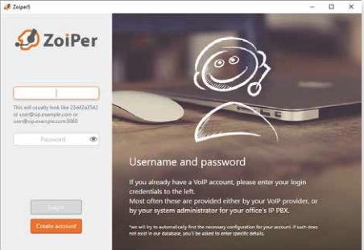
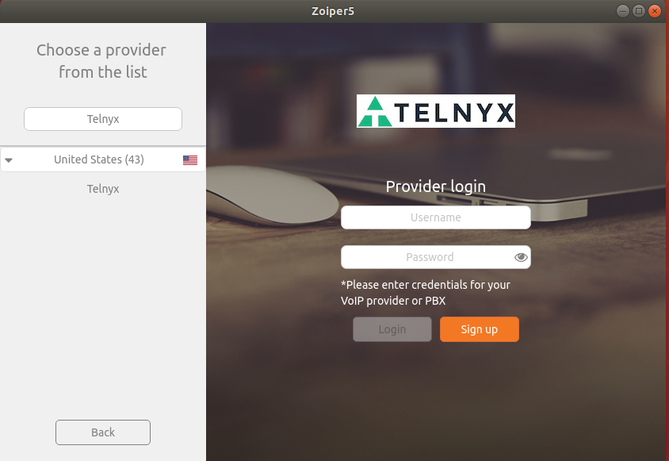
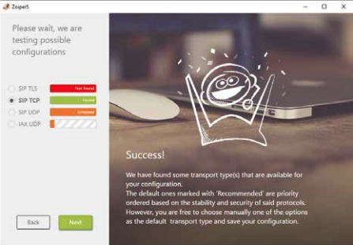
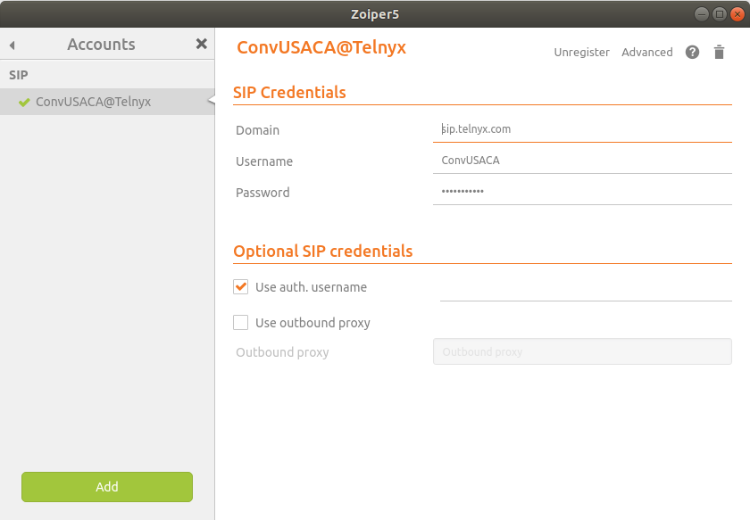
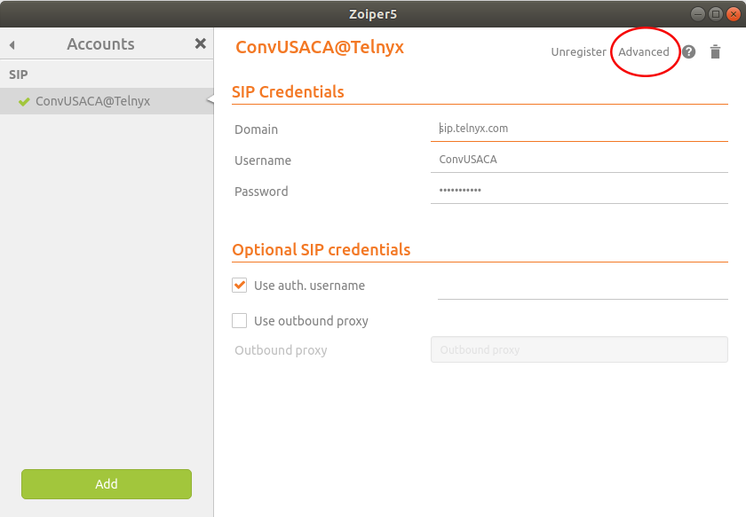
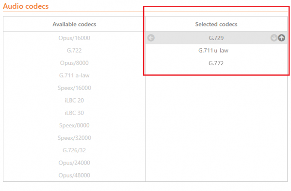
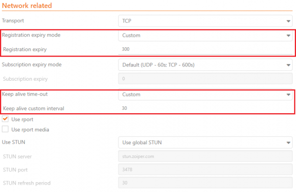
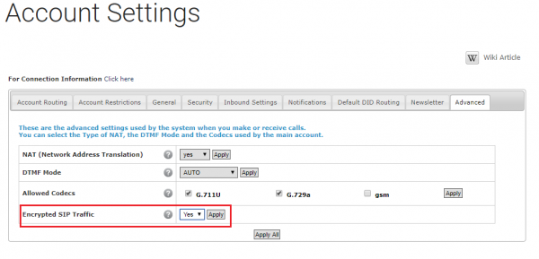
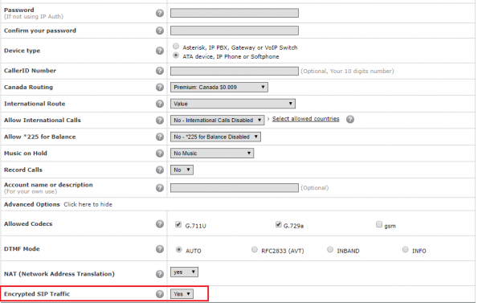
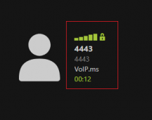

# Zoiper 5 Pro: Telnyx Setup

How to configure Zoiper 5 with a pro license to work with the Telnyx Mission Control portal. See Telnyx guidance and requirements.

C

[Jump to Instructions](#h_4ff34ebbdc)

​ [Zoiper](https://support.telnyx.com/en/articles/6133517-zoiper-communicator) is a cross-platform VoIP softphone solution that supports voice calling, video calling, and instant messaging. Zoiper is available for Windows, Mac and Linux and offers companion apps for iOS, Android, and Windows Phone. Zoiper secures voice, text, and video calls through a choice of several encryption protocols. Contacts are pulled from a variety of frequently-used contact lists and arranged in an easily searchable way. Additionally, Zoiper offers call center functionality with features such as auto-answer, call transfer, recording, provisioning, and click-2-dial CRM integration. One of the powers of Zoiper is its ability to facilitate direct calls from email clients or web browsers.

|  |
| --- |
| ***Note:*** *This guide covers account configuration for Zoiper 5 Pro. Find free user license configuration instructions [here](https://app.intercom.com/a/apps/ltcafuzd/articles/articles/5717568/show).*    *If you're not sure what version is best for you, you can compare the free and pro versions [here](https://www.zoiper.com/en/products/zoiper5/features).* |

For Zoiper documentation, see:

* [Zoiper 5 user guide](https://www.zoiper.com/pdf/User%20Guide%20Zoiper%205%20v.1.0.7.pdf)

---

## Instructions for Configuring the All-New Zoiper 5 with Telnyx

1. [Configure your Telnyx Mission Control Portal](#h_dc5df9cfdf)
2. [Create your VoIP account on Zoiper](#h_d68a340083)
3. [Activating Zoiper 5 Pro offline](#h_7d1c24c1d7)
4. [Configure advanced options and features](#h_8a0117958d)

   1. [Audio codecs](#h_15e3d5415d)
   2. [Network settings](#h_a0cfa51b80)
   3. [Call encryption: TLS/SRTP](#h_75146962a7)
5. [Setting up a Caller ID](#h_3093a1dc1f)

**Video Walkthrough**

Coming soon! Check back frequently as we are updating our documentation.

**Pre-Requisites:**

* Have obtained [a license for Zoiper 5 Pro](https://www.zoiper.com/en/shop/buy/zoiper5?cid=main-nav).
* Have created a [credentials based connection](https://portal.telnyx.com/#/app/connections) on your Telnyx Mission Control Portal account, assigned this connection to a DID and outbound profile in order to make and receive outbound calls. This provides you with the username and password you will use to register Zoiper 5 with Telnyx
  ​

## 1. Configure your Telnyx Mission Control Portal

For step by step instructions on each of the requirements on the Telnyx Mission Control Portal, please follow this [guide](https://support.telnyx.com/en/articles/1176636-get-started-with-a-mission-control-account).

[Back to Top](#h_4ff34ebbdc)

## 2. Create your VoIP account on Zoiper

1. To activate your license, click **Activate your Premium license** and follow the instructions in the activation wizard. Note: Activation credentials are provided by Zoiper after you purchase your license. These are not your Telnyx credentials.
   ​
   If you don't have a license, you can [continue as a free user](https://app.intercom.com/a/apps/ltcafuzd/articles/articles/5717568/show).

   
2. You will be taken to the login screen. Click Activate online. If you need to activate offline, see these instructions.

   
3. You will be taken to the account creation wizard. Click **Create account**.

   
4. Now, choose your location from the dropdown menu and select your country from the list. This will filter the available providers. Enter "Telnyx" in the next field to filter us out. Then select us as your provider.

   
5. The wizard will automatically identify the proper protocols for your account. You'll see something like this. You can click **Next**.

   
6. Once successfully authenticated, you'll have a new account on Zoiper 5. From here, you can set up your sound, video, and microphone settings (covered in [this guide](https://www.zoiper.com/pdf/User%20Guide%20Zoiper%205%20v.1.0.7.pdf) on page 16). Skip for now to confirm your account set up.

   
7. If you click on the account name, you'll be taken to the account settings page.

   

If you want to configure more accounts in this manner, click the **Add** button and follow steps 3-6 again.

[Back to Top](#h_4ff34ebbdc)

## 3. Activating Zoiper 5 Pro offline

If you experience difficulty with your internet connect, or are unable to bypass your company firewall or other security settings to reach the Zoiper server, you can activate your account offline.

1. From the login screen, click **Activate offline**.

   
2. This will generate a file named **Zoiper<ComputerName>.certificate** that contains information about your version of Zoiper and some details about your computer.

   1. If you have installed Zoiper for "all users", you can find the certificate folder within the \Zoiper5\ folder.
   2. If you have installed Zoiper for "the current user only", you can find the certificate folder in `%USERPROFILE%\AppData\Romaing\Zoiper5` on windows or either `~/Library/Application Support` or `~/Library/Preferences` on Mac.
3. Send **Zoiper<ComputerName>.certificate** to [register5@shop.zoiper.com](mailto:register5@shop.zoiper.com) who will send you back a certificate back.
4. Save this certificate in the same folder as 2.b.

|  |
| --- |
| ***Note:*** *By default, Windows hides known file extensions and may automatically append a file extension to the file when its saved. When you find it, right-click on the file, choose **Properties**, and remove any extension that Windows automatically may have added.* |

[Back to Top](#h_4ff34ebbdc)

## 4. Advanced setup and features

To adjust the advanced features of your Zoiper 5 account:

1. Click on **Advanced** from your account settings view.

   

## **4.1. Audio Codecs**

1. From the Advanced settings, scroll down the page to the **[Audio Codecs](https://telnyx.com/resources/codecs-affect-voip-sound-quality)** section.
2. From here, you can hover over any codecs on the left and use the arrows to move them to the right.

[Back to Top](#h_4ff34ebbdc)

## **4.2. Network Settings**

You can set your Zoiper 5 softphone to run all the time with the following steps:

1. Scroll through the advanced settings page to the **Network Related** section.
2. Apply the following changes:

   * **Registration expire mode:** Custom
   * **Registration expiry:** 300
   * **NAT keep alive time-out:** Custom
   * **Keep alive custom interval:** 30

   

[Back to Top](#h_4ff34ebbdc)

## **4.3. Call Encryption TLS/SRTP**

You can choose to use SIP TLS call encryption with your Zoiper 5 account. To do this:

1. Make sure your account has **Encrypted SIP Traffic** enabled. ***Keep in mind*** *that if this setting is enabled, but your device is sending UDP/TCP or RTP, this change will be rejected and you will get an error code (error code: 488).* Enable this setting here:

   
2. If you're encrypting a sub-account, you can enable this in **Sub accounts>Manage sub-accounts>Advanced Options (click here to display)**

   
3. Once you've enabled this setting in your desired account(s), you can set it up to send TLS and SRTP.
4. To enable TLS, find the **SIP Credentials** section in the **Advanced** section and fill in the following information:

   * **Domain:** sip.telnyx.com
   * **Username:** The name of your account/sub-account
   * **Password:** Your SIP password

   1. Scroll down the page to the **Network Related** section and set:

      1. **Transport:** TLS
5. To enable SRTP, scroll to the **Encryption** section and set the following:

   1. **SRTP Key Negotiation:** SDES

      

Your account will now be secure. When you place a call, you will notice a green closed padlock next to your call profile, showing it's a secure call.

That's it, you've now completed the configuration of your Zoiper 5 (free version) softphone client and can now make and receive calls by using Telnyx as the SIP provider.

[Back to Top](#h_4ff34ebbdc)

## 5. Setting up a Caller ID

At Telnyx we have a very strict caller ID policy. Most softphones do not have a direct way to setup what is sent in the FROM header, sometimes you can setup a number as the Display NAME variable and that will be used as the caller id. In any case, you need to make sure your softphone is sending a valid caller id correctly formatted per our policies found [here](https://support.telnyx.com/en/articles/3546251-caller-id-number-policy?q=verified+#h_986dcc6763) and the number you're using is either a number you have in your account with Telnyx or it's a number that has been previously verified with Telnyx. Instructions on how to verify a number can be found [here](https://support.telnyx.com/en/articles/6988813-verified-numbers).

If you are still getting a 403 error about an invalid caller id after setting up a valid caller id in your softphone, the most usual issue is your softphone or system is not correctly passing the caller ID in one of the headers required. As a workaround you will need to setup a caller ID override in the outbound section of your sip connection settings. You can find the instructions in the caller id policy article [here](https://support.telnyx.com/en/articles/3546251-caller-id-number-policy?q=verified+#h_986dcc6763).

[Back to Top](#h_4ff34ebbdc)

---

## Additional Resources

Review our [getting started guide](https://support.telnyx.com/en/articles/1176636-get-started-with-a-mission-control-account) to make sure your Telnyx Mission Control Portal account is set up correctly.

Check out the [Zoiper 5](https://www.zoiper.com/pdf/User%20Guide%20Zoiper%205%20v.1.0.7.pdf) user guide.

---

Related Articles

[Configuring Linphone with Telnyx](https://support.telnyx.com/en/articles/1130674-configuring-linphone-with-telnyx)[Zoiper 3: Telnyx Setup (Mac)](https://support.telnyx.com/en/articles/5720999-zoiper-3-telnyx-setup-mac)[Zoiper 3: Telnyx Setup (Linux)](https://support.telnyx.com/en/articles/5721766-zoiper-3-telnyx-setup-linux)[MicroSIP: Setup with Telnyx](https://support.telnyx.com/en/articles/6133145-microsip-setup-with-telnyx)[Zoiper Communicator](https://support.telnyx.com/en/articles/6133517-zoiper-communicator)

Did this answer your question?

😞😐😃
