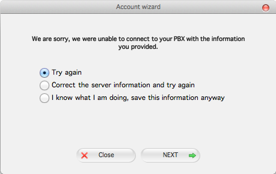

Zoiper 3: Telnyx Setup (Mac) | Telnyx Help Center

[Skip to main content](#main-content)

# Zoiper 3: Telnyx Setup (Mac)

How to configure Zoiper 3 to work with the Telnyx Mission Control portal for a Mac OS operating system.

C

Written by Customer Success

January 10, 2024

Table of contents

[Jump to Instructions](#h_9404c63fcf)

[Zoiper](https://support.telnyx.com/en/articles/6133517-zoiper-communicator) is a cross-platform VoIP softphone solution that supports voice calling, video calling, and instant messaging. Zoiper is available for Windows, Mac and Linux and offers companion apps for iOS, Android, and Windows Phone. Zoiper secures voice, text, and video calls through a choice of several encryption protocols. Contacts are pulled from a variety of frequently-used contact lists and arranged in an easily searchable way. Additionally, Zoiper offers call center functionality with features such as auto-answer, call transfer, recording, provisioning, and click-2-dial CRM integration. One of the powers of Zoiper is its ability to facilitate direct calls from email clients or web browsers.

For Zoiper documentation, see:

* [Zoiper 3 user guide](https://www.zoiper.com/en/support/home/article/34/Installation_%26_configuration_manuals_Zoiper_3)

---

# Instructions for Configuring Zoiper 3 with Telnyx

1. [Create your VoIP account on Zoiper 3](#h_c3a95f8595)
2. [Troubleshooting](#h_3548b277a8)

**Video Walkthrough**

Coming soon! Check back frequently as we are updating our documentation.

**Pre-Requisites:**

* Have [configured your Telnyx Mission Control Portal](https://support.telnyx.com/en/articles/1176636-get-started-with-a-mission-control-account)
* Have created a [credentials based connection](https://portal.telnyx.com/#/app/connections) on your Telnyx Mission Control Portal account, assigned this connection to a DID and outbound profile in order to make and receive outbound calls. This provides you with the username and password you will use to register Zoiper 3 with Telnyx

## 1. Create your VoIP account on Zoiper 3

|  |
| --- |
| ***Note:*** *Visit [https://oem.zoiper.com](https://oem.zoiper.com/) for more information about providing your users with a preconfigured/pre-provisioned Zoiper. This will allow the end user to bypass all the configuration steps and set them up to make calls immediately after they finish installation.* |

1. Download and install Zoiper and run the software.
2. If you have a business license, follow these steps. If not, move on to step 3.

   1. An activation screen will appear when you first run Zoiper. The first step is a login screen. Log in with the **email address you used to purchase your Zoiper license** and the **password that Zoiper emailed to you** immediately following purchase.
   2. **Activating online:** click the **Activate online** button and Zoiper will do the rest. If your computer needs to use a manually-configured proxy server, Zoiper will, by default, use the proxy settings configured in Mac OS Preferences.
   3. **Activating offline:** There may be circumstances where you can't activate online, such as a firewall or other security settings blocking activation. In this case, click the Activate offline button. This will generate a file named **Zoiper<ComputerName>.certificate** that contains information about your version of Zoiper and some details about your computer. You can find the certificate folder within the **~\Library\Zoiper3\** folder.
   4. Send the **Zoiper<ComputerName>.certificate** to [register4@shop.zoiper.com](mailto:register5@shop.zoiper.com) who will send you back a certificate back.
   5. Save this certificate in the same folder as 2.c.
3. You can now create your VoIP account on your new Zoiper softphone. Click on the **Settings** menu and select **Create a new account**.

   
4. The wizard will ask you what type of account you want to create. You'll need to select SIP here, as Telnyx doesn't support IAX or XMPP. Click **Next**.

   
5. You will be asked to provide your user credentials. These will be your *Telnyx* credentials. **Domain/outbound proxy** will be sip.telnyx.com. Click **Next**.

   
6. Next, you will provide a name to identify this account. You can give any name you wish here. When you're satisfied, click on **Next**.

   
7. Once you've clicked Next, Zoiper will do the rest to connect to the Telnyx server. This may take time, but the wizard will keep you apprised.

   

[Back to Top](#h_9404c63fcf)

## 2. Troubleshooting

If Zoiper is unable to configure your account, make sure:

* The server hostname is correct, and exists (Check spelling and periods versus commas etc.)
* The username or password is incorrect.
* The server is not responsive for some reason.
* A firewall or other security settings are blocking access. See Step 2 for the option to activate offline.
* The account needs additional configuration work in order to be registered.

If you've verified all the information is correct, you can save the information and complete the remainder of the configuration manually. To do this, select the **I know what I am doing, save this information anyway** radio option and click **NEXT**.

That's it, you've now completed the configuration of your Zoiper 3 softphone client and can now make and receive calls by using Telnyx as the SIP provider.

[Back to Top](#h_9404c63fcf)

---

## Additional Resources

Review our [getting started guide](https://support.telnyx.com/en/articles/1176636-get-started-with-a-mission-control-account) to make sure your Telnyx Mission Control Portal account is set up correctly.

Check out the [Zoiper 3](https://www.zoiper.com/en/support/home/article/34/Installation_%26_configuration_manuals_Zoiper_3) user guide.

---

Related Articles

[Configuring Bria Solo (a.k.a X-Lite)](https://support.telnyx.com/en/articles/1130645-configuring-bria-solo-a-k-a-x-lite)[Configuring Linphone with Telnyx](https://support.telnyx.com/en/articles/1130674-configuring-linphone-with-telnyx)[Zoiper 5 Pro: Telnyx Setup](https://support.telnyx.com/en/articles/5717957-zoiper-5-pro-telnyx-setup)[Zoiper 3: Telnyx Setup (Linux)](https://support.telnyx.com/en/articles/5721766-zoiper-3-telnyx-setup-linux)[Grandstream HT802: Telnyx Setup](https://support.telnyx.com/en/articles/5725071-grandstream-ht802-telnyx-setup)

Did this answer your question?

😞😐😃

Table of contents
