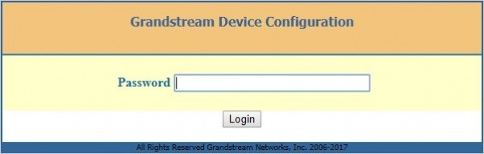
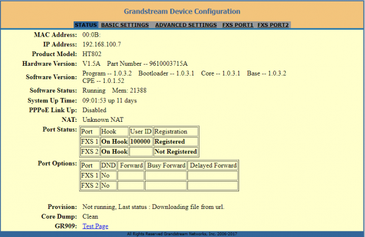

Grandstream HT802: Telnyx Setup | Telnyx Help Center

[Skip to main content](#main-content)

# Grandstream HT802: Telnyx Setup

Set up a connection between your Grandstream HT802, and Telnyx Mission Control Portal to send/receive faxes.

C

Written by Customer Success

June 6, 2024

Table of contents

[Jump to Instructions](#h_15146ed274)

The Grandstream HT802 (referred to in this document from here as the 802) is a 2 port analog telephone adapter (ATA) that allows users to create a high-quality and manageable IP telephony solution for both residential and office environments. With compact size, excellent voice quality, advanced VoIP functionality, security features, and auto-provisioning options, users are easily able to take advantage of VoIP on analog phones. The HT802 allows service providers to offer high quality IP services.

For Grandstream HT802 documentation, see:

* [Grandstream HT802 technical documentation and user guide](https://www.grandstream.com/hubfs/Product_Documentation/ht80x_user_guide.pdf)

---

# Instructions for Configuring Grandstream HT 802 for Telnyx

|  |
| --- |
| At the end of this walkthrough, you will have connected your Grandstream HT 802 and your Telnyx Mission Control Portal and will be able to send faxes through Telnyx. |

1. [Set up your Grandstream HT 802](#h_a68616ad92)
2. [Configure your Grandstream HT 802](#h_da92b2333f)
3. [OPTIONAL: Prevent direct IP calls](#h_a05cc54fae)
4. [Configure your Telnyx Command Portal](#h_e5d7e33010)

**Current Firmware Version:** 1.0.33.4 (v 1.0.35.4 in Beta)

* This document is compliant with the most recent firmware version. Please make sure to regularly [check to ensure you're on the most up-to-date firmware](https://www.grandstream.com/support/firmware).

**Pre-Requisites:**

* Ensure your device is running the [most current firmware](https://www.grandstream.com/support/firmware).
* In your Telnyx Portal, from **Connection Settings > Inbound**, make sure that:

  + **DNIS:** *SIP Username*  
    ​  
    This is necessary as Telnyx doesn't support phone numbers as connection usernames.

**Video Walkthrough**

Setting up your Telnyx SIP portal account so you can make and receive calls:

|  |
| --- |
| ***Note:*** *Video walkthrough for Grandstream HT8xx /Telnyx configuration coming soon. Check back as we update our docs.* |

## 1. Set up your Grandstream HT 802 for configuration

|  |
| --- |
| ***Note:*** *These instructions reference the 802 with factory default configuration. It is configured to grab a dynamic IP address automatically from your router using DHCP. For information on configuring your HandyTone with a Static IP Address, please refer to the* [802's user guide](https://www.grandstream.com/hubfs/Product_Documentation/ht80x_user_guide.pdf). |

1. The Grandstream HT802 typically requires you to have inbound calls sent to the username configured on the device in the SIP settings. The easy way to set this up is to have the phone number as the username of the trunk, however Telnyx doesn't support phone numbers as connection usernames.   
   ​  
   Instead, we suggest you have inbound calls sent to the alphanumeric username of the connection instead of the number. Change the inbound settings of the connection on the **Inbound** tab on the **Connection Options** screen to the following:  
   ​

   1. ***Number Format (DNIS):*** *SIP Username"*Connect your 802 directly to your router with the ethernet cable supplied with your device.
2. Connect your phone to the 802 by plugging the cable into the correct FXS port you've configured.
3. Now plug the 802's power cord into the outlet you're using.
4. *Wait 60 seconds before continuing to step 5.*
5. Have a text editor or pen and paper ready. Pick up the connected phone and dial **\*\*\*** and you will hear a message that says *"Enter a menu option."*
6. Dial 0 2 on your phone. This will return the IP address of your 802. Copy this number down.
7. Open a web browser and enter the IP address that you just entered into the address bar. Ensure you remove any leading zeros, as many browsers don't accept them.

   * For example: if your message gave you a number that looks like this: 192.168.001.010, change this to 192.168.1.10 and hit enter/return to direct your browser to this address.
   * Ensure you do this quickly, as the 802 interface has a timeout.
8. You'll be prompted to log in.

   
9. The 802 will come configured with a default admin password:

   1. **Password:** admin

[Back to Top](#h_15146ed274)

## 2. Configure your Grandstream HT 802

1. Once you're logged in, you'll see a screen that looks like this:

   
2. In the top menu, click on FXS PORT1 and configure the following settings:

   1. **Primary SIP server:** sip.telnyx.com
   2. **Failover SIP server:** (Leave blank)
   3. **Outbound Proxy:** (Leave blank unless you're on firmware version 1.0.15.4 or lower. In that case, just use sip.telnyx.com.)
   4. **NAT Traversal**: Keep-Alive
   5. **SIP User ID:** Your Telnyx SIP ID
   6. **Authenticate ID:** Your Telnyx SIP ID
   7. **Authenticate Password:** Your Telnyx SIP account password
   8. **Name:** The name you want as your Outbound Caller ID. It must meet the following requirements:

      1. No special characters. They will not be displayed. Spaces are allowed.
      2. Suggested character maximum: 15
      3. Suggested format: CAPITAL LETTERS. This improves accessibility and is more easily visible on some devices.
   9. **DNS Mode:** A Record
   10. **SIP Registration:** Yes
   11. **Unregister on Reboot:** No
   12. **Outgoing Call Without Registration:** Yes
   13. **Register Expiration:** 5
   14. **Allow Incoming SIP Messages from SIP Proxy Only:** Yes
   15. ***Preferred DTMF method***: In-audio, RFC2833
   16. ***Use P-Access-Network-Info Header***: No
   17. ***Use P-Emergency-info Header***: No
   18. ***Enable Call Features***: No
   19. ***Dial Plan***: {[x\*]+}
   20. ***Preferred Vocoder***: PCMU, PCMA, G72
   21. **Fax Mode:** T38
   22. **Re-INVITE After Fax Tone Detected:** Disabled

   **Optional Settings:**

   If you are noticing that large successes have a low success rate, set:

   1. **Jitter Buffer Type:** Fixed
   2. **Jitter Buffer Length:** High
   3. **Disable Line Echo Canceller (LEC):** Yes
   4. **Disable Network Echo Suppressor:** Yes

   

[Back to Top](#h_15146ed274)

## 3. OPTIONAL: Prevent Direct IP calls

If you want to prevent direct IP faxes to your device (such as 100 or 1000) and only allow calls from us, you can enable the following two options on the FXS PORT1 page:

1. **Check SIP User ID for Incoming INVITE:** *Yes* (no direct IP calling if yes)
2. **Allow Incoming SIP Messages from SIP Proxy Only:** *Yes* (no direct IP calling if yes)

   

If these options are enabled, the device will not be able to make direct IP calls.

[Back to Top](#h_15146ed274)

## 4. Configure your Telnyx Command Portal

1. Go to your Telnyx Command Portal and set up a [Number](https://support.telnyx.com/en/articles/4380325-search-and-buy-numbers), [Connection](https://support.telnyx.com/en/articles/1177115-how-to-setup-a-did-to-sip-connection) and [Outbound Profile](https://support.telnyx.com/en/articles/4320411-more-about-outbound-voice-profiles).
2. Now you can send a test fax!

That's it, you've now completed the configuration of your Grandstream HT 802 device and can now make and receive faxes with Telnyx as the SIP provider.

[Back to Top](#h_15146ed274)

---

**Additional Resources**

Review our [getting started guide](https://support.telnyx.com/en/articles/1176636-get-started-with-a-mission-control-account) to make sure your Telnyx Mission Control Portal account is set up correctly.

Grandstream HT802 [technical documentation and user guide](https://www.grandstream.com/hubfs/Product_Documentation/ht80x_user_guide.pdf).

Check for the 802's [most current firmware](https://www.grandstream.com/support/firmware)

---

Related Articles

[Configuring Grandstream GXP16XX with Telnyx](https://support.telnyx.com/en/articles/1130660-configuring-grandstream-gxp16xx-with-telnyx)[Grandstream UMC6202: Auth Setup](https://support.telnyx.com/en/articles/1295514-grandstream-umc6202-auth-setup)[Grandstream GXP: Telnyx Setup](https://support.telnyx.com/en/articles/5815720-grandstream-gxp-telnyx-setup)[Grandstream GXP21XX](https://support.telnyx.com/en/articles/5819218-grandstream-gxp21xx)[Grandstream GXV3370](https://support.telnyx.com/en/articles/6187576-grandstream-gxv3370)

Did this answer your question?

😞😐😃

Table of contents
