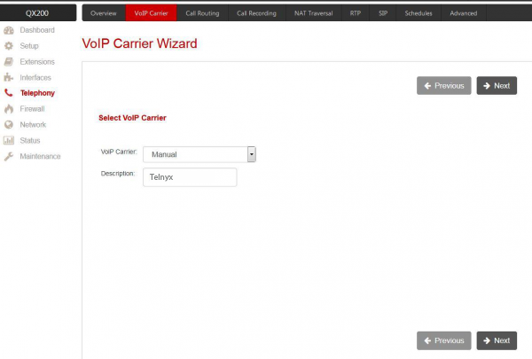
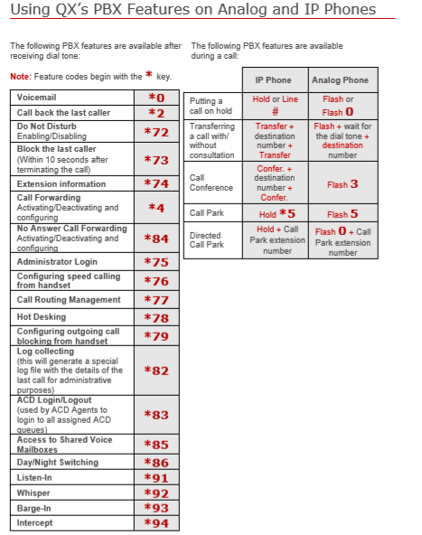

# Epygi IP PBX: Telnyx Setup

Learn how to configure the Epygi IP PBXs QX series with Telnyx and allowing QX users to make as well as receiving calls. See Telnyx guidance and requirements.

C

[Jump to Instructions](#h_240891fe93)

Epygi has a long industry history designing, manufacturing, and delivering IP PBX, IP Gateway appliances and cloud services. Epygi supports businesses of all sizes, through both appliances and cloud-based products with solutions tailored to meet business-specific needs from a small office communication solution, to complex call centers with hundreds of agents. Epygi's flexible offering makes their software an idea solution to pair with your Telnyx setup.

Additional documentation:

* Visit Epygi's website: <https://www.epygi.com/about-us/>
* [Epygi quick install guide](https://www.epygi.com/wp-content/uploads/2019/03/Install-Guide-20_500IPPBXs-v02.pdf)
* [Epygi product warranty information](http://206.81.0.143/warranty/)

---

## Instructions for configuring Epygi IP PBX to work with Telnyx

The QX VoIP Carrier Wizard will guide you through the steps to configure your account. After finishing the wizard, the extensions on the QX will be able to place calls as well as receive calls. The VoIP Carrier Wizard supports both IP-based authentication and SIP registration methods. However, we will use SIP registration for this guide.

|  |
| --- |
| ***Note:*** *This is a generic configuration for all QX models: QX20/QX50/QX200/QX500/QX2000/QX3000/QX5000/QXISDN4+, ecQX, UC20 and UC80.* |

In this document, you will:

1. [Register your Epygi IP PBX QX Device](#h_07b8adef32)
2. [Place a call](#h_160e0f24a3)
3. [Access additional features](#h_7d86118a72)

**Pre-Requisites**

* [Connect and configure your Epygi device](https://www.epygi.com/wp-content/uploads/2019/03/Install-Guide-20_500IPPBXs-v02.pdf)
* [Configure your Telnyx Mission Control Portal](https://support.telnyx.com/en/articles/1176636-get-started-with-a-mission-control-account)

**Video Walkthrough**

Coming soon! Check back frequently as we are updating our documentation.

## 1. Register your Epygi IP PBX QX

In this step, you'll register your Epygi device and connect it to your Telnyx account.

1. From a computer connected to the same LAN as your Epygi QX, open your preferred web browser and enter *`http://172.30.0.1`* into the address field.
2. Log in. If you haven't yet updated the username or password, use the default credentials pre-configured on all QX devices.

   1. **Username:** admin
   2. **Password:** 19

   **IMPORTANT:** Ensure that you update your device's credentials as soon as possible.
3. In the lefthand menu, select **Telephony** to open the VoIP carrier wizard and enter the following:

   1. **VoIP Carrier:** *Manual*
   2. **Description:** *Telnyx* (suggested)
4. Click **Next**.

   
5. On the next screen, configure the following settings:

   1. **Account Name:** Your Telnyx account username
   2. **Password:** Your Telnyx account password
   3. **SIP Registrar:** sip.telnyx.com
   4. **SIP Server Port:** 5060
   5. **Use RTP Proxy:** Enabled
6. Click **Next.**

   
7. On the next screen, you'll define:

   1. **Access Code:** (e.g. 011) Defines how to make outgoing calls through Telnyx, as well as the QX extension which will receive all incoming calls from the Telnyx [SIP trunks](https://telnyx.com/products/sip-trunks).
   2. **Emergency code:** (e.g. 911 or 999) Defines where to send an emergency call.
   3. **Route Incoming Calls To:** The extension to which all incoming calls will be routed. (Note that the default setting for this field is the extension that sends callers to your auto-attendant. This is also a very common scenario, which is why we're using it for this example, but you can choose to send it to another extension, if you wish.)

   
8. Click **Next**.
9. You'll be taken to a screen where you can confirm your settings. If you're happy with the way they look, click **Finish**.

[Back to Top](#h_240891fe93)

## 2. Place a call

This step is more of a reference, as it provides the data required to make a typical call. You don't need to place a call in order to complete any configuration setup or step.

* **Internal extensions:** Dial the extension
* **External call:** External call: 9 +10-digit number you wish to call
* **Emergency call:** The emergency call number you configured in step 2 (i.e.: 911)

[Back to Top](#h_240891fe93)

## 3. Additional Features

**Voicemail Features**

**Star Codes**

That's it, you've now completed the configuration of your VitalPBX and can now make and receive calls by using Telnyx as the SIP provider.

[Back to Top](#h_240891fe93)

---

## Additional Resources

Review our [getting started guide](https://support.telnyx.com/en/articles/1176636-get-started-with-a-mission-control-account) to make sure your Telnyx Mission Control Portal account is set up correctly.

Additionally:

* Visit Epygi's website: <https://www.epygi.com/about-us/>
* [Epygi quick install guide](https://www.epygi.com/wp-content/uploads/2019/03/Install-Guide-20_500IPPBXs-v02.pdf)
* [Epygi product warranty information](http://206.81.0.143/warranty/)

---

Related Articles

[Configuring an Elastix 4 PBX IP Trunk](https://support.telnyx.com/en/articles/1130622-configuring-an-elastix-4-pbx-ip-trunk)[How to configure a Thirdlane PBX](https://support.telnyx.com/en/articles/1130631-how-to-configure-a-thirdlane-pbx)[Positron IP PBX](https://support.telnyx.com/en/articles/5790910-positron-ip-pbx)[Synway UC-200: Telnyx Setup](https://support.telnyx.com/en/articles/5800399-synway-uc-200-telnyx-setup)[ScopTEL IP PBX](https://support.telnyx.com/en/articles/5803103-scoptel-ip-pbx)

Did this answer your question?

😞😐😃
