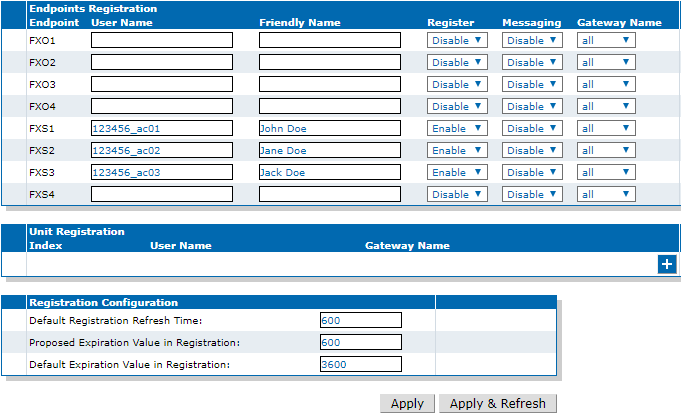
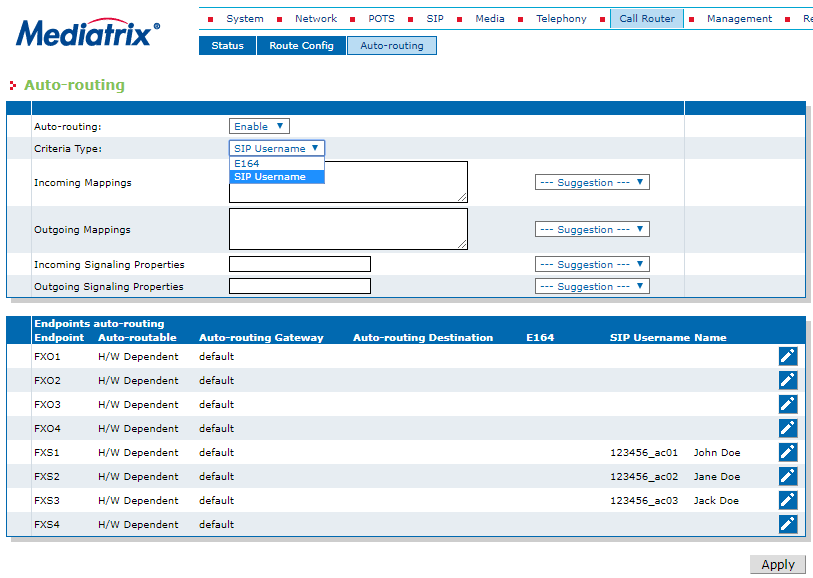
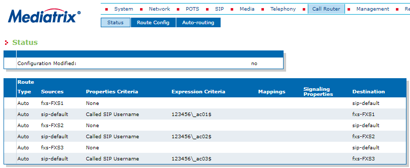
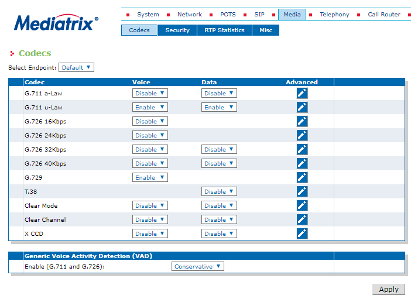
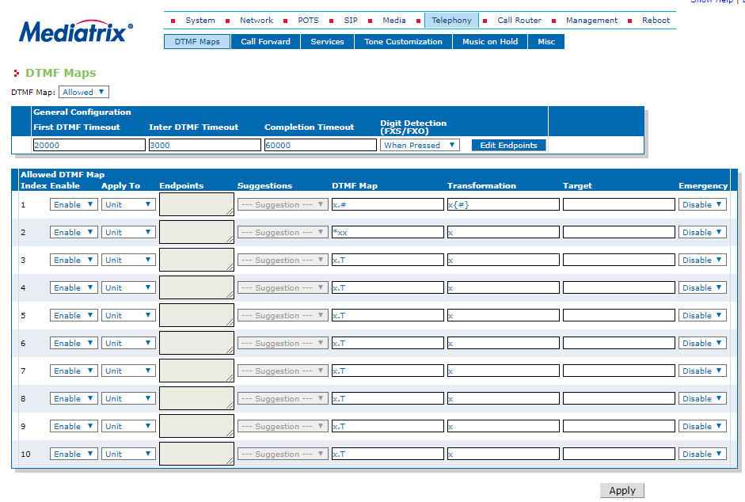
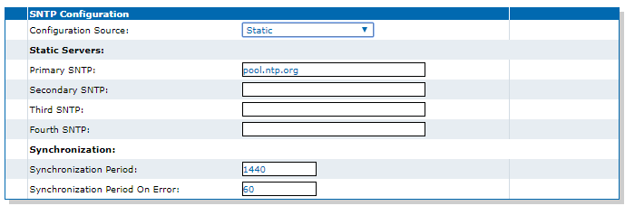

# Mediatrix C7/4100: Telnyx Setup

Learn how to connect and configure your Mediatrix C7 or Mediatrix 4100 to work with your Telnyx Mission Control Portal. See Telnyx guidance and requirements.

C

[Jump to Instructions](#h_3ae36cf660)

The [Mediatrix C7 Series gateways](https://documentation.media5corp.com/pages/viewpage.action?pageId=16547905) combine a VoIP Analog Adaptor and Media Gateway in both a secure and reliable platform. They feature a FXS, FXO, and BRI interfaces while still hitting a very cost-effective price point, delivering a simple-setup and transparent connection to PSTN and analog terminals.

|  |
| --- |
| ***Note:*** *While this document uses the Mediatrix C7 setup as an example, the setup criteria for the 4100 should be the same. Where any differences exist, this document will call it out.* |

Further documentation:

* <https://documentation.media5corp.com/pages/viewpage.action?pageId=16547905> - Mediatrix C7 technical documentation

---

## Instructions for configuring Mediatrix C7/4100 to work with your Telnyx Mission Control Portal

In this document, you will:

1. [Connect your Mediatrix device to your network](#h_551f05d9d8)
2. [Access the Mediatrix GUI](#h_b693b7e47d)
3. [Set the Telnyx server FQDN](#h_e85191689a)
4. [Restart all required services](#h_3a643db00c)
5. [Register telephony ports](#h_c2a49e6d16)
6. [Set the Telnyx credentials on new telephony ports](#h_ca254f6f5d)
7. [Set auto-routing to support the Telnyx username format](#h_1ce65d73eb)
8. [Disable the G.711 a-law codec (*North America only*)](#h_d622167dc2)
9. [Set dial patterns (DTMF maps)](#h_016aa39444)
10. [Set a time server](#h_60f8910ea6)

**Video Walkthrough**

Coming soon! Check back frequently as we are updating our documentation.
​
​

**Pre-Requisites**

* It is STRONGLY recommended that your device has the latest firmware updates:

  + [Download latest](https://documentation.media5corp.com/display/DGWLATEST/Latest+DGW)
* You have a [number](https://support.telnyx.com/en/articles/4380325-search-and-buy-numbers) in your account.
* You have [configured a connection.](https://support.telnyx.com/en/articles/1177115-how-to-setup-a-did-to-sip-connection)
* You have [assigned that number to the connection.](https://support.telnyx.com/en/articles/1177115-how-to-setup-a-did-to-sip-connection)
* You have [configured an outbound profile.](https://support.telnyx.com/en/articles/4320411-more-about-outbound-voice-profiles)
* You have assigned your connection to the outbound profile.

## 1. Connect your Mediatrix device to your network

In this step, you'll establish a hard wired connection between your Mediatrix C7/4100 device to your network.

1. Find the ethernet ports on your device (The C7 and 4100 both have 2):

   * Connect your device to your router/network via the **ETH1** (**WAN** on the 4100) ethernet port. It is already set to get an IP address from a DHCP server.
   * Find the **ETH2** (**LAN** on the 4100) ethernet port. It has a default IP address of 192.168.1.2 and is used to directly manage your device through a web browser.
2. Check the Power LED light.

   1. If the light is **ON**, you can now connect a phone to one of the telephony ports and dial **\*#\*0** and the device will play back the IP address the device has. Take note of this, as you'll need it in the next step.
   2. If the light is **OFF**, perform the following initial troubleshooting steps before calling for any additional help, as the following are usually the most likely culprits:

      1. Ensure the network cable is properly connected between your device and your network gateway.
      2. Ensure that the port on your router/network switch is active.
      3. If the first two steps don't solve the problem, connect your device to your computer through the **ETH2/LAN** port.

[Back to Top](#h_3ae36cf660)

## 2. Access the Mediatrix GUI

In this step, you'll access the configuration settings by connecting to your device via a web browser and ensure you can log in.

1. From a computer connected (via ethernet or wifi) to the same network as your Mediatrix, open your preferred web browser.
2. Enter the IP address you obtained in step 1.1 to reach the Mediatrix GUI login page.

For your first login, you'll need to use the Mediatrix default login:

1. Username: public
2. Password: (empty - no default password)

[Back to Top](#h_3ae36cf660)

## 3. Set the Telnyx server FQDN

In this step, you're going to set the Fully Qualified Domain Name (FQDN) so the device knows to connect to Telnyx.

1. Once you're logged into your Mediatrix GUI, click on **SIP** in the top menu.
2. Click on the **Servers** sub-menu.
3. Find the **Registrar Host** field and enter the registrar FQDN associated with your account (i.e.: sip.telnyx.com).
4. In the **Proxy Host** field, enter the proxy FQDN associated with your account (i.e.: sip.telnyx.com)
5. Click **Apply**.

   

[Back to Top](#h_3ae36cf660)

## 4. Restart required services

Once you've set the Telnyx servers in the previous step, you'll need to perform a services restart to apply changes.

1. After clicking **Apply** in the previous step, you'll get a message at the top of the screen telling you to restart required services. You'll have the option to either open the **Services Table** and do this manually, or just **Restart Required Services** from the link in the message.

   

[Back to Top](#h_3ae36cf660)

## 5. Register telephony ports

In this section, you'll enable all the analog ports you will be registering with this service.

1. Click on **SIP** in the top menu.
2. Click on the **Registrations** sub-menu.
3. For every analog port you want to register, provide the following information:

   1. **Username:** Enter the associated Telnyx username for your account or sub-account
   2. **Friendly Name:** This is your choice, and is the name that will be displayed when you make calls.
   3. **Register:** Enable
4. Click **Apply**.

   

[Back to Top](#h_3ae36cf660)

## 6. Set the Telnyx Credentials

In this section, you'll set the Telnyx credentials for each of the telephony ports you just entered in step 5.

1. Click on **SIP** in the top menu.
2. Click on the **Authentications** sub-menu.
3. Click on **Edit All Entries** to open the telephony port entries for editing.
4. For each entry you've registered enter the following:

   1. **Criteria:** Endpoint
   2. **Endpoint:** Select the telephony port to register
   3. **Validate Realm:** Disable
   4. **Username:** Enter your Telnyx account/sub-account username.
   5. **Password:** Enter your telnyx account/sub account password.
5. Click **Apply & Refresh Registration**.

   

[Back to Top](#h_3ae36cf660)

## 7. Set auto-routing to support the Telnyx username format

Now you'll set the criteria for auto-routing to ensure your system is set up to use SIP.

1. Click on **Call Router** in the top menu.
2. Click on **Auto-routing** in the submenu.
3. In the settings you see, set the following configurations:

   1. **Auto-routing:** Enable
   2. **Criteria Type:** SIP Username
4. Click **Apply**.

   
5. In order to validate that your call router is set correctly, click on the **Status** sub-menu (in the **Call Router** menu).
6. Find the **Route** table (under the **Type** column) and make sure auto routes are present and configured as expected.

   

[Back to Top](#h_3ae36cf660)

## 8. Disable G.711 a-law codec (*North America only*)

If you're in North America or Japan, you'll want to disable the G.711 a-law codec, as Mu-law (also written µ-Law) is the encoding scheme for voice traffic in these regions. Once you've disabled this codec, you'll configure the µ-Law codec.

1. Click on **Media** in the top menu.
2. Click on the **Codecs** sub-menu.
3. Find **G.711 a-law** and **disable** for both **Voice** and **Data**.
4. Click **Apply**.

   
5. Perform a [services restart](#h_3a643db00c).
6. Next, find the G.711 µ-Law and click the pencil icon under the **Advanced** column.
7. A new window will open.
8. Find the **Minimum and Maximum Packetization time** ("ptime") fields and set the following configurations:

   1. **Minimum Packetization:** 20ms
   2. **Maximum Packetization:** 30ms
9. Click **Apply**.

   

[Back to Top](#h_3ae36cf660)

## 9. Set dial patterns (DTMF maps)

In this section, you'll change your [DTMF](https://support.telnyx.com/en/articles/1130710-what-is-dtmf) maps settings in order to use standard star codes/feature codes, such as \*97 (voicemail).

1. Click on **Telephony** in the top menu.
2. Click on **DTMF Maps** in the sub-menu.
3. In the table on this page, find the second row and configure the following:

   1. **DTMF Map:** \*xx
   2. **Transformation:** x

   
4. Click **Apply**.

[Back to Top](#h_3ae36cf660)

## 10. (OPTIONAL) Set a time server

This section may not be required, but if your DHCP server doesn't also provide an SNTP server, this section will allow you to configure it manually.

1. Click on **Network** in the top-menu.
2. Click on **Host** in the sub-menu.
3. Find the **SNTP Configuration** table and configure the following settings:

   1. **SNTP Configuration Source:** Static
   2. **Primary SNTP:** *pool.ntp.org* (Or any known and reachable SNTP server)

   
4. Click **Apply**.

That's it, you've now completed the configuration of your Mediatrix C7/4100 device.
​

[Back to Top](#h_3ae36cf660)

---

## Additional Resources

Review our [getting started guide](https://support.telnyx.com/en/articles/1176636-get-started-with-a-mission-control-account) to make sure your Telnyx Mission Control Portal account is set up correctly.

Check out the [Mediatrix](https://documentation.media5corp.com/pages/viewpage.action?pageId=16547905) technical documentation.

---

Related Articles

[Grandstream HT802: Telnyx Setup](https://support.telnyx.com/en/articles/5725071-grandstream-ht802-telnyx-setup)[Flyingvoice: Telnyx Setup](https://support.telnyx.com/en/articles/5810663-flyingvoice-telnyx-setup)[Panasonic KX-HDV: Telnyx setup](https://support.telnyx.com/en/articles/5814406-panasonic-kx-hdv-telnyx-setup)[Gigaset A510: Telnyx Setup](https://support.telnyx.com/en/articles/5815209-gigaset-a510-telnyx-setup)[Snom C520: Telnyx Setup](https://support.telnyx.com/en/articles/5815678-snom-c520-telnyx-setup)

Did this answer your question?

😞😐😃
