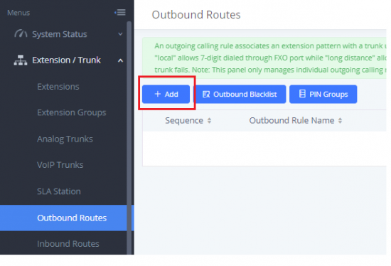
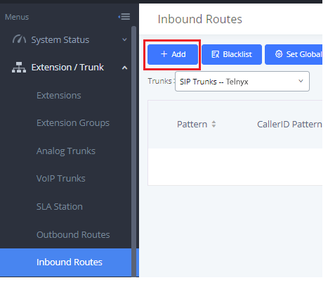
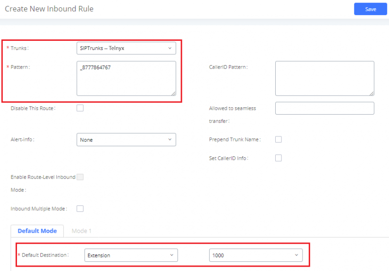

# Grandstream UCM6xxx: SIP Trunks

In this article, you'll learn how to configure SIP trunks in the Grandstream UCM 6xxx that are Telnyx-compatible. See Telnyx guidance and requirements.

C

[Jump to Instructions](#h_c0cf38c0c4)

Designed to provide a centralized solution for the communication needs of businesses, the [Grandstream UCM6200 series](https://www.grandstream.com/products/ip-pbxs/ucm-series-ip-pbxs/product/ucm6200-series) IP PBX appliance combines enterprise-grade voice, video, data, and mobility features in an easy-to-manage solution. This IP PBX series allows businesses to unify multiple communication technologies, such as voice, video calling, video conferencing, video surveillance, data tools, mobility options, and facility access management onto one common network that can be managed and/or accessed remotely. The secure and reliable UCM6xxx series delivers enterprise-grade features without any licensing fees, costs-per-feature or recurring fees.

|  |
| --- |
| ***Firmware Notices:***    *UCM6xxx EOL notice:*  *Firmware 1.0.18.x will be the last supported firmware for UCM61xx. UCM61xx will no longer receive new features, but will continue to receive critical security updates and major bug fixes.*    *UCM6xxx Upgrade Notice:*  *Please upgrade all UCM devices to latest official firmware for product lifespan and security improvements**.*** |

Further documentation:

* [Grandstream UCM6xxx series user guides](https://www.grandstream.com/support/resources?title=UCM6200%20series&hsLang=en)
* [Grandstream Firmware updates](https://www.grandstream.com/support/firmware)

---

## Instructions for creating a SIP trunk on your Grandstream UCM6xxx device

In this document, you will:

1. [Log into your UCM device](#h_f453c758a4)
2. [Create your SIP trunks](#h_f453c758a4)
3. [Configure your outbound routes](#h_d4243b6d77)
4. [Configure your inbound route](#h_1a50e9420f)
5. [OPTIONAL: Configure time conditions](#h_8b042c7954)
6. [OPTIONAL: Group trunks](#h_a438f8243f)
7. [OPTIONAL: Set a failover rate](#h_fb16022def)

**Pre-Requisites**

* Ensure your device is running the [most current firmware](https://www.grandstream.com/support/firmware).
* Ensure that your [Telnyx Mission Command Portal is configured properly](https://support.telnyx.com/en/articles/1176636-get-started-with-a-mission-control-account)
* RECOMMENDED: [Enable TLS to encrypt your traffic](https://support.telnyx.com/en/articles/1130711-does-telnyx-encrypt-communication)

## Additional Setup Considerations

* Edtensions range on UCM6xxx in main office is 1000-1999
* Dialing to international numbers should be prefixed with 99 with no size limits
* Local numbers start with 06 and are 10 digits in length

**Video Walkthrough**

Setting up your Telnyx SIP portal account so you can make and receive calls:

|  |
| --- |
| ***Note:*** *There is currently no video walkthrough for configuring a SIP trunk on the UCM6xxx. Check back as we update our docs.* |

## 1. Log into your UCM device

In this step, you'll access your Grandstream web portal, which is where you'll complete the remainder of the setup and configuration.

1. Ensure that the UCM device is properly powered on. It should show an IP address on its screen.
2. From a computer that is on the same network as your UCM device, open a web browser and enter the IP address you see on the UCM device. It should be in the following format: ***http(s)://ipaddress:portnumber***. The default protocol is HTTPS and the default port number is 8089.
3. You'll be taken to a login screen. For your first login, use the default UCM credentials:

   1. **Username:** admin
   2. **Password:** admin

   

[Back to Top](#h_c0cf38c0c4)

## 2. Create your SIP trunks

In this step, you'll create and register SIP trunks to work with your Grandstream. This step walks you through an example with two SIP trunks; one used for international calls, the other used for domestic calls.

You should have the following information from Telnyx that you will use to register your trunk(s):

|  |  |
| --- | --- |
| **SIP trunk information** | **Value** |
| Provider address | sip.telnyx.com |
| Username | Your Telnyx SIP username |
| Authenticate ID | Your Telnyx SIP username |
| Password | Your Telnyx SIP password |
| Main number | Your main 10-digit number (ie: 0655441000) |
| Provided DIDs | The 10-digit DIDs you have provisioned. |

1. Log into the UCM6xxx portal through your web browser.
2. Navigate to **Extension/Trunk > VoIP Trunks.**
3. Click on the **Add SIP Trunk** button and, on the **Basic Settings** tab, provide the following information:

   1. **Type:** Choose *Register SIP trunk*
   2. **Provider Name:** Telnyx
   3. **Host Name:** *sip.telnyx.com* (US. For a list of international servers, see [this document](https://sip.telnyx.com/#signaling-addresses).)
      ​
      ​***Note:*** *If you are enabling TLS encryption, append* :5061 *(ie:* sip.telnyx.com:5061*)*
   4. **Keep Trunk CID:**  Enable this option if you want the trunk to send its own CID number or disable it if your extensions are going to send their own CID number.
   5. **Caller ID Name:** This is your caller ID. You can choose whatever you like, but keep in mind the following naming conventions:

      1. Caller ID Name should be in capital letters. This will appears more clearly/visible on some devices.
      2. You must NOT use any special characters, as they will not be displayed. Spaces are allowed.
      3. Some of regular Canadian providers will not show more than 15 characters. We suggest shrinking or adapt your caller ID.
   6. **From Domain:** *sip.telnyx.com* (US. For a list of international servers, see [this document](https://sip.telnyx.com/#signaling-addresses).)
   7. **Username:** Your Telnyx account/sub-account username
   8. **Password:** Your Telnyx account/sub-account password
   9. **Transport:** Choose *TCP* or *UDP* unless you are encrypting traffic and have set up encryption on your Telnyx portal. In this case, choose *TLS*.
      ​

      
4. Next, click on the **Advanced Settings** tab and enable the following settings:

   1. **Codec Preference**: Here you can use the arrows to ensure that only Telnyx-supported codecs are selected, namely:

      1. *ulaw(g711u)*
      2. *alaw(g711a)*
      3. *g722*
      4. *g729*
   2. Enable caller ID functionality by choosing either a PPI (P-Preferred-Identity) or PAI (PAsserted-Identity) header to be sent in your SIP HEADER
      ​
      ​***IMPORTANT*:** “Send PPI Header” *and* “Send PAI Header” *cannot be enabled at the same time. Only one of the two headers is allowed in the SIP INVITE message. Some providers use PPI, and others use PAI. Choose the best option for your setup.*

      1. If you are planning to send a PPI header in your SIP INVITE message, enable **Send PPI Header.**
      2. If you are planning to send a PAI header in your SIP INVITE message, enable **Send PAI Header.**
   3. **Passthrough PAI Header:** If **Send PAI Header** is *disabled*, enabling this setting will allow PAI headers to be preserved as calls passing through UCM.
   4. **DTMF Mode:** *Default* (The default [DTMF](https://support.telnyx.com/en/articles/1130710-what-is-dtmf) mode is RFC2833)
   5. **Enable Heartbeat Detection:** In order to avoid your modem closing your local SIP ports, find the Enable Heartbeat Detection field and check this box
   6. **Heartbeat Frequency:** 60
   7. **SRTP:** If you are encrypting calls with TLS, choose *Enabled and forced*

      
5. Click **Save**, then **Apply Changes**.
6. If you want to check your SIP trunk's registration status, you can do so by visiting **System Status > Dashboard.**

|  |
| --- |
| ***Note:*** *If a status is Rejected, it's letting you know that your UCM wasn't registered with Telnyx. Verify that the Telnyx server is reachable from your UCM. Additionally, double-check your trunk credentials.* |

[Back to Top](#h_c0cf38c0c4)

## 3. Configure your outbound routes

In this step, you'll configure your outbound routes, which will analyze your dial pattern and send your calls through the correct trunk.

1. Log into your UCM6xxx portal through your web browser.
2. Click **Extension/Trunk > Outbound Routes.**
3. Click **+Add**.

   
4. Configure the following settings:

   1. **Calling Rule Name**: Any name you want for this route.
   2. **Pattern**: The desired pattern your callers will need to dial.
      ​
      Note that if you want to include a dial-out prefix, you can type it after the "\_" character in your dial patterns. However, this number will need to be "stripped off", which you can do in the Strip field (see e)
   3. **Trunk**: The Telnyx trunk your call will be sent through.
   4. **Privilege Level**: Choose the desired privilege your extensions must have to be able to use this route. Bear in mind that an extension with an inferior privilege won't be able to use this route. Hover over the field name for more information.
   5. **Strip:** If you are using a dial-out prefix, use this field to specify *the number of* digits to strip off after the "\_" character in your dial patterns.
      ​
      For example: If you want to use "9" to dial out, then your pattern will need to be \_9NXXXXXXXXX To strip off this number "9" when dialing out, set the **Strip** field to *1* to remove this single number following the "\_"

   

[Back to Top](#h_c0cf38c0c4)

## 4. Configure your inbound route

Inbound routes will make it so that you only need to use a single SIP trunk to receive incoming calls so that you only need one trunk for your phone numbers. Inbound routes will receive all your calls and route them to the right destination in the UCM.

|  |
| --- |
| ***Note:*** *We don't suggest using more than one Telnyx trunk on the same device* |

1. Log into your UCM6xxx portal through your web browser.
2. Click on **Extension/Trunk > Inbound Routes**.
3. Click **Add**.

   
4. Configure the following settings:

   1. **Trunks:** Choose your Telnyx trunk where incoming calls should be sent
   2. **Patterns:** Type your Telnyx DID phone number exactly as it is shown in your Telnyx Mission Control Portal. This number should be prefixed by the character "\_"
   3. **Default Destination:** Choose the default destination for the PBX to send incoming call.

   

This stage is the end of the required configuration steps, however, there are some optional steps we recommend for a more streamlined, organized, and automated experience.
​

[Back to Top](#h_c0cf38c0c4)

## 5. OPTIONAL: Configure Time Conditions

You can set a time condition on your inbound/outbound rules if you want to use different routes at different times.

1. Click on **Extension / Trunk > Outbound Routes**. Or **Extension/Trunk > Inbound Rules** if you're configuring time conditions for incoming calls.
2. Find the **Time Condition** section.
3. Select the time when this trunk should be used.
4. Click on **Add** to add the time condition.

[Back to Top](#h_c0cf38c0c4)

## 6. OPTIONAL: Group Trunks

Starting from firmware 1.0.20.17 users can create VoIP Trunk Groups to apply the same settings on multiple accounts within the same SIP server. This will help you reduce time spent on account management, as well as improving the overall cleanliness of the GUI.

Instead of creating a new trunk, you can create a new trunk GROUP. During its settings configuration, you'll see a **+** button giving you the option to add multiple trunks in the **Username** field.
​

[Back to Top](#h_c0cf38c0c4)

## 7. OPTIONAL: Set up a failover route

Failover trunks can be used to make sure that a call goes through an alternate route, when the primary trunk is busy or down.

UCM6xxx will use Failover trunks in following scenarios: •

* No response from first trunk after 32 seconds.
* If UCM6xxx receives 403/407/408/503/603 SIP responses from primary trunk.
* If primary trunk is disabled.
* If primary trunk is an analog trunk and it’s busy or not connected.

Users can setup failover for peer and register trunks by following below steps:

1. Go to PBX→Basic/Call Routes→Outbound Routes
2. Click on “Click to add failover trunk”.
3. Select then the trunk to be set as failover as shown in the below figure.
4. Strip and prepend digits if needed.

[Back to Top](#h_c0cf38c0c4)

That's it, you've now completed the configuration of your Grandstream UCM6xxx device.

---

**Additional Resources**

Review our [getting started guide](https://support.telnyx.com/en/articles/1176636-get-started-with-a-mission-control-account) to make sure your Telnyx Mission Control Portal account is set up correctly.

Grandstream UCM62xx [technical documentation and user guide](https://www.grandstream.com/support/resources?title=UCM6200%20series&hsLang=en).

UCM6xxx's [most current firmware](https://www.grandstream.com/support/firmware)

---

Related Articles

[Grandstream GXP21XX](https://support.telnyx.com/en/articles/5819218-grandstream-gxp21xx)[Grandstream GRP260x: SIP Trunk](https://support.telnyx.com/en/articles/6169513-grandstream-grp260x-sip-trunk)[Grandstream GRP2612: SIP Trunk](https://support.telnyx.com/en/articles/6184147-grandstream-grp2612-sip-trunk)[Grandstream GXP1700: SIP Trunk](https://support.telnyx.com/en/articles/6184520-grandstream-gxp1700-sip-trunk)[Grandstream GXV3370](https://support.telnyx.com/en/articles/6187576-grandstream-gxv3370)

Did this answer your question?

😞😐😃
