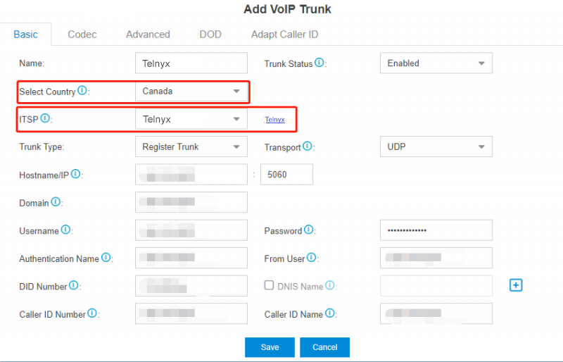
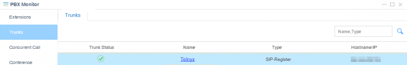

# Yeastar S-Series: Telnyx SIP

Learn how to configure both a Yeastar S-Series IP or Credentials trunk to work with your Telnyx Mission Control Portal. See Telnyx guidance and requirements.

C

[Jump to instructions](#h_4d0e45deda)

Designed for small- to mid-sized businesses, Yeastar S-Series VoIP PBX and Yeastar Cloud PBX deliver enterprise-grade communication features along with advanced UC capabilities, bringing a solid, reliable and affordable on-premises and hosted business voice solution.

There are two types of [SIP trunks](https://telnyx.com/products/sip-trunks) you can configure:

* **A VoIP Register Trunk:** Uses a credentials-based authentication
* **A VoIP Peer Trunk:** Uses an IP address and PBX port based authentication

This document covers the configuration of both a register trunk and a peer trunk.

Additional documentation:

* Admin Guide for Yeastar Cloud PBX : [Yeastar Admin Guide](https://help.yeastar.com/en/cloudpbx/topic/admin_guide.html)
* Admin Guide for Yeastar S-Series VoIP PBX : [Yeastar Admin Guide](https://help.yeastar.com/en/s-series/topic/admin_guide.html)

---

## Instructions for setting up a VoIP trunk in Yeastar

In this document, you will:

1. Add either a [register trunk](#h_c84ec4ba10) or a [peer trunk](#h_c359ed19d8)
2. [Set up outgoing calls](#h_8eb21b9e4b)
3. [Set up incoming calls](#h_f16bbd59cc)

**Video Walkthrough**

Coming soon! Check back frequently as we are updating our documentation.
​

**Pre-Requisites**

* Have an active, and properly configured, Telnyx Mission Control Portal
* Have chosen your DIDs in your Mission Control Portal
* Install Yeastar PBX and work through the first 3 sub-sections of the [Yeastar Getting Started Guide](https://help.yeastar.com/en/cloudpbx/topic/getting-started-guide.html). When you reach the **Set up VoIP trunks** section, return here and begin at step 1 below for a Telnyx-specific configuration.

## 1.1 Set up a VoIP register trunk

In this step, you'll add a peer SIP trunk in your Yeastar PBX.

|  |
| --- |
| ***Note:*** *A register trunk uses a username/password combination (credentials) to authenticate. If you are looking to set up a peer trunk (which uses a Telnyx-provided IP address to authenticate)* [click here](#h_c359ed19d8). |

1. In your Yeastar PBX (Cloud or VoIP), go to **Settings > PBX > Trunks**.
2. Click **Add Trunk**.

   
3. Set the following configurations:

   1. Go to **Settings** and expand **PBX** and go to the **Trunks** tab, click **Add**.
   2. **Name:** Enter a trunk name.
   3. **Select Country:** select *General* from the drop-down list
   4. **Trunk Type**: select *Register Trunk* from the drop-down list
   5. **Hostname/IP**: Enter the IP address or the domain of the VoIP provider (e.g.,*peer.sip.com*).
   6. **Domain**: Enter the IP address or the domain of the VoIP provider (e.g., *peer.sip.com*).
   7. **Username:** Your Telnyx username
   8. **Password:** Your Telnyx password
   9. **Authentication Name:** The authentication name used to register to Telnyx. Reach out to Telnyx support if you need to have this provided.
   10. **From User:** Your Telnyx username

   
4. If the trunk [DID number](https://telnyx.com/resources/sip-did) is different from the trunk authentication name, you will need to set the DID number.

   1. Click **Advanced** and enter the DID numbers provided by Telnyx.
   2. Select the checkbox of DNIS names and enter a DNIS name for the DID number. This will be the display name users will see on their phones.
   3. Click + to add another DID number.
5. Configure other [VoIP trunk settings](https://help.yeastar.com/en/s-series/topic/voip-trunk-settings.html#topic_pyd_f3t_2fb) as your need.
6. Click **Save** and **Apply**.
7. You can check the trunk status in **PBX Monitor**. If the trunk status shows , the trunk is ready for use.

   
8. Now set the registration time to 300. In your Yeastar PBX (Cloud or VoIP), go to **Settings** and expand **PBX** and go to the **General** tab. Then select **SIP** above **General**. and set:

   1. **Default Registration Time:** *300*

Once this configuration is complete, skip to [Step 2](#h_8eb21b9e4b).
​

[Back to Top](#h_4d0e45deda)

## 1.2. Add Peer SIP trunks in your Yeastar PBX

In this step, you'll add a peer SIP trunk in your Yeastar PBX. A peer trunk uses IP

|  |
| --- |
| ***Note:*** *A register trunk uses a username/password combination (credentials) to authenticate. If you are looking to set up a peer trunk (which uses a Telnyx-provided IP address to authenticate)* [click here](#h_c84ec4ba10). |

1. In your Yeastar PBX (Cloud or VoIP), go to **Settings > PBX > Trunks**.
2. Click **Add Trunk**.

   
3. Set the following configurations:

   1. Go to **Settings** and expand **PBX** and go to the **Trunks** tab, click **Add**.
   2. Name: Enter a trunk name.
   3. **Select Country:** select *General* from the drop-down list
   4. **Trunk Type**: select *Peer Trunk* from the drop-down list
   5. Enter the trunk information that is provided by the VoIP provider.

      * **Hostname/IP**: Enter the IP address or the domain of the VoIP provider (e.g.,*peer.sip.com*).
      * **Domain**: Enter the IP address or the domain of the VoIP provider (e.g., *peer.sip.com*).
   6. Configure other [VoIP trunk settings](https://help.yeastar.com/en/s-series/topic/voip-trunk-settings.html#topic_pyd_f3t_2fb) as your need.
   7. Click **Save** and **Apply**.

   
4. You can check the trunk status in **PBX Monitor**. If the trunk status shows , the trunk is ready for use.

   

[Back to Top](#h_4d0e45deda)

## 2. Set up outgoing calls

In this step, you will get your Yeastar PBX set up for outgoing calls. Yeastar compares the number with the pattern that you have defined in your route 1. If it matches, it will initiate the call using the selected trunks. If it does not, it will then compare the number with the pattern for route 2, and so on. The outbound route which is in a higher position will be matched firstly.

1. To make outbound calls via the newly created SIP trunk, you need to configure an outbound route for the trunk. Go to **Settings** and expand **PBX**. Click on **Call Control**
2. In the top-nav, click **Outbound** **Routes**.

   
3. Click **Add** and configure the following settings:

   1. **Route Name**: Give this outbound route a name of your choice.
   2. **Dial Patterns**: Set the dial patterns. As the settings below, to make calls via the SIP trunk, you need to precede the number to be dialed with the prefix 8.
   3. **Dial Pattern**: The number one would need to dial to place an outgoing call. In this example, the number is 8.
   4. **Strip**: 1 (This removes the number you specified in the Dial pattern from the call before placing it)
   5. **Member Extensions**: Select the extensions that are allowed to make calls through the outbound route.
   6. **Member Trunks**: Select the *Telnyx* trunk.

   

[Back to Top](#h_4d0e45deda)

## 3. Set up incoming calls

In this step, you'll get Yeastar ready to take incoming calls by configuring an inbound route for the SIP trunk.

1. Go to **Settings** and expand **PBX**. Click on **Call Control**
2. In the top-nav, click **Inbound** **Routes**.

   
3. Click **Add** and configure the following settings:

   1. **Name:** Give this inbound route a name of your choice.
   2. **Member Trunks:** Choose the Telnyx trunk.
   3. **Destination:** Select the destination where you want incoming calls routed.
4. Click **Save**, then **Apply**.

   

That's it, you've now set up your SIP trunk in Yeastar PBX and configured it to work with Telnyx.
​

[Back to Top](#h_4d0e45deda)

---

## Additional Resources

Review our [getting started guide](https://support.telnyx.com/en/articles/1176636-get-started-with-a-mission-control-account) to make sure your Telnyx Mission Control Portal account is set up correctly.

* Admin Guide for Yeastar Cloud PBX : [Yeastar Admin Guide](https://help.yeastar.com/en/cloudpbx/topic/admin_guide.html)
* Admin Guide for Yeastar S-Series VoIP PBX : [Yeastar Admin Guide](https://help.yeastar.com/en/s-series/topic/admin_guide.html)

---

Related Articles

[Configuring an Elastix 4 PBX IP Trunk](https://support.telnyx.com/en/articles/1130622-configuring-an-elastix-4-pbx-ip-trunk)[Grandstream UCM6xxx: SIP Trunks](https://support.telnyx.com/en/articles/5748258-grandstream-ucm6xxx-sip-trunks)[Xorcom PBX: SIP Trunk](https://support.telnyx.com/en/articles/5754127-xorcom-pbx-sip-trunk)[Wildix: SIP Trunk Setup](https://support.telnyx.com/en/articles/5799830-wildix-sip-trunk-setup)[How to configure Yeastar P-series](https://support.telnyx.com/en/articles/13375115-how-to-configure-yeastar-p-series)

Did this answer your question?

😞😐😃
