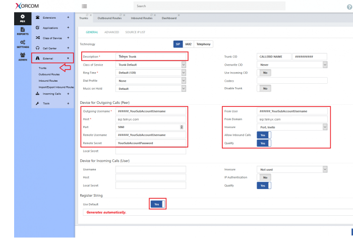
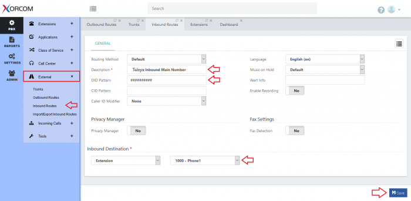

Xorcom PBX: SIP Trunk | Telnyx Help Center

[Skip to main content](#main-content)

# Xorcom PBX: SIP Trunk

Learn to set up Xorcom CompletePBX and configure SIP trunks with Telnyx's Mission Control Panel.

C

Written by Customer Success

December 14, 2023

Table of contents

[Jump to Instructions](#h_7831da969f)

Xorcom, designs and manufactures integrated business telephony solutions that support both traditional PSTN and VoIP, including IP PBX (Private Branch Exchange), Hotel Phone Systems – award-winning IP PBX (Private Branch Exchange) for Hospitality, Virtual PBX Systems, and Multi-tenant PBX.

Further documentation:

* CompletePBX 4.6 technical documentation: <https://files.xorcom.com/techdocs/pm0618-completepbx-reference-guide.pdf>   
  ​  
  Note that version 5.x is currently available, however, Xorcom is updating its product documentation and the version 5 docs are not currently available.

---

# Instructions For Configuring a Xorcom CompletePBX SIP Trunk

## In this guide, you will:

1. [Create a CompletePBX SIP trunk](#h_b030b313ef)
2. [Configure an outbound route](#h_bb7fb81679)
3. [Configure an inbound route](#h_3e8a28256d)

**Pre-Requisites**

* [Download](https://www.xorcom.com/pbx-download/) and [install](https://youtu.be/exQmoIqnYTw) CompletePBX

## 1. Create a CompletePBX SIP trunk

In this step, you'll configure your first [SIP trunk](https://telnyx.com/products/sip-trunks) in CompletePBX so you can get ready to make and receive calls.

1. From the left navigation bar, click on **PBX** > **External** then click on **Trunks** and configure the following settings:  
   ​  
   In the **Technology** section, enter the following:

   1. **Technology**: *SIP*
   2. **Description**: Enter a description for this trunk.
   3. **Trunk CID:** If you enter a CallerID Name, it must be in CAPITAL LETTERS, without any special characters (Spaces are allowed) and NOT longer than 15 characters. The Outbound CallerID Name will only work when you call a Canadian number. For the US, you will need to update your record associated with your CallerID Number, in the CNAM database, by requesting an update to our support.  
      ​  
      ​**Note:** If you would like to set your outbound Caller ID Name in the **Trunk CID** fields, it will override everything that your extension/Outbound Routes will try to pass. Enter the Trunk CID and set **Overwrite CID:** *Always*.

   In the **Device for Outgoing Calls (Peer)** section, enter the following:

   1. **Outbound Username:** Your Telnyx username
   2. **Host**: sip.telnyx.com (or, depending on your country, .ca, .au, .eu)
   3. **Port**: 5060
   4. **Remote Username**: Your Telnyx account username
   5. **Remote Secret**: Your Telnyx account password
   6. **From User**: Your Telnyx account username
   7. **From Domain**: sip.telnyx.com
   8. **Insecure**: Choose *Port, Invite* from the dropdown menu
   9. **Allow Inbound Calls**: *Yes*
   10. **Qualify**: *Yes*

   Find the **Register String** section and enter the following:

   1. **Use Default:** *Yes* The whole string will automatically be generated.

   
2. Click on the **Advanced** tab and enter the following:

   1. **Type**: *Peer*
   2. **Parameter**: *sendrpid*
   3. **Value**: *PAI*
   4. **Enabled**: *On*

   

[Back to Top](#h_7831da969f)

## 2. Configure an outbound route

In this step, you will configure an outbound calling route pattern that CompletePBX will use as a template, or set of rules, to follow for outbound calls associated with the route.

1. From the lefthand navigation, click **PBX > External.**
2. Click on **Outbound Routes** and set the following:

   In the **General** section, enter the following:

   * **Description**: A description that will help you identify the route, such as *"TLS Calling Rule".*
   * **Trunks**: Select the Telnyx trunk you just created in step 1.
   * **CID**: (Caller ID) If this is not set already in your Telnyx trunk, you can enter your company name here.  
     ​  
     If you enter a CallerID Name, it must be in CAPITAL LETTERS, without any special characters (Spaces are allowed) and NOT longer than 15 characters. The Outbound CallerID Name will only work when you call a Canadian number. For the US, you will need to update your record associated with your CallerID Number, in the CNAM database, by requesting an update to our support.
   * **Overwrite CID**: *Always* if you would like to use this CID associated with this Outbound Route. (Your trunk Overrite CID settings must be set to [NEVER] to use it)

   In the **Dial Patterns** section, enter the following:

   * **Prefix**: You may enter a prefix if needed, such as 9, if you want your extensions to dial 9 before the outgoing number. Note that the number [9] will not be sent to Telnyx.
   * **Pattern**: You can indicate multiple patterns matching for an outbound call. *E.g. for a North American number, you can use NXXNXXXXXX/1NXXNXXXXXX (N = digits between 0-9 and X = digits between 2-9).*

   

   

[Back to Top](#h_7831da969f)

## 3. Configure an inbound route

In this step, you will configure an inbound calling route pattern that CompletePBX will require in order for you to receive inbound calls from your DID. Each DID will need to be associated with an inbound route. Multiple DIDs can be associated with the same route, but any single DID can only be associated with a single route.

1. From the lefthand navigation, click **PBX > External.**

Click on **Inbound Routes** and set the following:

In the General section, enter the following:

1. **Routing Method**: *Default*
2. **Description**: Enter a description that will help you identify your inbound route
3. **DID Pattern**: Enter your [DID number](https://telnyx.com/resources/sip-did) as it excluding any dots, parentheses, etc.
4. **Inbound Destination**: Destination to route this inbound call when it is first answered.

That's it, you've now configured Xorcom CompletePBX to work with Telnyx.

[Back to Top](#h_7831da969f)

---

**Additional Resources**

Review our [getting started guide](https://support.telnyx.com/en/articles/1176636-get-started-with-a-mission-control-account) to make sure your Telnyx Mission Control Portal account is set up correctly.

* [Complete PBX technical specifications and documentation](https://files.xorcom.com/techdocs/pm0618-completepbx-reference-guide.pdf)

---

Related Articles

[Configuring an Elastix 4 PBX IP Trunk](https://support.telnyx.com/en/articles/1130622-configuring-an-elastix-4-pbx-ip-trunk)[Configuring an Elastix 4 PBX Trunk](https://support.telnyx.com/en/articles/1130654-configuring-an-elastix-4-pbx-trunk)[Grandstream UCM6xxx: SIP Trunks](https://support.telnyx.com/en/articles/5748258-grandstream-ucm6xxx-sip-trunks)[Yeastar S-Series: Telnyx SIP](https://support.telnyx.com/en/articles/5748952-yeastar-s-series-telnyx-sip)[How to configure Yeastar P-series](https://support.telnyx.com/en/articles/13375115-how-to-configure-yeastar-p-series)

Did this answer your question?

😞😐😃

Table of contents
