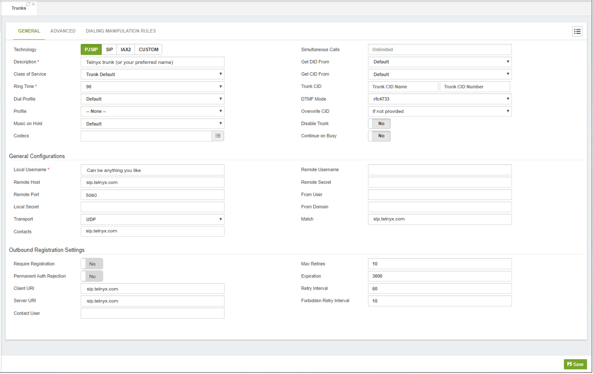
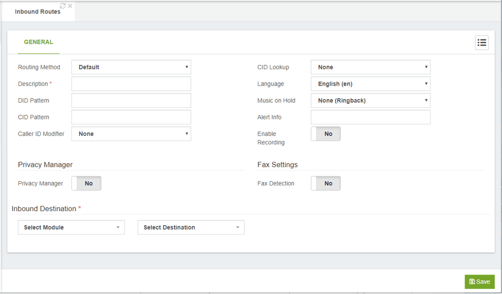

# VitalPBX: Configuring Your VitalPBX

Learn how to configure VitalPBX to work with Telnyx using either credentials (user/pass) or IP authentication. See Telnyx guidance and requirements.

C

[Jump to Instructions](#h_8338bee77a)

VitalPBX is a Unified Communications PBX System based on Asterisk. It is currently developed by Telesoft S.A (a company that has a broad experience with with both proprietary and open-source Telephone Systems, and is largely community-supported.

The goal of VitalPBX has always been to provide easy-to-use, adaptable software. Today, VitalPBX can adapt to different mobile devices (Fully Responsive Design), and with all the characteristics of an advanced telecommunications system;

VitalPBX combines the flexibility from Asterisk with concepts that have been satisfactorily used in traditional telephone systems.

There are two types of trunks you can configure in VitalPBX:

* **A credentials-based (user/pass) trunk:** Uses a credentials-based authentication
* **An IP-based trunk:** Uses an IP address and PBX port based authentication

This document covers the configuration of both a credentials-based trunk and an IP trunk.

Additional documentation:

* VitalPBX user documentation: [https://www.vitalpbx.org/manuals/](https://wiki.vitalpbx.com/)
* Here you can download VitalPBX and also check out modules that work with, and enhance, VitalPBX: [https://www.vitalpbx.org/pbx-system-download/#](https://vitalpbx.com/pbx-system-download/)

---

## Instructions for configuring VitalPBX to work with Telnyx

In this document, you will:

1. [Configure your Telnyx Mission Control Portal](#h_11a01257c9)
2. Configure VitalPBX to use either [credentials-based](#h_94f10fef8a) or [IP authentication](#h_ca7da4f2c6)
3. [Configure outbound routes](#h_b4fff0b308)
4. [Configure inbound routes](#h_d73d08d348)

**Video Walkthrough**

Coming soon! Check back frequently as we are updating our documentation.
​

**Pre-Requisites**

* Have [downloaded](https://vitalpbx.com/pbx-system-download/) and [installed](https://wiki.vitalpbx.com/wiki/installation/system-specifications/) VitalPBX
* [Complete initial configurations](https://wiki.vitalpbx.com/documentation/vitalpbx-manual/initial-configurations/) through VitalPBX, such as security settings

## 1. Configure your Telnyx Mission Control Portal

For step by step instructions on each of the requirements on the Telnyx Mission Control Portal, please follow this [guide](https://support.telnyx.com/en/articles/1176636-get-started-with-a-mission-control-account).

[Back to Top](#h_8338bee77a)

## 2.1. Configure VitalPBX to use a credentials-based (user/pass) authentication

This section will walk you through configuring PJSIP to use a credentials-based authentication (user/pass). This means you'll use a username/password combination to perform various authentication activities.

1. From the VitalPBX console, expand **External** from the left-hand menu.

   
2. From here, click on the **Trunks** tab.
3. Create a trunk with the following parameters:

   1. **Technology:** Choose *PJSIP* or *SIP*. (Telnyx *does NOT* support IAX.)
   2. **Profile:** Optional. Can be set to the *Default PJSIP Profile* for adding NAT configurations and other settings.
   3. **Codecs:** VitalPBX supports the following codecs:

      1. g729
      2. g719
      3. g722
      4. g723
      5. lpc10
      6. slin
      7. ulaw

      Of these, Telnyx supports g722, g729, ulaw.
   4. **Trunk CID**: You can use a CID number of one of your Telnyx DIDs.
   5. **Overwrite CID:** Can be set to *If not provided* in order to allow external incoming caller ID during call forwards.
   6. **Local User:** This is the name of your trunk. It can be anything of your liking.
   7. **Contacts:** *sip.telnyx.com*
   8. **Match:** *sip.telnyx.com*
   9. **Remote Username:** Main SIP username
   10. **Remote Secret:** Same password that you use for login into the portal.
   11. **Require Registration:** *Yes*
   12. **Permanent Auth Rejection:** *Yes*

   

Once you have completed this step, skip to step 3.

[Back to Top](#h_8338bee77a)

## 2.2. Configure VitalPBX to use a IP authentication

This section will walk you through configuring PJSIP to use IP authentication. This means you'll authenticate through an organization's outward facing IP addresses as a means to identify users coming from a subscribing institution and in turn authenticate access.

1. From the VitalPBX console, expand **External** from the left-hand menu.

   
2. From here, click on the **Trunks** tab.
3. Create a trunk with the following parameters:

   1. **Technology:** Choose *PJSIP* or *SIP*. (Telnyx *does NOT* support IAX.)
   2. **Profile:** Optional. Can be set to the *Default PJSIP Profile* for adding NAT configurations and other settings.
   3. **Codecs:** VitalPBX supports the following codecs:

      1. g729
      2. g719
      3. g722
      4. g723
      5. lpc10
      6. slin
      7. ulaw

      Of these, Telnyx supports g722, g729, ulaw.
   4. **Trunk CID**: You can use a CID number of one of your Telnyx DIDs.
   5. **Overwrite CID:** Can be set to *If not provided* in order to allow external incoming caller ID during call forwards.
   6. **Local User:** This is the name of your trunk. It can be anything of your liking.
   7. **Contacts:** *sip.telnyx.com*
   8. **Match:** *sip.telnyx.com*
   9. **Remote Username:** Main SIP username
   10. **Remote Secret:** Same password that you use for login into the portal.
   11. **Require Registration:** *No*
   12. **Permanent Auth Rejection:** *No*

   

[Back to Top](#h_8338bee77a)

## 3. Configure outbound routes

In order to place calls, we will need to create an outbound route pointing to the trunk we created in step 2.

This will be the outbound route configuration that will allow national and international phone calls.

1. ### **In the left-hand menu, expand Extensions and select Outbound Routes and provide the following information:**

   1. **Description:** Short description for your outbound route. The name is usually descriptive of the purpose of the route (for example, “local” or “international”).
   2. **Trunks:** The list of trunks to use with this route. Note that order matters. The trunk at the top will be given a higher priority than the ones below it.
   3. **PIN:** These PINs will be found in **PIN Lists**. These can be configured in the VitalPBX PIN dialog.
   4. **Outbound CID:** The Caller ID Number/Name that will be using on this outbound route, if you configured **Overwrite CID** in step 2, when you set up either a [credentials-based trunk](#h_94f10fef8a), or an [IP trunk](#h_ca7da4f2c6).
   5. **Overwrite CID:** Overwrites the CID sent by the Extension or module. You got the following options.

      * **No:** No overwrite will take place and the CID number is preserved.
      * **Yes:** This will overwrite any CID number sent through this route.
      * **If not Provided:** This will overwrite the CID information if no External CID is provided.
   6. **Intra-Company:** If checked, the internal caller id will be sent through this outbound route, instead of the external caller ID of the calling extension.
   7. #### Dial Patterns:

      * **Prepend:** Digits to add to a successful match.
      * **Prefix:** Prefix to remove to a successful match.
      * **Pattern:** Pattern-matching lets you create extension patterns in the dial plan that match more than one possible dialed number. You can choose between:

        + **X:** The letter X or x represents a single digit from 0 to 9.
        + **Z:** The letter Z or z represents any digit from 1 to 9.
        + **N:** The letter N or n represents a single digit from 2 to 9.
        + **.:** wildcard; this matches one or more characters.
        + **!:** wildcard; matches zero or more characters right away, without any check.
        + **[1237-9]:** matches any digit or letter in the brackets (in this example, 1,2,3,7,8,9)
        + **[a-z]:** matches any lower-case letter
        + **[A-Z]:** matches any upper-case letter
      * **CID Pattern:** if defined, calls that match with the Dial Pattern, will also need to have a matching CID number in order to place a call through this route. The CID number to take into consideration is the Internal CID not the External CID. You got the following options.

        + **X:** Represents a single digit from 0 to 9.
        + **Z:** Represents any digit from 1 to 9.
        + **N:** Represents a single digit from 2 to 9.
        + **.:** Wildcard, matches to one or more characters.
        + **!:** Wildcard, matches zero or more characters immediately.
        + **[1237-9]:** Matches any digit or letter in the brackets (in this example, 1,2,3,7,8,9)
        + **[a-z]:** Matches any lower-case letter
        + **[A-Z]:** Matches any Upper-case letter

   Be sure that the outbound routes you create allow you to dial the following types of calls:

   * **Emergency:** Dedicate a route just for this purpose. *Calls for emergency services should never be mangled by another dial pattern.*
   * **Local:** Calls to local numbers (usually *NXXXXXXXXX*).
   * **Toll-free:** Calls to toll-free numbers (such as 1-888 or 1-800 numbers)
   * **Mobiles:** Ensure that your outbound routes have been configured to handle calls to all mobile phone providers.
   * **International:** Calls outside of the country, if permitted (usually 011)
   * **Special:** Calls that do not fit any other category. This includes calls such as calls to the operator (0) and directory assistance (411)
   * **Long distance:** Calls outside of the local calling area, if permitted (usually *1NXXXXXXXXX*). Make sure that your outbound routes are designed to properly handle calls if you are using a dedicated provider for international calls.

   

|  |
| --- |
| *Note: You can also configure the pattern “4443” to perform a sound quality test, and the pattern “4747” to perform a DTMF test.* |

[Back to Top](#h_8338bee77a)

## 4. Configure inbound routes

This step will show you how to create an inbound route with your Telnyx DIDs `that will be used to receive calls.

1. ### **In the left-hand menu, expand Extensions and select Inbound Routes and provide the following information:**

   1. **Routing Method:** Either the Telephony channel for an analog port (FXO), or default for all other inbound routes like E1, T2, or SIP trunk. From version 2.3.8 onward it is possible to route a DID range to an extension number. For example, if I have the DID range from 1 (305) 6724 7100 to 1 (305) 6724 7200, it is possible to get the last four digits of the DID and route it to the corresponding extension.
   2. **Description\*:** A brief description to identify this DID. This field is used to hold a description to help you remember what this particular inbound route is for.
      ​
      Note: This field is not parsed by VitalPBX.
   3. **DID Pattern\*:** The phone number of the DID to be matched (the expected number or pattern used when you want DID-based routing.)
      ​
      Note that the [DID number](https://telnyx.com/resources/sip-did) must match the format in which the provider is sending the DID. Many providers will send the DID information with the call as +15555555555, while others will leave out the country code information and simply send 5555555555. *If the DID entered in this field does not exactly match the number sent by the provider, then the inbound route will not be used.* This field can be left blank to match calls from any DIDs (this will also match calls that have no DID information).

      * This field also allows patterns to match a range of numbers. Patterns must begin with an underscore (\_) to signify that they are patterns. Within patterns, X will match the numbers 0 through 9, and specific numbers can be matched if they are placed between square parentheses. For example, to match both 555-555-1234 and 555-555-1235, the pattern would be \_555555123[45].
   4. **CID Pattern:** CID number or CID pattern to match. This can be used when CID-based routing is preferred. As with the DID Number field, the CID entered in this field must *exactly match* the format in which the provider is sending the CID. Providers may send 7, 10, or 11 digits; they may include a country code and the plus symbol. Check with your provider to see the format in which the CID is sent, in order to ensure that this field is entered correctly.

      * The Caller ID Number field can be left blank to match with any CIDs (this will also match calls that have no CID information sent with them). The field allows Private, Blocked, Unknown, Restricted, Anonymous, and Unavailable values to be entered, as many providers will send these in the CID number data.
      * Leaving both the DID Number and Caller ID Number fields blank will create a route that matches all calls.
   5. **Caller ID Modifier:** Modify the caller ID name/number
   6. **CID Lookup:** Select a CID Lookup item to search the incoming caller number within a directory of a CRM or a cloud directory, or other and set the correct CID Name.
   7. **Language:** Specifies the language setting to be used for this route, forcing all prompts specific to the route to be played in the selected language, provided that the language is installed and voice prompts for the specified language exist on your server. This field is not required. If left blank, prompts will be played in the default language of the VitalPBX server.
   8. **Music on Hold:** Select the music-on-hold for this route. Whenever a caller accessing this route is placed on hold, they will hear the music on hold defined in the class you've selected. This is often used for companies that use their music on hold to advertise services, or that accept calls in multiple different languages.
   9. **Alert Info:** Set a distinct ring for that inbound route. There is no set standard for telling a SIP phone to ring with a distinctive ringtone. Many SIP handsets do support custom ringing, but the exact method of specifying them varies from one model to another. (In many cases this is done by sending a SIP\_ALERT\_INFO header, but even the usage of this header is not consistent.)
   10. **Enable Recording:** Enable call recording on this route.
2. ### **Find the Privacy Manager section and configure the following settings:**

   1. **Privacy Manager:** Used to enable or disable the VitalPBX privacy manager functionality. When *enabled*, incoming calls that arrive without an associated caller ID number will be prompted to enter their telephone number. Callers will be given a number of attempts (as defined in the **Max attempts** field, below) to enter this information before their call is disconnected.
3. ### **Find the Fax Settings section and configure the following settings:**

   1. **Fax Detection:** Determines whether faxes should be detected on this route. If fax detection is enabled, additional parameters can be configured, and a dropdown will appear which is used to select the extension to which the inbound faxes will be directed. Typically, this extension is a DAHDI extension that has a physical fax machine plugged into it. However, it may also be a virtual extension that will be answered by VitalPBX. The program will accept faxes and turn them into digital documents for review.

      1. If fax detection is disabled, fax detection will not be used for calls on this route. Any fax calls will be handled just like voice calls.

#### Find the Destination\* section and configure the following settings:

* **Select Module:** Choose which module should be activated.
* **Select Destination:** Call target where the module should be routed

That's it, you've now completed the configuration of your VitalPBX and can now make and receive calls by using Telnyx as the SIP provider.
​

[Back to Top](#h_8338bee77a)

---

## Additional Resources

Review our [getting started guide](https://support.telnyx.com/en/articles/1176636-get-started-with-a-mission-control-account) to make sure your Telnyx Mission Control Portal account is set up correctly.

Check out the [VitalPBX user guide](https://wiki.vitalpbx.com/wiki-category/vitalpbx/).

---

Related Articles

[FreePBX Trunk Settings With Telnyx](https://support.telnyx.com/en/articles/1130620-freepbx-trunk-settings-with-telnyx)[FreePBX V14: IP Trunk - ChanSIP](https://support.telnyx.com/en/articles/3284736-freepbx-v14-ip-trunk-chansip)[FreePBX V14: Credentials - ChanSIP](https://support.telnyx.com/en/articles/3284752-freepbx-v14-credentials-chansip)[FreePBX V15: IP Trunk - PJSIP](https://support.telnyx.com/en/articles/5619595-freepbx-v15-ip-trunk-pjsip)[How to configure Yeastar P-series](https://support.telnyx.com/en/articles/13375115-how-to-configure-yeastar-p-series)

Did this answer your question?

😞😐😃
