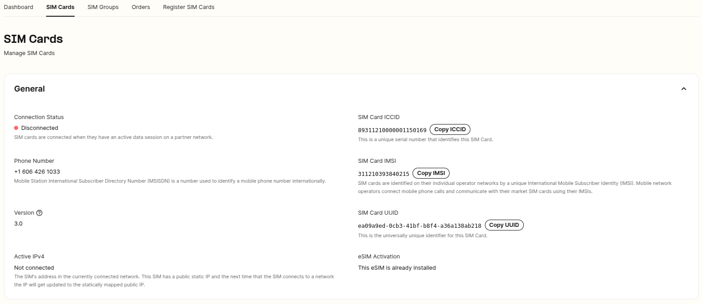
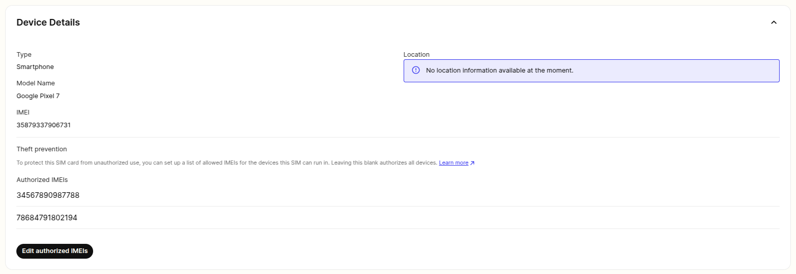

SIM Card Theft Prevention | Telnyx Help Center

[Skip to main content](#main-content)

# SIM Card Theft Prevention

Secure your SIM fleet with Telnyx. Add authorized IMEIs and get alerts for unauthorized access, ensuring your SIMs remain safe.

Written by Telnyx Engineering

December 30, 2024

Table of contents

# SIM Card Theft Prevention

Add up to 5 authorized IMEIs to the SIMs in your SIM fleet so as to ensure that they can only be used by your authorized devices. You can now rest easy in the knowledge that your SIMs in the field will not be hijacked by bad actors.

An [IMEI (International Mobile Equipment Identity) number](https://en.wikipedia.org/wiki/International_Mobile_Equipment_Identity) is a unique identifier for a mobile device. To configure Telnyx SIM cards to auto-disable when an unauthorized IMEI is recognized in the SIM Card drill down section.

## Handling Unauthorized IMEIs and SIM Card Authorization

Please allow up to 5 minutes before SIM cards get disabled due to unauthorized IMEIs. Once an unauthorized IMEI is recognized an email is dispatched to your account to let you know.

If no authorized IMEIs are added to SIM cards, all devices will be considered authorized. This is the default configuration for SIM cards.

---

Related Articles

[How to set up a Telnyx SIM Card](https://support.telnyx.com/en/articles/3269600-how-to-set-up-a-telnyx-sim-card)[SIM Setup and Configuration](https://support.telnyx.com/en/articles/4298710-sim-setup-and-configuration)[SIM Connectivity Logs](https://support.telnyx.com/en/articles/5666594-sim-connectivity-logs)[SIM Card Location and Device Details](https://support.telnyx.com/en/articles/5812302-sim-card-location-and-device-details)[SIM Card Actions](https://support.telnyx.com/en/articles/5812328-sim-card-actions)

Did this answer your question?

😞😐😃

Table of contents
