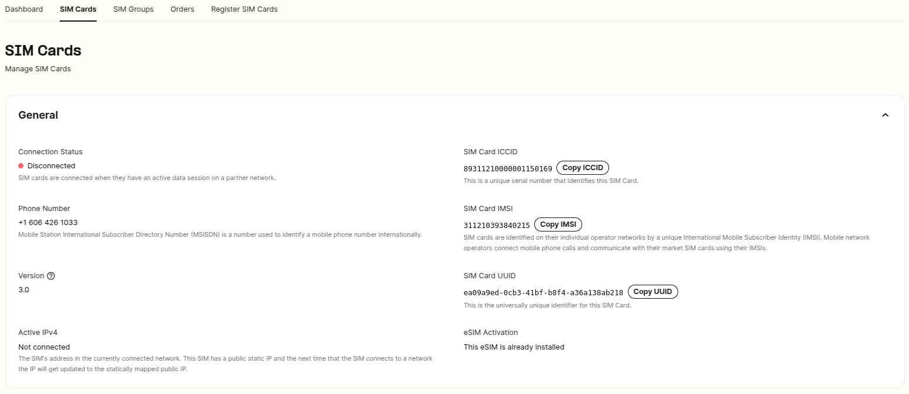
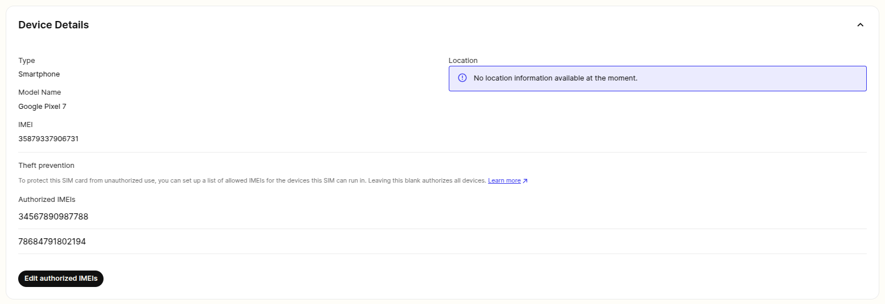

# SIM Card Theft Prevention

Secure your SIM fleet with Telnyx. See Telnyx guidance and requirements Learn more about SIM Card Theft Prevention with Telnyx.

## SIM Card Theft Prevention

Add up to 5 authorized IMEIs to the SIMs in your SIM fleet so as to ensure that they can only be used by your authorized devices. You can now rest easy in the knowledge that your SIMs in the field will not be hijacked by bad actors.

An [IMEI (International Mobile Equipment Identity) number](https://en.wikipedia.org/wiki/International_Mobile_Equipment_Identity) is a unique identifier for a mobile device. To configure Telnyx SIM cards to auto-disable when an unauthorized IMEI is recognized in the SIM Card drill down section.

## Handling Unauthorized IMEIs and SIM Card Authorization

Please allow up to 5 minutes before SIM cards get disabled due to unauthorized IMEIs. Once an unauthorized IMEI is recognized an email is dispatched to your account to let you know.

If no authorized IMEIs are added to SIM cards, all devices will be considered authorized. This is the default configuration for SIM cards.
