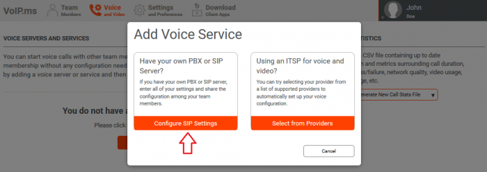
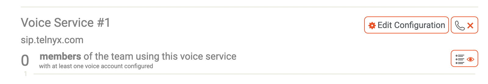
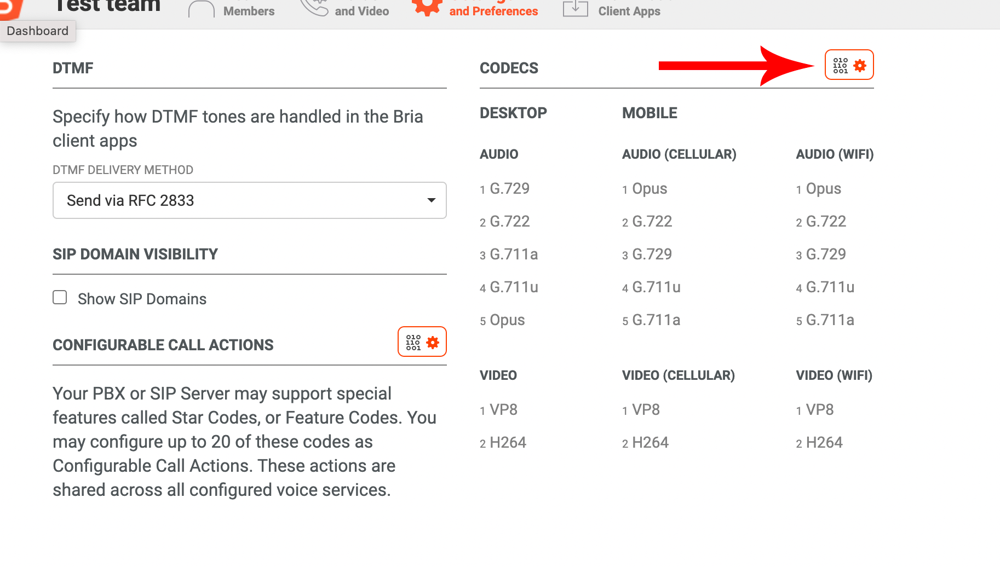
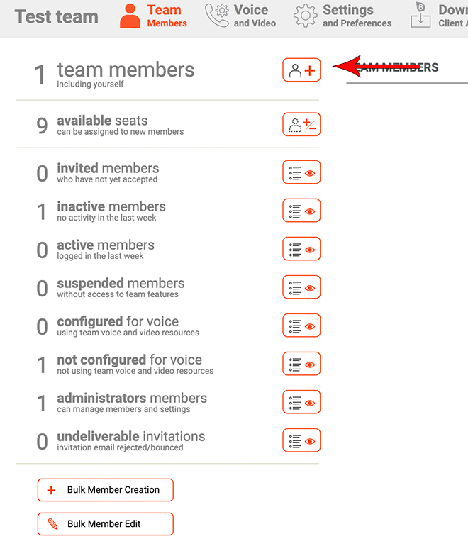
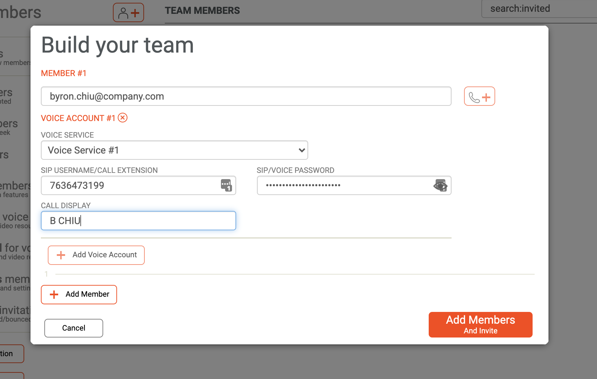

CounterPath Bria Teams: Setup | Telnyx Help Center

[Skip to main content](#main-content)

# CounterPath Bria Teams: Setup

Elevate team connectivity with Bria Teams and Telnyx. This tutorial covers everything from linking accounts to configuring dial plans.

C

Written by Customer Success

January 10, 2024

Table of contents

[Jump to Instructions](#h_246be6708b)

Bria Teams is a powerful and secure team-communication solution in which the team can connect via voice, messaging, online presence and screen share, using any or all of their devices while still streamlined into one application. Every tool you might need to keep your teams connected can be managed by one easy-to-use dashboard.

Additional documentation:

* [Bria Portal user documentation](https://docs.counterpath.com/docs/PortalUG/Resources/TitlePages/TeamsTitlePage.htm) (you can find your operating system from here)
* [Bria Solo user documentation](https://docs.counterpath.com/docs/PortalUG/clients/UserGuides/Desktop/quickStart/quickStartSolo.htm?Highlight=bria%20solo)
* [Bria Teams user documentation](https://docs.counterpath.com/docs/PortalUG/Resources/TitlePages/TeamsTitlePage.htm)
* [Counterpath support](https://support.counterpath.com/hc/en-us)

---

# Instructions for integrating your Bria Portal with Telnyx

In this document, you will:

1. [Link your Bria Teams account with Telnyx](#h_d1f4708790)
2. [(OPTIONAL) Configure security and encryption settings](#h_917bf7c44c)
3. [Configure a dial plan](#h_59017d026b)
4. [Configure audio and video codecs](#h_97fd196198)
5. [Link a team member to a SIP account profile](#h_28a0f9bd97)

|  |
| --- |
| ***Note:*** *Each team member added to Bria Teams will need a sub account, which you can set up in your Bria Teams dashboard at any time. However, for this example, we'll just use a team with one member for clarity.* |

**Pre-requisites and system requirements**

* Make sure your [Telnyx Mission Control Portal is set up properly](https://support.telnyx.com/en/articles/1176636-get-started-with-a-mission-control-account)
* *Minimum* OS requirements:

  + Windows 10
  + Mac 10.13
  + Android 5.0
  + iOS 11
* Download and install the Bria Desktop client or Bria Mobile client

**Video Walkthrough**

Setting up your Telnyx SIP portal account so you can make and receive calls:

|  |
| --- |
| ***Note:*** *Video walkthrough for Auth0/Telnyx configuration coming soon. Check back as we update our docs.* |

## 1. Link your Bria Portal with Telnyx

In this step, you'll add Telnyx to your Bria Teams client through your Bria Teams portal.

1. From the Bria Portal, click **Voice and Video** in the top navigation.
2. Click on either

   1. 
   2. 
3. The Add Service screen will give you two options. Currently, Telnyx is not on the pre-configured list of providers, so you'll need to add it manually. To add Telnyx, click on **Configure SIP Settings**.

   
4. The **New Voice Configuration** screen will appear. Here you will add server details that will apply to every entity (such as people or SIP connections) that you will add to your portal in the future. Fill in the following:

   1. **Service Label**: Only for your own purposes, for easy association
   2. **Domain**: *sip.telnyx.com*
   3. **Port**: *5060*
   4. **Register with domain and receive calls**: [CHECKED]
   5. **Transport**: *Automatic*
   6. **Keep Alive**: *Enabled*
   7. **Voicemail**: Voicemail Number: *\*97*
   8. **Service Options**: [CHECKED] This voice service requires an authorization username for each voice account.
   9. **Firewall Method:** *Stun* (This is optional, but you can use this if you want to specify it)
   10. **Firewall Server URL:** *stun.telnyx.com:3478*
   11. **Username:** Telnyx firewall username (Reach out to support for more information)
   12. **Password:** Telnyx firewall password (Reach out to support for more information)

   
5. Click **Save And Close**.

   1. Unless you have already configured voice accounts, in which case, click **Assign Voice Accounts From this configuration to team members** and skip to section x.
6. You can test your setup from your Bria Portal client on your computer or mobile device. On the computer, click the arrow beside **Auto Select**. On mobile, go to Bria **Settings** > **Accounts**. You should see both accounts with a green icon.

[Back to Top](#h_246be6708b)

## 2. (OPTIONAL) Configure security and encryption settings

This section is optional, but you will want to follow it if you want to encrypt call traffic. If you're not sure, or want to know more about the benefits of encrypting traffic, contact support for more information.

1. If you haven't already, you'll need to adjust your SIP settings to support TLS encryption. To do this, go to the Bria Portal, click **Voice and Video** in the top navigation.
2. Find the voice service you want to encrypt and click the **Edit Configuration** button.

   
3. Make the following changes:

   1. **Port:** *5061*
   2. **Transport:** *TLS*
   3. **SRTP:** *Enabled*
   4. **Register with Domain and Receive Calls:** [checked]

   

[Back to Top](#h_246be6708b)

## 3. Configure a dial plan

In this step, you will configure a dial plan in Bria Portal. For example, you may want to configure your system to require all outgoing callers to dial 9 before dialing out.

(add a concept article or tooltip explaining dial plan - should contain something like...

{a dial plan can be used to modify how your calls are placed. For example, a dial plan can change any number that starts with “+1613” to “613”. A dial plan is used for any combination of the following reasons:

* To modify (transform) the input (the number to be dialed), such as to add the “9” required to obtain an outside line from a PBX.
* To select the account to use to place a call, if users have more than one account. For example, to use Account 1 to dial a number starting with 61, and use Account 2 to dial a number starting with 64.}

Bria has [their own dial plan syntax](https://docs.counterpath.com/docs/PortalUG/clients/UserGuides/Desktop/calls/deskDialPlan.htm).

[Back to Top](#h_246be6708b)

## 4. Configuring audio and video codecs

In this step, you will configure your audio and video codecs and even set them in order of preference. This configuration will apply to all the custom SIP accounts you configured in step 1.

1. Open your Bria Portal client or the Bria Portal web app and click **Settings and Preferences** in the top navigation.

   
2. Click the **Configure** **Codecs** button to open the Codec Settings page.
3. In the **Codecs** section, click the gear icon.

   
4. On this screen, you can choose, and prioritize, the codecs you'll use for audio and video. Note that the following codecs are supported by Telnyx:

   1. ulaw(g711u)
   2. alaw(g711a)
   3. g722
   4. g729

   

[Back to Top](#h_246be6708b)

## 5. Link a team member to an account and SIP profile

In this section, you'll learn how to associate a team member with the SIP profile you added in step 1.

1. Click on the **Team Members** tab in the top navigation menu.

   

   ​
2. If you have already added team members and are familiar with this step, skip to step 4. Otherwise, from the left-hand navigation, click the button next to **team members**.

   
3. Enter the email address of the new team member. Their invite will be sent here. If you want to assign them to a SIP profile, click the phone button next to the email field and go on to step 4. Otherwise, click **Add Members And Invite** if you are finished. You can also add additional team members with the **+ Add Member** button.

   
4. To assign a team member to a SIP profile, you'll need to provide the following:

   1. **VOICE SERVICE:** If you have multiple voice services, you can select the one you wish to assign to your new team member. If you only have one voice service set up, the wizard will default to this.
   2. **SIP USERNAME/CALL EXTENSION**: The team member's Telnyx username
   3. **SIP/VOICE PASSWORD**: The team member's Telnyx password
   4. **CALL DISPLAY**: Is your Outbound Caller ID Name. *(**Note**: We suggest entering it in capital letters, and no longer than 15 characters, without special characters such as dots, commas or apostrophe.)*

   

   Some additional considerations for your call display name:

   1. Call ID name should be in CAPITAL LETTERS. This is easier to read on some devices.
   2. No special characters will be displayed. Don't use them.
   3. Max 15 characters
   4. Spaces are allowed

When you create a new member with his email address, they will receive a link in order to download and install the softphone. Then they will need to follow the instructions. A new password will need to be created by them using the email address that you used to create the member.

That's it, you've now linked Bria Teams to Telnyx and your fellow teammates to Telnyx!

[Back to Top](#h_246be6708b)

---

## Additional Resources

Review our [getting started guide](https://support.telnyx.com/en/articles/1176636-get-started-with-a-mission-control-account) to make sure your Telnyx Mission Control Portal account is set up correctly.

Additionally, check out:

* [Bria Portal user documentation](https://docs.counterpath.com/docs/PortalUG/Resources/TitlePages/TeamsTitlePage.htm) (you can find your operating system from here)
* [Bria Solo user documentation](https://docs.counterpath.com/docs/PortalUG/clients/UserGuides/Desktop/quickStart/quickStartSolo.htm?Highlight=bria%20solo)
* [Bria Teams user documentation](https://docs.counterpath.com/docs/PortalUG/Resources/TitlePages/TeamsTitlePage.htm)
* [Counterpath support](https://support.counterpath.com/hc/en-us)

---

Related Articles

[Configuring a Cisco CUBE/CUCM IP Trunk](https://support.telnyx.com/en/articles/1130606-configuring-a-cisco-cube-cucm-ip-trunk)[Configuring Bria Solo (a.k.a X-Lite)](https://support.telnyx.com/en/articles/1130645-configuring-bria-solo-a-k-a-x-lite)[Configuring a Cisco CME Credentials Trunk](https://support.telnyx.com/en/articles/1130668-configuring-a-cisco-cme-credentials-trunk)[Configuring a Cisco CUBE/CUCM SIP Trunk](https://support.telnyx.com/en/articles/1130673-configuring-a-cisco-cube-cucm-sip-trunk)[Grandstream GXP: Telnyx Setup](https://support.telnyx.com/en/articles/5815720-grandstream-gxp-telnyx-setup)

Did this answer your question?

😞😐😃

Table of contents
