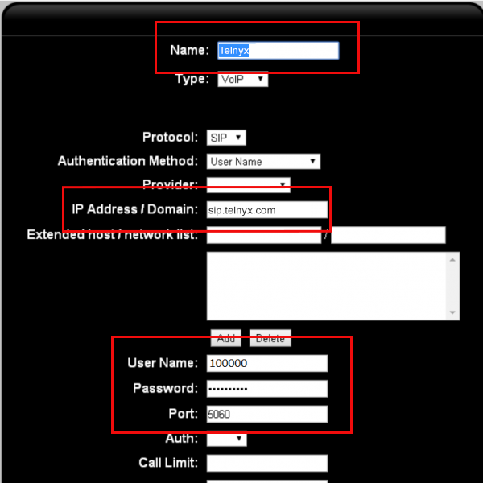
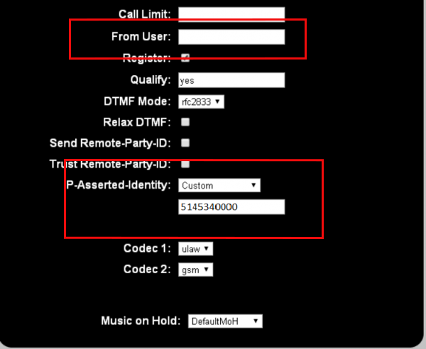

Positron IP PBX | Telnyx Help Center

[Skip to main content](#main-content)

# Positron IP PBX

Learn how to configure your Positron IP PBX to make and receive outgoing and incoming calls using Telnyx.

C

Written by Customer Success

January 10, 2024

Table of contents

[Jump to Instructions](#h_1a18b00218)

Positron IP PBX Solutions offers small and medium sized businesses powerful VoIP phone systems that combine voice and data into one easy-to-use device. These features, which were traditionally only available to large companies, allow you to be more efficient and productive at any size.

Additional documentation and resources:

* Positron G-Series PBX Installation Guide
* Positron G-Series PBX Administrator's Guide
* Positron customer support

|  |
| --- |
| ***A Note on available vendor documentation:*** *Positron PBX currently does not provide current documentation to non-partners. The guides in this list are quite dated (2013), but may be useful. If you are still looking for something additional to read, we encourage you to find a user-support group from places such as stack exchange or reddit. And of course contact Telnyx support if you want our help directly.* |

---

# Instructions for configuring Positron IP PBX to work with Telnyx

In this activity you will:

1. [Configure your Positron PBX](#h_afd9fd981d)
2. [Configure outbound rules](#h_ea3dd43fa6)
3. [Configure inbound rules](#h_2ce87f1e41)

**Pre-requisites**

* [Configure your Telnyx Mission Control Portal](https://support.telnyx.com/en/articles/1176636-get-started-with-a-mission-control-account)

  + Set [DTMF](https://support.telnyx.com/en/articles/1130710-what-is-dtmf) mode to Auto in your portal
  + Ensure that you make note of your account username and password, and server (sip.telnyx.com) as you will need these during configuration.
* [Provision a DID from Telnyx](https://support.telnyx.com/en/articles/3562148-requesting-numbers)

**Video Walkthrough**

Coming soon! Please check frequently as we are updating our docs.

## 1. Configure your Positron PBX

In this step, you'll configure your PBX to connect to your Telnyx account.

1. Log into your Positron PBX portal.
2. Go to **PBX > Trunks/Lines > Trunks/Lines.**
3. Click **Add**.
4. Provide the following:

   1. **Name:** Give it a name that makes sense to you. We called ours *Telnyx*.
   2. **IP Address/Domain:** *sip.telnyx.com*
   3. **Username:** Your Telnyx SIP account username (The 100000 is just a dummy value)
   4. **Password:** Your Telnyx SIP account password
   5. **Port:** *5060*

   
5. Click **Save**.
6. Click **Edit** on the trunk you just created. You'll see you now have additional settings you can configure:

   1. **From User:** remove the username from this field
   2. **P-Asserted-Identity:** Select *Custom* and in the text field beneath this, enter your DID you provisioned as part of your [pre-requisite](#h_99673b75b0) activities.

   
7. Click **Save**.
8. Click **Apply**. You should now be able to apply the trunk in the VoIP section of the status screen.

[Back to Top](#h_1a18b00218)

## 2. Configure outbound rules

In this step, you will configure rules that will manage your outgoing calls. These rules will control things such as long distance calling, call patterns (i.e.: 10 digit dialing), and the line groups that various types of outgoing calls are using.

1. From the Positron PBX portal, go to **PBX > Trunks/Lines > Outgoing Line Groups**.
2. Create a new group.
3. Find your trunk in the dropdown. (This will be the name of the trunk you just created in step 1)
4. Once this is created, go to **PBX > Call Handling > Outgoing Call Rules**.
5. From here, you can choose the ruleset your extensions will be using.

|  |
| --- |
| ***Note:*** *It's a good idea to create a few rules to test patterns you plan to use, to ensure that the outgoing line group you created is using them correctly and as expected.* |

[Back to Top](#h_1a18b00218)

## 3. Configure inbound rules

In this step, you will configure rules that will manage incoming calls, such as where incoming callers are routed first.

1. From the Positron PBX portal, go to **PBX > Trunks/Lines > Incoming Call Rules**.
2. Create a new group.
3. Link the new group to your trunk using the checkboxes.
4. Once you have finished creating the group, click **Edit**.
5. Find the **DID** field and enter the DID you provisioned as part of your [pre-requisite](#h_99673b75b0) activities.
6. Choose the **Extension** (*IVR, ring group,* or *simple extension*). This is the destination where incoming calls should be routed.

|  |
| --- |
| ***Note:*** *If you have another SIP trunk through another provider, make sure you go to **PBX > PBX Settings > SIP** in your Positron PBX portal and set your **SIP Registration Timer** to a minimum of 600.* |

That's it! Your Positron PBX will now work with Telnyx to allow you to make/receive outbound and inbound calls.

[Back to Top](#h_1a18b00218)

---

## Additional Resources

Review our [getting started with guide](https://support.telnyx.com/en/articles/1176636-get-started-with-a-mission-control-account) to make sure your Telnyx Mission Control Portal account is setup correctly!

And in case you missed it, check out:

* Positron G-Series PBX Installation Guide
* Positron G-Series PBX Administrator's Guide
* Positron customer support

|  |
| --- |
| ***A Note on available vendor documentation:*** *Positron PBX currently does not provide current documentation to non-partners. The guides in this list are quite dated (2013), but may be useful. If you are still looking for something additional to read, we encourage you to find a user-support group from places such as stack exchange or reddit. And of course contact Telnyx support if you want our help directly.* |

---

Related Articles

[Configuring an Elastix 4 PBX IP Trunk](https://support.telnyx.com/en/articles/1130622-configuring-an-elastix-4-pbx-ip-trunk)[How to configure a Thirdlane PBX](https://support.telnyx.com/en/articles/1130631-how-to-configure-a-thirdlane-pbx)[Configuring an Elastix 4 PBX Trunk](https://support.telnyx.com/en/articles/1130654-configuring-an-elastix-4-pbx-trunk)[Epygi IP PBX: Telnyx Setup](https://support.telnyx.com/en/articles/5728748-epygi-ip-pbx-telnyx-setup)[ScopTEL IP PBX](https://support.telnyx.com/en/articles/5803103-scoptel-ip-pbx)

Did this answer your question?

😞😐😃

Table of contents
