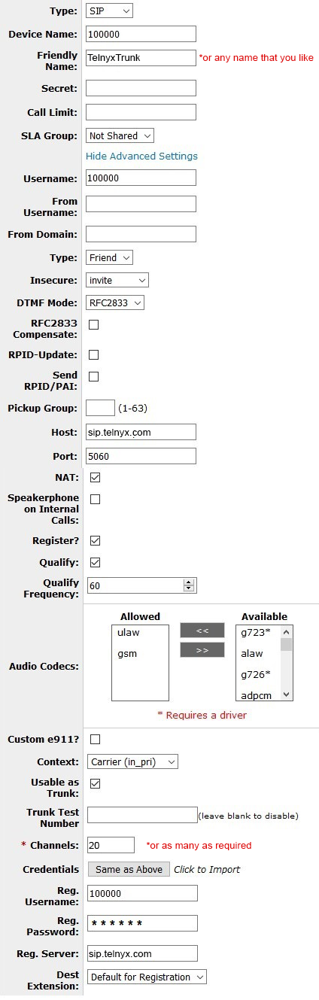

# PhoneSuite Voiceware

Learn how to configure a SIP trunk in PhoneSuite's Voiceware suite and connect it to Telnyx. See Telnyx guidance and requirements.

C

[Jump to Instructions](#h_5b8010f066)

[PhoneSuite](https://phonesuite.com/) offers hospitality communications specifically designed for the hospitality industry (Hotel managers and owners). Offering solutions such as Cloud PBX [Voiceware](https://phonesuite.com/products/), [Voiceware Express](https://phonesuite.com/voiceware-hotel-phone-system/)/[Voiceware Express +](https://phonesuite.com/voiceware-hotel-phone-system/) and Voiceware Series 2 and On-Premise solution are reliable, simple-to-implement and cost-effective.

Voiceware, which we will demonstrate in this document, is PhoneSuite's software VoIP IP-PBX phone system and was designed with the hospitality industry, and its communication needs, in mind. It is extremely scalable and flexible, and its software base means that there is no need for expensive equipment or firmware upgrades.

|  |
| --- |
| ***Note:*** *Very little PhoneSuite documentation exists externally. You can [contact PhoneSuite](https://phonesuite.com/lets-get-started/) directly for more questions, or reach out to Telnyx support for live help.* |

---

## Instructions for configuring PhoneSuite Voiceware to work with Telnyx

In this activity you will:

1. [Configure your PBX](#h_93bffdbd12)

**Pre-requisites**

* Ensure that your [Telnyx Mission Command Portal is configured properly](https://support.telnyx.com/en/articles/1176636-get-started-with-a-mission-control-account)
* [Provision a DID from Telnyx](https://portal.telnyx.com/#/app/numbers/search-numbers) ([How do I do this?](https://support.telnyx.com/en/articles/3562148-requesting-numbers))

**Video walkthroughs**

Setting up your Telnyx Mission Control Portal so you can make/receive call:

The PhoneSuite SIP trunking stress test: Is SIP the right solution for your hotel?

## 1. Configure your PBX

1. Open your PhoneSuite PBX Voiceware portal and click on the **Advanced** tab and ensure that:

   1. **DTMF Mode:** *Auto*
      ​
      If it is not, you can set this in your Telnyx Mission Control Portal.

   
2. Create a new SIP trunk in your portal and provide the following information:

   1. **Type:** *SIP*
   2. **Device Name:** Your device name
   3. **Friendly Name:** Choose something that makes sense to you, such as *TelnyxTrunk*.
   4. **Secret:** Your Telnyx password
   5. **Username:** Your Telnyx account number
   6. **Insecure:** *Invite*
   7. **Host:** *sip.telnyx.com*
   8. **Port:** *5060*
   9. **NAT:** Check this box
   10. **Register?:** Check this box
   11. **Audio Codecs:** Select the Telnyx-supported [audio codecs](https://telnyx.com/resources/codecs-affect-voip-sound-quality) you want to use from the following and move from **Available** to **Allowed**:

       1. ulaw(g711u)
       2. alaw(g711a)
       3. g722
       4. g729
   12. **Usable as Trunk:** Check this box
   13. **Channels:** A channel is a line for a single call on your SIP trunk. If you want to make multiple simultaneous calls, you'll a SIP channel for each one. Learn more [here](https://telnyx.com/resources/what-is-sip-trunk-channel).
   14. **Credentials:** Select *Same as Above*, as each channel (phone line) will probably need its own credential.
   15. **Reg. Username:** Your account number (Same as the device name)
   16. **Reg. Server:** *sip.telnyx.com*

   

That's it! You've now configured a SIP trunk in PhoneSuite Voiceware and connected it to Telnyx.

[Back to Top](#h_5b8010f066)

---

## Additional Resources

#### Review our [getting started guide](https://support.telnyx.com/en/articles/1176636-get-started-with-a-mission-control-account) to make sure your Telnyx Mission Control Portal account is set up correctly.

Additionally, check out:

* [PhoneSuite inquiries](https://phonesuite.com/lets-get-started/)

---

Related Articles

[Grandstream UCM6xxx: SIP Trunks](https://support.telnyx.com/en/articles/5748258-grandstream-ucm6xxx-sip-trunks)[Wildix: SIP Trunk Setup](https://support.telnyx.com/en/articles/5799830-wildix-sip-trunk-setup)[ScopTEL IP PBX](https://support.telnyx.com/en/articles/5803103-scoptel-ip-pbx)[Grandstream GXV3370](https://support.telnyx.com/en/articles/6187576-grandstream-gxv3370)[Fanvil H2U: Compact IP](https://support.telnyx.com/en/articles/6202755-fanvil-h2u-compact-ip)

Did this answer your question?

😞😐😃
