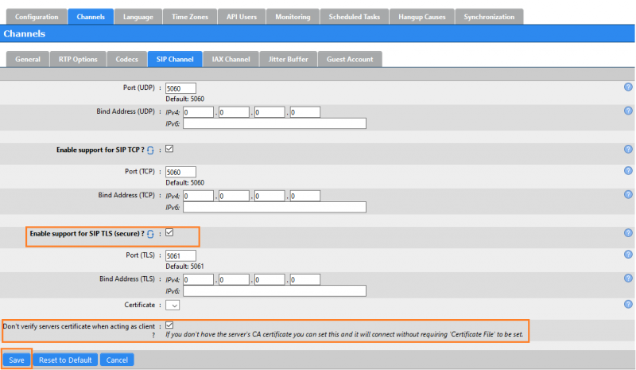
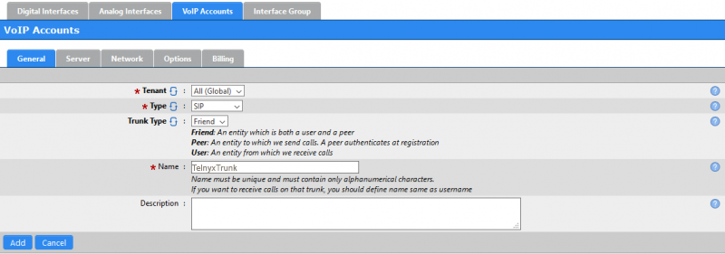
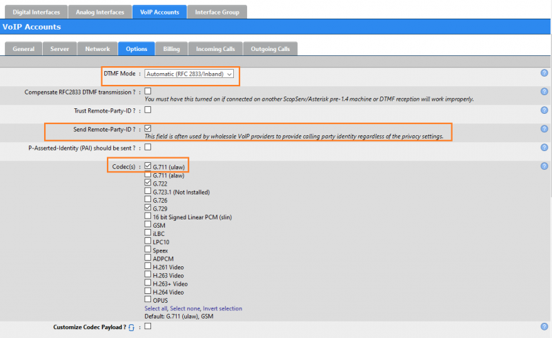

ScopTEL IP PBX | Telnyx Help Center

[Skip to main content](#main-content)

# ScopTEL IP PBX

Integrate ScopServ's ScopTEL IP PBX with Telnyx. Dive into steps for SIP channel configuration, trunk creation, and inbound rule setup.

C

Written by Customer Success

January 10, 2024

Table of contents

[Jump to Instructions](#h_77062ad51b)

[ScopTEL](https://www.scopserv.com/en/) is a comprehensive all-in-one IP PBX solution and call manager. Reliable and scalable, ScopTEL IP PBX provides complete multi-tenant platform as well as a unified communications system and a Call Contact Center.

ScopTEL IP PBX software suite is full virtual and supports all major OS platforms, including virtual machines. Additionally, it provides text and graphic reports that can be configured to analyze historical or real-time data regarding servers, phone extensions and call lines. ScopTEL IP PBX also offers a multilingual GUI (graphical user interface) in a user-friendly web portal for users.

Additional documentation:

* [ScopServ IP PBX user guides](http://www.scopserv.us/support/documentation/)
* [ScopServ API](https://help.shipserv.com/en/articles/5480733-api)
* [ScopServ trainings](https://www.shipserv.com/category/technical-training/11984)

---

# Instructions for configuring ScopTel IP PBX to work with Telnyx

In this activity you will:

1. [Configure your SIP channel](#h_8f17c7685e)
2. (RECOMMENDED) [Configure SIP TLS/SRTP to encrypt call traffic](#h_643cd5372d)
3. [Create a new SIP trunk](#h_7c728a87b0)
4. [Create inbound rules](#h_2a7bf6626f)

**Pre-requisites**

* Ensure that your [Telnyx Mission Command Portal is configured properly](https://support.telnyx.com/en/articles/1176636-get-started-with-a-mission-control-account)
* [Provision a DID from Telnyx](https://portal.telnyx.com/#/app/numbers/search-numbers) ([How do I do this?](https://support.telnyx.com/en/articles/3562148-requesting-numbers))
* You must have a valid copy of the ScopTEL software. You can start [here](https://www.scopserv.com/en/) for a free trial, or learn more about full versions [here](https://www.scopserv.com/en/).
* Minimum software release scopserv-telephony25-6.9.1.6.20191218-1
* There are [additional pre-requisites](https://service.scopserv.com/portal/en/home) if you are planning to enable SRTP voice encryption

  + You'll also need to activate SIP traffic encryption on your Telnyx Mission Control Portal

**Video walkthrough(s)**

Setting up your Telnyx Mission Control Panel so you can make/receive calls:

|  |
| --- |
| ***Note:*** *Video walkthrough for ScopTEL IP PBX/Telnyx configuration coming soon. Check back as we update our docs.* |

## 1. Configure your SIP channel

In preparation to create your [SIP trunk](https://telnyx.com/products/sip-trunks), you may need to modify two settings, depending on your needs.

1. From your ScopTEL portal, click on **Configuration** in the top navigation to open the **Telephony Settings: Channels** section.
2. From the **Telephony Settings: Channels** section, click the **Channels** tab.
3. In the **Channels** section, click on the **SIP Channel** tab.

   
4. We're going to edit some of these settings. Click **Edit** at the bottom of this page.
5. In the editor, find the **Miscellaneous** section and edit the following:

   1. **Enable Session Progress and In-Band Audio**: This is used for Asterisk Early Audio with SIP channels. Configure as needed.
   2. **Enable Premature Media?:** Enabling this option will prevent your SIP channel from automatically initiating early media if it receives audio from the incoming channel before there has been a progress indication. Configure as needed.

   
6. Click **Save**.

[Back to Top](#h_77062ad51b)

## 2. (RECOMMENDED) Configure SIP TLS/SRTP to encrypt call traffic

In this activity, you'll set up encryption for voice traffic over SIP TLS/SRTP.

|  |
| --- |
| ***Note:*** *If you don't want to configure your trunk to use TLS and encrypt call traffic, jump to [step 3](#h_7c728a87b0).* |

|  |
| --- |
| ***IMPORTANT:*** *In order to complete this step, you'll need to make sure you've activated SIP traffic encryption on your Telnyx Mission Control Portal per your* [pre-requisite activities](#h_c6a1784efc). |

1. From your ScopTEL portal, click on **Configuration** in the top navigation to open the **Telephony Settings: Channels** section.
2. From here, click on the **SIP Channel** tab and provide the following information:

   1. **Enable support for SIP TLS (secure)?:** Check this box
   2. **Don't verify servers certificate when acting as client?:** Check this box.

   
3. Click **Save**.

[Back to Top](#h_77062ad51b)

## 3. Create a new SIP trunk

In this activity, we're going to create your first SIP trunk through ScopTEL.

1. From your ScopTEL portal, click on **Interfaces** in the top navigation to open the **Interfaces Manager**.
2. From the Interfaces Manager, click the **VoIP Accounts** tab.
3. On the right of this section, click **Add a new VoIP Account** to open the VoIP accounts configuration utility.
4. Click on the **General** tab and provide the following information:

   1. **Type:** *SIP*
   2. **Trunk Type:** *Friend*
   3. **Name:** This is your choice. It must be unique and contain ONLY alphanumeric characters. If you want to receive calls on this trunk, you should define the name to be the same as the username. We just chose the generic *TelnyxTrunk* as an example.

   
5. Now click on the **Server** tab and provide the following information:

   1. **Username:** Your Telnyx account/sub-account username
   2. **Password:** Your Telnyx account/sub-account password
   3. **Host:** *sip.telnyx.com*
   4. **Port:** *5060*
   5. **Register as User Agent:** Check this box
   6. **Enable TLS registration:** (OPTIONAL) If you completed [step 2](#h_643cd5372d), check this box. Otherwise, leave it unchecked.
   7. **Contact Extension:** Your Telnyx account/sub-account username

   
6. Next, click on the **Network** tab and provide the following information:

   1. **Transport mode:** Choose *UDP*, *TCP*, or both UNLESS you have created a SIP trunk with TLS. In this case, only check *TLS*.
   2. **Insecure:** Check the box next to *Invite*.

   
7. And finally, click on the **Options** tab and provide the following information:

   1. **DTMF Mode:** *Automatic* (Will use RFC 2833)
   2. **Send Remote-Party-ID:** Check this box
   3. **Codecs:** Select any Telnyx-supported audio and video codecs:  
      ​  
      Supported [audio codecs](https://telnyx.com/resources/codecs-affect-voip-sound-quality):

      1. ulaw(g711u)
      2. alaw(g711a)
      3. g722
      4. g729  
         ​

      Supported video codecs:

      1. H264
   4. **Disallowed Methods:** Check the box next to *UPDATE*.

   
8. Click **Add**.

[Back to Top](#h_77062ad51b)

## 4. Create inbound rules

In this activity, you'll set inbound rules which will allow you to receive incoming calls from your Telnyx DIDs that you provisioned as part of your [pre-requisite activities](#h_c6a1784efc).

1. To create an incoming line, Click **Lines** in the top-navigation.
2. In the **Lines Manager: Incoming Lines** sub-section, click on the **Incoming Lines** tab.
3. Click on the **Add a new Incoming Line** on the right to open the **Incoming Lines** form.
4. Click on the **General** tab and provide the following information:

   1. **Extension (DNIS):** Your Telnyx [DID number](https://telnyx.com/resources/sip-did) that you provisioned as part of your [pre-requisite activities](#h_c6a1784efc).
   2. **Trunk:** Use the dropdown menu to select the trunk you just created.

   
5. Click **Add**.

That's it! You've now configured a trunk to work between ScopTEL IP PBX and Telnyx!

[Back to Top](#h_77062ad51b)

---

## Additional Resources

Review our [getting started guide](https://support.telnyx.com/en/articles/1176636-get-started-with-a-mission-control-account) to make sure your Telnyx Mission Control Portal account is set up correctly.

Additionally, check out:

* [ScopServ IP PBX user guides](http://www.scopserv.us/support/documentation/)
* [ScopServ API](https://help.shipserv.com/en/articles/5480733-api)
* [ScopServ trainings](https://www.shipserv.com/category/technical-training/11984)

---

Related Articles

[Configuring an Elastix 4 PBX IP Trunk](https://support.telnyx.com/en/articles/1130622-configuring-an-elastix-4-pbx-ip-trunk)[How to configure a Thirdlane PBX](https://support.telnyx.com/en/articles/1130631-how-to-configure-a-thirdlane-pbx)[Configuring an Elastix 4 PBX Trunk](https://support.telnyx.com/en/articles/1130654-configuring-an-elastix-4-pbx-trunk)[Positron IP PBX](https://support.telnyx.com/en/articles/5790910-positron-ip-pbx)[Fanvil X-Series: IP Phone](https://support.telnyx.com/en/articles/6209971-fanvil-x-series-ip-phone)

Did this answer your question?

😞😐😃

Table of contents
