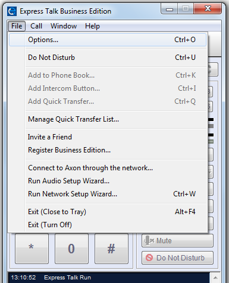

# NCH Express Talk

Learn how to set up your NCH Express Talk with Telnyx for seamless VoIP communication. See Telnyx guidance and requirements.

C

[Jump to Instructions](#h_566ee5892a)

NCH's Express Talk is a VoIP softphone that allows you to make calls from your PC or Mac instead of requiring the use of external/traditional handsets. Express Talk works with almost any VoIP SIP gateway provider and offers common VoIP features such as conferencing, call recording, caller ID display, and voice commands, and allows you to configure up to 6 distinct lines, making it most ideal for small businesses or enterprise offices that are on the smaller side. Additionally, it integrates with Microsoft Address Book and includes a phone book with a quick dial configuration. It even can be used with USB phones, headsets, microphones, webcams, and USB phones.

|  |
| --- |
| ***Note:*** *There is a free trial version, however it is available for non-commercial use only.* |

Additional documentation:

* Download Express Talk for [Windows](https://www.nch.com.au/components/talksetup.exe) or [Mac](https://www.nch.com.au/components/talkmaci.zip)
* [Express Talk SDK](https://www.nch.com.au/talk/sdk.html)
* [Express Talk technical support](https://www.nch.com.au/talk/support.html)
* [Pricing and purchasing](https://secure.nch.com.au/cgi-bin/register.exe?software=talk)

---

## Instructions for configuring Express Talk to work with Telnyx

In this activity you will:

1. [Configure Express Talk](#h_af40e1f0fc)

**Pre-requisites and other requirements**

**System requirements:**

* Windows XP/Vista/7/8/8.1/10/11
* Works on **Mac OS X** 10.5 - 10.14
* A soundcard

**Telnyx-side pre-requisites:**

* [Configure your SIP channel](https://support.telnyx.com/en/articles/5803103-scoptel-ip-pbx#h_8f17c7685e)
* (RECOMMENDED) [Configure SIP TLS/SRTP to encrypt call traffic](https://support.telnyx.com/en/articles/5803103-scoptel-ip-pbx#h_643cd5372d)

**Video walkthrough(s)**

Setting up your Telnyx Mission Control Panel so you can make/receive calls:

|  |
| --- |
| ***Note:*** *Video walkthrough for Express Talk/Telnyx configuration coming soon. Check back as we update our docs.* |

## 1. Configure Express Talk

In this step, you'll configure your Express Talk softphone to work with your Telnyx Mission Control Portal.

1. From your computer, run the Express Talk softphone.

   
2. Open the **File** menu and select **Options**.

   
3. Click on the **Lines** tab and provide the following information:

   1. **Full "Friendly" display name:** The display name of your choice (Your own name, for example, or your business name, or role)
   2. **Server (SIP Proxy or Virtual PBX):** *sip.telnyx.com*
   3. **SIP Number (or Username):** Your Telnyx SIP account ID
   4. **Password:** Your Telnyx SIP account password

   

That's it! Your Express Talk softphone is now ready to make and receive calls with Telnyx.

[Back to Top](#h_566ee5892a)

---

## Additional resources

Review our [getting started guide](https://support.telnyx.com/en/articles/1176636-get-started-with-a-mission-control-account) to make sure your Telnyx Mission Control Portal account is set up correctly.

Additionally, check out:

* Download Express Talk for [Windows](https://www.nch.com.au/components/talksetup.exe) or [Mac](https://www.nch.com.au/components/talkmaci.zip)
* [Express Talk SDK](https://www.nch.com.au/talk/sdk.html)
* [Express Talk technical support](https://www.nch.com.au/talk/support.html)
* [Pricing and purchasing](https://secure.nch.com.au/cgi-bin/register.exe?software=talk)

---

Related Articles

[Configuring Bria Solo (a.k.a X-Lite)](https://support.telnyx.com/en/articles/1130645-configuring-bria-solo-a-k-a-x-lite)[Configuring an Asterisk Credentials Trunk](https://support.telnyx.com/en/articles/1130676-configuring-an-asterisk-credentials-trunk)[Ubiquiti Trunk: Unifi Talk - Auth](https://support.telnyx.com/en/articles/6122586-ubiquiti-trunk-unifi-talk-auth)[MicroSIP: Setup with Telnyx](https://support.telnyx.com/en/articles/6133145-microsip-setup-with-telnyx)[Ubiquiti Trunk: Unifi Talk - IP Auth](https://support.telnyx.com/en/articles/6303467-ubiquiti-trunk-unifi-talk-ip-auth)

Did this answer your question?

😞😐😃
