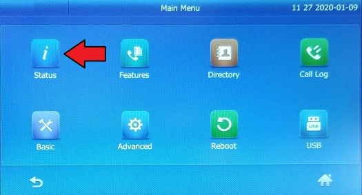
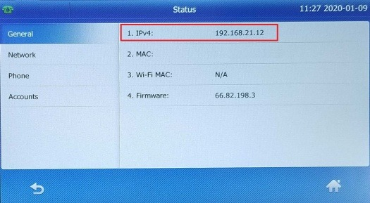
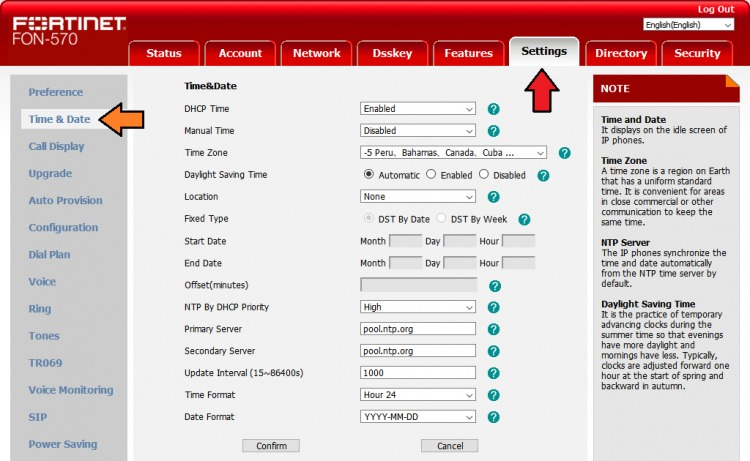

FortiFone FON-570 | Telnyx Help Center

[Skip to main content](#main-content)

# FortiFone FON-570

Master the setup and configuration of your FortiFone FON-570. Our detailed guide walks you through each step.

C

Written by Customer Success

January 10, 2024

Table of contents

[Jump to Instructions](#h_85ab341b29)

[FortiFone](https://www.fortinet.com/products/business-phone-systems/fortivoice-fortifone/phones-softclients) is equipped with high-definition audio and reliable performance, enabling efficient and clear conversations. It offers a range of selection from entry-level phones to executive-level phones that offer a variety of features, with programmable line and extension appearances. The FortiFone FON-570 is one of the top-line models and boasts a large 7" color screen for easy configuration and use. Additionally, enjoy 7 dedicated feature keys, 109 programmable phone keys, full-duplex speakerphone, 2 10/100/1000 ethernet ports, and integrated PoE (Power over Ethernet) support.

Additional documentation:

* [FortiFONE documentation](https://www.fortinet.com/search?q=fortifone)
* [Fortinet support](https://www.fortinet.com/support/contact)

---

# Instructions for setting up and configuring the FortiFone FON 570

In this activity you will:

1. [Get your device's IP address](#h_2a7d29498d)
2. [Set up your FortiFone for traffic flow](#h_16d047806e)

**Pre-requisites:**

* Ensure that your [Telnyx Mission Command Portal is configured properly](https://support.telnyx.com/en/articles/1176636-get-started-with-a-mission-control-account)
* RECOMMENDED: [Enable TLS to encrypt your traffic](https://support.telnyx.com/en/articles/1130711-does-telnyx-encrypt-communication)

**Video Walkthrough**

Setting up your Telnyx SIP portal account so you can make and receive calls:

|  |
| --- |
| ***Note:*** *Video walkthrough for FortiFone FON-570/Telnyx configuration coming soon. Check back as we update our docs.* |

## 1. Get your device's IP address

In this step, you'll obtain the IP address from your FortiFone, which you'll need to log into the web portal in the next step.

1. From your FortiFone device, press the **OK** button on the phone, or the **Menu** button on the screen.
2. Click on the **Status** button on-screen.

   
3. You should find your phone's IP address on the **Status** page.

   

[Back to Top](#h_85ab341b29)

## 2. Set up your FortiFone for traffic flow

In this step, you will set up your device and register it with Telnyx.

1. From your computer, open a web browser and enter the IP address of your device that you obtained in [Step 1](#h_2a7d29498d) into your address bar. Prepend with *http://*
2. Log into your device. The first time logging in, you'll use the default credentials (Don't forget to change them after!)

   1. **Username:** *admin*
   2. **Password:** *23646*

   
3. To register your device with Telnyx, click on the **Account** tab at the top of the page and select **Register** in the left-hand navigation. Enter or confirm the following settings on this page:

   1. **Line Active:** *Enabled* (if you want to use the line)
   2. **Label:** Give this a name that can help you recognize the account
   3. **Display Name:** This is your caller ID. You can choose whatever you like, but keep in mind the following naming conventions:

      1. Caller ID Name should be in capital letters. This will appears more clearly/visible on some devices.
      2. You must NOT use any special characters, as they will not be displayed. Spaces are allowed.
      3. Some of regular Canadian providers will not show more than 15 characters. We suggest shrinking or adapt your caller ID.
   4. **Register Name:** Your Telnyx SIP account username
   5. **User Name:** Your Telnyx SIP account username
   6. **Password:** Your Telnyx SIP account password
   7. **Server Host:** *sip.telnyx.com*
   8. **Port:** If you are using UDP transport, use port *5060*. If you are using TLS transport, use port *5061.*
   9. **Transport:** By default, *UDP* is selected. If you enabled TLS and your account is configured to use SRTP encryption as part of your [pre-requisite activities](#h_6edc08d8c8) then you should choose *TLS.*
   10. **Server Expires:** *300*
   11. **Server Retry Counts:** Keep at *3* (should be default)

   
4. This step is OPTIONAL, but is required if you've [planned to encrypt traffic](#h_6edc08d8c8). If you are using UDP transport and not encrypting traffic, continue to the next step. Click on **Advanced** in the left-hand navigation and set the following:

   1. **RTP Encryption (SRTP):** *Compulsory*

   
5. Now you will change the date/time settings. Click on the **Settings** tab at the top of the page and click **Date and Time** in the left-hand navigation and provide the following information:

   1. **Time Synchronized via DHCP**: *Yes*
   2. **Time zone**: Select your time zone by using the drop-down.
   3. **Location**: Select location you are in for daylight saving.
   4. **Primary Server**: *pool.ntp.org* *(*optional*)*  
      ​  
      ​

      The pool.ntp.org project is a virtual cluster of timeservers providing reliable easy to use NTP service.The project is maintained and developed by Ask Bjørn Hansen and a great group of contributors on the mailing lists.  
      ​
   5. **Time Format**: Choose how you want your time displayed (12 hour or 24 hour)
   6. **Date Format**: Choose the format you want to use for date display

   
6. Click **Confirm**.

That's it! You've finished configuring your FortiFone FON-570 profile, and can now start testing calls!

[Back to Top](#h_85ab341b29)

---

## Additional Resources

Review our [getting started with guide](https://support.telnyx.com/en/articles/1176636-get-started-with-a-mission-control-account) to make sure your Telnyx Mission Control Portal account is setup correctly!

Additionally, check out:

* [FortiFONE documentation](https://www.fortinet.com/search?q=fortifone)
* [Fortinet support](https://www.fortinet.com/support/contact)

---

Related Articles

[Algo 8xxx: Telnyx Endpoints](https://support.telnyx.com/en/articles/5790092-algo-8xxx-telnyx-endpoints)[FortiFone Setup: FON-375/175/H25](https://support.telnyx.com/en/articles/5811545-fortifone-setup-fon-375-175-h25)[Panasonic KX-HDV: Telnyx setup](https://support.telnyx.com/en/articles/5814406-panasonic-kx-hdv-telnyx-setup)[Gigaset A510: Telnyx Setup](https://support.telnyx.com/en/articles/5815209-gigaset-a510-telnyx-setup)[MicroSIP: Setup with Telnyx](https://support.telnyx.com/en/articles/6133145-microsip-setup-with-telnyx)

Did this answer your question?

😞😐😃

Table of contents
