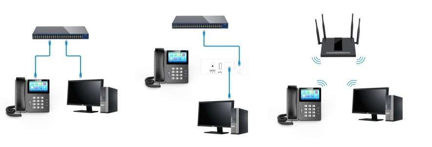
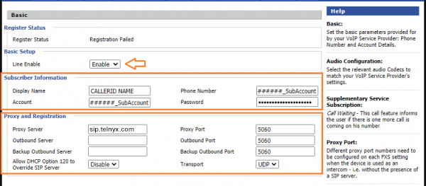
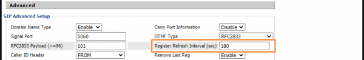
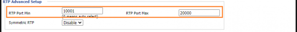
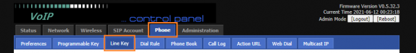

Flyingvoice: Telnyx Setup | Telnyx Help Center

[Skip to main content](#main-content)

# Flyingvoice: Telnyx Setup

Learn how to set up and configure your Flyingvoice IP phone to work with Telnyx

C

Written by Customer Success

February 1, 2024

Table of contents

[Jump to Instructions](#h_afd494eb76)

[Flyingvoice](https://www.flyingvoice.com/) is a device and VoIP CPE solution provider. They offer a full range of VoIP products, such as VoIP phones, ATAs, gateways and routers for businesses and consumers. Flyingvoice's WiFI IP phones offer a wireless option, eliminating the requirement for a hard-wired internet connection in order to make/receive calls.

This guide will cover setup for [the entire range of Flyingvoice IP phones](https://www.flyingvoice.com/products.html).

**Additional resources:**

* [Flyingvoice documentation, firmware, and other product detail](https://www.flyingvoice.com/download.html)
* [Flyingvoice training videos](https://www.flyingvoice.com/training.html)
* [Flyingvoice FAQs](https://www.flyingvoice.com/Faq/index.html) (includes support link)

---

# Instructions for setting up and configuring a Flyingvoice IP phone

In this activity you will:

1. [Physically connect your phone to a network](#h_6c89e7656f)
2. [Get your device's IP and log into the web portal](#h_52bcf1f6af)
3. [Set up your Flyingvoice phone for traffic flow](#h_47a0298737)
4. (OPTIONAL) [Set the multiple line button](#h_248ee299b8)
5. (OPTIONAL) [Set up a SIP trunk from your phone](#h_1fe842898b)

**Pre-requisites:**

* Ensure that your [Telnyx Mission Command Portal is configured properly](https://support.telnyx.com/en/articles/1176636-get-started-with-a-mission-control-account)

  + Make sure to configure an extension (sub-account)
* RECOMMENDED: [Enable TLS to encrypt your traffic](https://support.telnyx.com/en/articles/1130711-does-telnyx-encrypt-communication)

**Video Walkthrough**

Setting up your Telnyx SIP portal account so you can make and receive calls:

Setting up a link to a provider from your Flyingvoice device:

|  |
| --- |
| ***Note:*** *This Flyingvoice video shows configuration with 3CX PBX, so you will need to adapt this workflow for Telnyx.* |

## 1. Physically connect your phone to a network

In this step, you'll learn about how to physically connect your phone to a network. You'll want to connect your phone to the same network as the computer you will use to configure it.

Here is the network topology you'll need to follow:

## 2. Get your device's IP address and log into the phone's web portal

In this step, you'll obtain the IP address from your phone's IP address, which you'll need to log into the web portal in the next step.

1. Turn on the phone. You'll see a welcome message on the LCD screen as it initializes. Lights on the phone will flash, that's just fine. The phone will initialize the network before loading the OS.
2. After this initial sequence, the phone will display the date and time, as well as the IP address of the phone. Take note of this, as you'll need it next.
3. Open a web browser on a computer on the same network and enter the IP address you just obtained in step 2 into the address bar. Prepend it with *http://*
4. To log into the Flyingvoice web portal for the first time, use the default credentials (Don't forget to change them after you're in!)

   1. **Username:** *admin*
   2. **Password:** *admin*

   

[Back to Top](#h_afd494eb76)

## 2. Set up your Flyingvoice phone for traffic flow

In this step, you will set up your device and register it with Telnyx.

1. Click on the **SIP Account** tab at the top of the page.
2. Click on the **Line 1** sub-tab below and configure the following information:

   1. **Line Enable:** Enable
   2. **Display Name:** This is your caller ID. You can choose whatever you like, but keep in mind the following naming conventions:

      1. Caller ID Name should be in capital letters. This will appears more clearly/visible on some devices.
      2. You must NOT use any special characters, as they will not be displayed. Spaces are allowed.
      3. Some of regular Canadian providers will not show more than 15 characters. We suggest shrinking or adapt your caller ID.
   3. **Phone Number:** Your Telnyx username
   4. **Account:** Your Telnyx username
   5. **Password:** Your Telnyx password
   6. **Proxy Server:** *sip.telnyx.com*
   7. **Proxy Port:** If you are using UDP transport, use port *5060*. If you are using TLS transport, use port *5061.*
   8. **Transport:** By default, *UDP* is selected. If you enabled TLS and your account is configured to use SRTP encryption as part of your [pre-requisite activities](https://support.telnyx.com/en/articles/5810226-fortifone-fon-570#h_6edc08d8c8) then you should choose *TLS.*

      
   9. **Voice Mailbox Numbers:** *\*97*

      
   10. **Register Refresh Interval (sec):** *180*

       
   11. **RTP Port Min:** *100001*
   12. **RTP Port Max:** *200000*

       
3. Click **Save & Apply**.

[Back to Top](#h_afd494eb76)

## 3. (OPTIONAL) **Set the Multiple Line button**

In this section, you will set up the button types you would like (i.e.: Line, BLF, Speed Dial etc.) This lets you set buttons on your phone and associate them with your Line 1 account.

1. Click on the **Phone** tab at the top of the page.
2. Click on the **Line Key** sub-tab below.

   
3. If you want to associate multiple buttons for your Line 1 account, locate your LineKey number in the **Dsskey** table and provide the following:

   1. **Type:** Select *Line*
   2. **Line:** select *Line 1* (The SIP account we created in [step 2](#h_47a0298737)).
   3. **Label**: This is the Label of your button: it could be *L1* or *Line1* or your extension number.

   
4. Click **Save**.

[Back to Top](#h_afd494eb76)

## 4. (OPTIONAL) Set up your SIP trunk from your phone

If you prefer, you can configure your [SIP trunk](https://telnyx.com/products/sip-trunks) right from your device instead of logging into the web portal.

1. From your phone's screen, navigate to **Menu > Advanced.**
2. You'll need a password to continue. The default password is *admin*.
3. Continue to **Accounts > Line 1.**
4. On this screen, enable **Registration**.
5. Enter the following information:
6. **Phone Number:** Your Telnyx username
7. **Account:**
8. **Password:**

   1. **Display Name:** This is your caller ID. You can choose whatever you like, but keep in mind the following naming conventions:

      1. Caller ID Name should be in capital letters. This will appears more clearly/visible on some devices.
      2. You must NOT use any special characters, as they will not be displayed. Spaces are allowed.
      3. Some of regular Canadian providers will not show more than 15 characters. We suggest shrinking or adapt your caller ID.
   2. **Register Name:** Your Telnyx username
   3. **User Name:** Your Telnyx username
   4. **Password:** Your Telnyx password
   5. **SIP Server:** *sip.telnyx.com*
   6. **SIP Port:** If you are using UDP transport, use port *5060*. If you are using TLS transport, use port *5061.*

      

      
9. Press **OK**.

That's it! You've finished configuring your Flyingvoice IP Phone, and can now start testing calls!

[Back to Top](#h_afd494eb76)

---

## Additional Resources

Review our [getting started with guide](https://support.telnyx.com/en/articles/1176636-get-started-with-a-mission-control-account) to make sure your Telnyx Mission Control Portal account is setup correctly!

Additionally, check out:

* [Flyingvoice documentation, firmware, and other product detail](https://www.flyingvoice.com/download.html)
* [Flyingvoice training videos](https://www.flyingvoice.com/training.html)
* [Flyingvoice FAQs](https://www.flyingvoice.com/Faq/index.html) (includes support link)

---

Related Articles

[Gigaset A510: Telnyx Setup](https://support.telnyx.com/en/articles/5815209-gigaset-a510-telnyx-setup)[Snom C520: Telnyx Setup](https://support.telnyx.com/en/articles/5815678-snom-c520-telnyx-setup)[Grandstream GXP: Telnyx Setup](https://support.telnyx.com/en/articles/5815720-grandstream-gxp-telnyx-setup)[Audiocodes 400HD](https://support.telnyx.com/en/articles/5819923-audiocodes-400hd)[Fanvil A32i: Telnyx Setup](https://support.telnyx.com/en/articles/6056428-fanvil-a32i-telnyx-setup)

Did this answer your question?

😞😐😃

Table of contents
