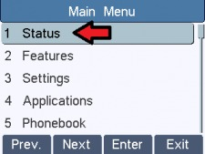
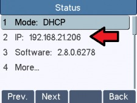
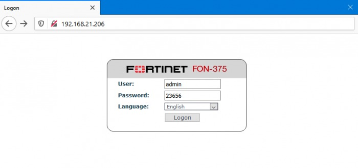

FortiFone Setup: FON-375/175/H25 | Telnyx Help Center

[Skip to main content](#main-content)

# FortiFone Setup: FON-375/175/H25

Learn how to set up and configure a FortiFone FON-375, FON-175 or FON-H25 IP phone with Telnyx

C

Written by Customer Success

January 10, 2024

Table of contents

[Jump to Instructions](#h_aff9fe9001)

[FortiFone](https://www.fortinet.com/products/business-phone-systems/fortivoice-fortifone/phones-softclients) is equipped with high-definition audio and reliable performance, enabling efficient and clear conversations. It offers a range of selection from entry-level phones to executive-level phones that offer a variety of features, with programmable line and extension appearances. The FortiFone FON-570 is one of the top-line models and boasts a large 7" color screen for easy configuration and use. Additionally, enjoy 7 dedicated feature keys, 109 programmable phone keys, full-duplex speakerphone, 2 10/100/1000 ethernet ports, and integrated PoE (Power over Ethernet) support.

|  |
| --- |
| ***Note:*** *This document also supports configuration of the FortiFone FON-175 and FortiFone FON-H25. If either of these is the device you're using, you can follow this document.* |

Additional documentation:

* [FortiFONE documentation](https://www.fortinet.com/search?q=fortifone)
* [Fortinet support](https://www.fortinet.com/support/contact)

---

# Instructions for setting up and configuring the FortiFone FON 570

In this activity you will:

1. [Get your device's IP address](#h_40df07ca02)
2. [Set up your FortiFone for traffic flow](#h_a62ac1b7a8)

**Pre-requisites:**

* Ensure that your [Telnyx Mission Command Portal is configured properly](https://support.telnyx.com/en/articles/1176636-get-started-with-a-mission-control-account)
* RECOMMENDED: [Enable TLS to encrypt your traffic](https://support.telnyx.com/en/articles/1130711-does-telnyx-encrypt-communication)

**Video Walkthrough**

Setting up your Telnyx SIP portal account so you can make and receive calls:

|  |
| --- |
| ***Note:*** *Video walkthrough for FortiFone FON-570/Telnyx configuration coming soon. Check back as we update our docs.* |

## 1. Get your device's IP address

In this step, you'll obtain the IP address from your FortiFone, which you'll need to log into the web portal in the next step.

1. From your phone, tap the **Menu** button on your LCD screen and select **Status** to see your IP address. Take note of this.  
   ​  
   The menu button:

   

   Status:

   

   IP address:

   

[Back to Top](#h_aff9fe9001)

## 2. Set up your FortiFone for traffic flow

In this step, you will set up your device and register it with Telnyx.

1. From your computer, open a web browser and enter the IP address of your device that you obtained in [Step 1](https://support.telnyx.com/en/articles/5810226-fortifone-fon-570#h_2a7d29498d) into your address bar. Prepend with *http://*
2. Log into your device. The first time logging in, you'll use the default credentials (Don't forget to change them after!)

   1. **Username:** *admin*
   2. **Password:** *23656*

      
3. To register your device with Telnyx, click on **Line** in the left-hand menu and select the **SIP** tab at the top of the page. Find the **Line** section and enter the following:

   1. **Username:** This is your SIP main or sub account username.
   2. **Display Name:** This is your caller ID. You can choose whatever you like, but keep in mind the following naming conventions:

      1. Caller ID Name should be in capital letters. This will appears more clearly/visible on some devices.
      2. You must NOT use any special characters, as they will not be displayed. Spaces are allowed.
      3. Some of regular Canadian providers will not show more than 15 characters. We suggest shrinking or adapt your caller ID.
   3. **Authentication Name:** This is your SIP main or sub account username.
   4. **Authentication Password:** This is your SIP main or sub account password.
   5. **Server Name:** *sip.telnyx.com*
   6. **Register Address:** *sip.telnyx.com*
   7. **Register Port:** If you are using UDP transport, use port *5060*. If you are using TLS transport, use port *5061.*
   8. **Activate:** Check this to activate

   
4. Scroll to the **Advanced** section on this tab and enter the following information:

   1. **Transportation Protocol:** By default, *UDP* is selected. If you enabled TLS and your account is configured to use SRTP encryption as part of your [pre-requisite activities](https://support.telnyx.com/en/articles/5810226-fortifone-fon-570#h_6edc08d8c8) then you should choose *TLS.*
5. This step is OPTIONAL, but is required if you've [planned to encrypt traffic](https://support.telnyx.com/en/articles/5810226-fortifone-fon-570#h_6edc08d8c8). If you are using UDP transport and not encrypting traffic, continue to the next step.   
   ​  
   Still in the **Advanced** section:

   1. **Transportation Protocol:** *TCP*
   2. **RTP Encryption:** Check this box

   

That's it! You've finished configuring your FortiFone FON-375 profile, and can now start testing calls!

[Back to Top](#h_aff9fe9001)

---

## Additional Resources

Review our [getting started with guide](https://support.telnyx.com/en/articles/1176636-get-started-with-a-mission-control-account) to make sure your Telnyx Mission Control Portal account is setup correctly!

Additionally, check out:

* [FortiFONE documentation](https://www.fortinet.com/search?q=fortifone)
* [Fortinet support](https://www.fortinet.com/support/contact)

---

Related Articles

[Flyingvoice: Telnyx Setup](https://support.telnyx.com/en/articles/5810663-flyingvoice-telnyx-setup)[Panasonic KX-HDV: Telnyx setup](https://support.telnyx.com/en/articles/5814406-panasonic-kx-hdv-telnyx-setup)[Gigaset A510: Telnyx Setup](https://support.telnyx.com/en/articles/5815209-gigaset-a510-telnyx-setup)[Snom C520: Telnyx Setup](https://support.telnyx.com/en/articles/5815678-snom-c520-telnyx-setup)[Fanvil H5: Hotel IP](https://support.telnyx.com/en/articles/6203401-fanvil-h5-hotel-ip)

Did this answer your question?

😞😐😃

Table of contents
