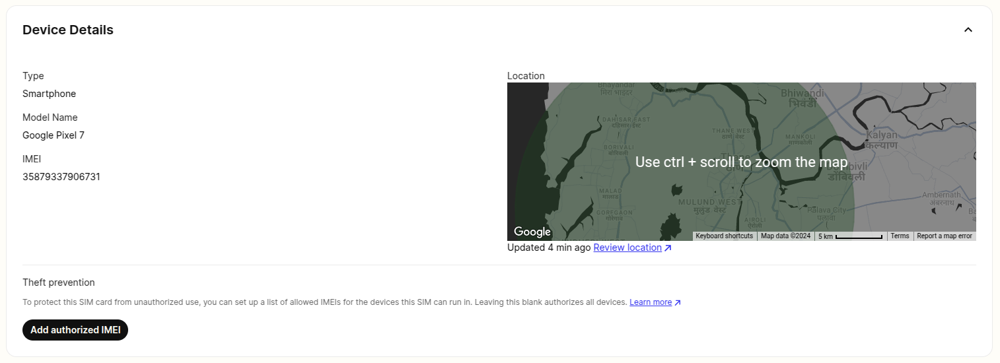

SIM Card Location and Device Details | Telnyx Help Center

[Skip to main content](#main-content)

# SIM Card Location and Device Details

How to view your SIM card's estimated location in the Mission Control Portal and API. Understand the significance of cell tower connections.

Written by David

April 30, 2026

Table of contents

# Location Information

An estimate of your SIM card location can be viewed both in the Mission Control Portal and API. This information can be found in the portal by drilling into a SIM card in the [SIM cards view](https://portal.telnyx.com/#/wireless/sim-cards). The location information is acquired based on the location of the cell tower to which the SIM is connected to. An estimate of the location in which the SIM is located is denominated by a circle on a map as shown below. The more powerful the cell tower is, the larger the error rate of the SIMs location will be due to the strength of the signal coming off of that tower.



This information can also be acquired from the Telnyx API. The `/sim_cards` endpoint gives back a nested object as shown below:

```
"current_device_location": {  
      "accuracy": 1250,  
      "accuracy_unit": "m",  
      "latitude": "41.143",  
      "longitude": "-8.605"  
    },
```

API specifications can be viewed [here](https://developers.telnyx.com/api-reference/sim-cards/get-sim-card).

## Device Details

The device details exposed in the portal are the type of device, model name, and IMEI. The API also has fields for the brand name and operating system on the device. The IMEI can be added to the authorized IMEIs field to lock the SIM to a specific device so as to ensure that no other devices can use it.

---

Related Articles

[Account Verification](https://support.telnyx.com/en/articles/1130595-account-verification)[SIM Data Limits & Notifications](https://support.telnyx.com/en/articles/3403998-sim-data-limits-notifications)[SIM Reporting & Analytics](https://support.telnyx.com/en/articles/3679913-sim-reporting-analytics)[SIM Setup and Configuration](https://support.telnyx.com/en/articles/4298710-sim-setup-and-configuration)[SIM Card Actions](https://support.telnyx.com/en/articles/5812328-sim-card-actions)

Did this answer your question?

😞😐😃

Table of contents
