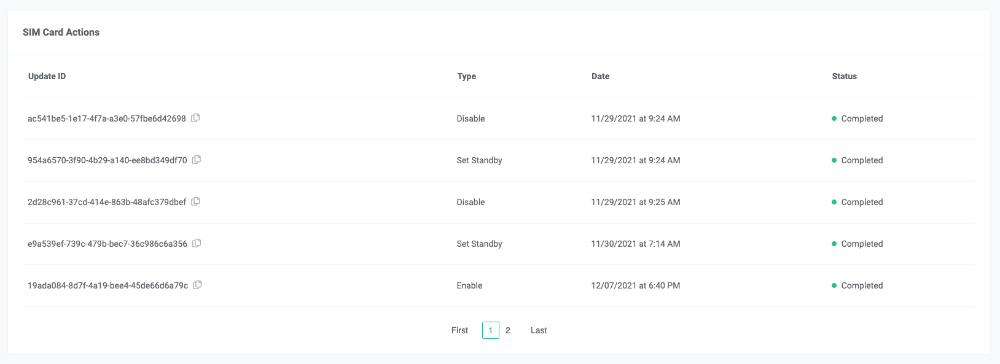

# SIM Card Actions

Track every update made to your SIM cards with Telnyx's SIM card actions. See Telnyx guidance and requirements.

## SIM Card Actions

To ensure full visibility over the state of your [SIM cards](https://telnyx.com/products/iot-sim-card) each update made to them is tracked as an action in the SIM card actions section of the Mission Control portal and API. This section in the portal can be found by drilling into a SIM card in the [SIM cards view](https://portal.telnyx.com/#/app/wireless/sim-cards) and scrolling to the bottom.

Each time an update is made to a [SIM card](https://telnyx.com/products/iot-sim-card) it is added to the SIM Card Actions list with an associated status. As the status of the action changes, the SIM card action resource will get updated with the new status. Each action is logged in chronological order so you can see when the update was applied.

## Inspecting SIM card actions via the API

The SIM card actions can also be inspected via the Telnyx API and the specifications can be viewed [here](https://developers.telnyx.com/docs/iot-sim/sim-lifecycle).

Operations that are tracked as SIM card actions are:

* Enable SIM card
* Disable SIM card
* Standby SIM card
* Data Limit exceeded
* Enable Standby SIM card.

---

Related Articles

[Telnyx Global SIMs FAQs](https://support.telnyx.com/en/articles/3270136-telnyx-global-sims-faqs)[SIM Data Limits & Notifications](https://support.telnyx.com/en/articles/3403998-sim-data-limits-notifications)[SIM Setup and Configuration](https://support.telnyx.com/en/articles/4298710-sim-setup-and-configuration)[SIM Connectivity Logs](https://support.telnyx.com/en/articles/5666594-sim-connectivity-logs)[SIM Card Location and Device Details](https://support.telnyx.com/en/articles/5812302-sim-card-location-and-device-details)

Did this answer your question?

😞😐😃
