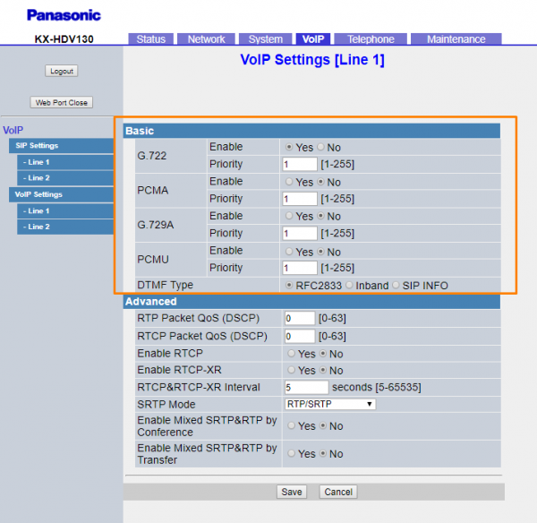

Panasonic KX-HDV: Telnyx setup | Telnyx Help Center

[Skip to main content](#main-content)

# Panasonic KX-HDV: Telnyx setup

Learn the steps to configure Panasonic KX-HDV and KX-TGP series IP Phones with Telnyx for optimal performance.

C

Written by Customer Success

January 10, 2024

Table of contents

[Jump to Instructions](#h_7329822d49)

The [Panasonic KX-HDV130](https://na.panasonic.com/us/office-products-unified-communications/unified-communications/sip-phones/kx-hdv130-basic-sip-phone) IP desk phone delivers the same balance of low cost/high quality, alongside a range of value-adding features that are robust for an entry-level device. If you demand budget-friendly technology that still provides the reliable, flexible performance their businesses require, the KX-HDV130 makes professional-grade communications more accessible than ever.

|  |
| --- |
| ***Note:*** *This guide was created using images of the KX-HDV130, but this guide can be used to configure the KX-HDV230 and the KX-HDV330.* |

Additional documentation:

* [Panasonic's New Phone System Checklist](https://ftp.panasonic.com/scanner/flyer/new_phone_system_checklist_flyer.pdf)
* [KX HDV130 Operating Instructions](https://na.panasonic.com/ns/235945_KX-HDV130_OI_2015-02.pdf)
* [Panasonic Support](https://na.panasonic.com/us/support/references/186?series=691&product=20636)

---

# Instructions for setting up and configuring the Panasonic KX-HDV130C

In this activity you will:

1. [Get your device's IP address and log into the phone's web portal](#h_03c60b3f1c)
2. [Configure your SIP profile](#h_cfe359a8f9)
3. [Configure audio codecs](#h_f17cbabcb3)

**Pre-requisites**

* Ensure that your [Telnyx Mission Command Portal is configured properly](https://support.telnyx.com/en/articles/1176636-get-started-with-a-mission-control-account)
* OPTIONAL/RECOMMENDED: [Enable TLS to encrypt your traffic](https://support.telnyx.com/en/articles/1130711-does-telnyx-encrypt-communication)

**Video Walkthrough**

Setting up your Telnyx SIP portal account so you can make and receive calls:

|  |
| --- |
| ***Note:*** *Video walkthrough for Positron IP304 phone/Telnyx configuration coming soon. Check back as we update our docs.* |

## 1. Get your device's IP address and log into the phone's web portal

In this step, you'll obtain the IP address from your IP304, which you'll need to log into the web portal in the next step.

1. From your phone, click on the **Basic Settings** menu and navigate to **Other Options**.
2. Select: **Embedded Web** and select **On**.
3. After that go to **System Settings** **>> Status >> IPv4 Settings >> IP Address**. You will find your IP address here. Record this. You'll need it soon.
4. From a computer on the same network as your phone, open a web browser and enter the IP address you obtained in the previous steps into the browser's address bar. Prepend it with *http://*
5. You'll need to log in. If you have not changed your default login credentials, or if it's your first time logging in, use the following credentials:

   1. **Username:** *admin*
   2. **Password:** *adminpass*

[Back to Top](#h_7329822d49)

## 2. Configure your SIP profile

In this step, you will set up your device and register it with Telnyx.

1. Once logged into the web portal, click on the **VoIP** tab at the top of the screen.
2. In the left-hand menu, under the **SIP Settings** link, click **Line 1** and enter the following information in the **Basic** section:

   1. ***Phone Number***: Your Telnyx SIP main account or sub-account
   2. ***Registrar Server Address***: *sip.telnyx.com*
   3. ***Registrar Server Port***: If you are using UDP transport, use port *5060*. If you are using TLS transport, use port *5061.*
   4. ***Proxy Server Address***: *sip.telnyx.com*
   5. ***Proxy Server Port***: If you are using UDP transport, use port *5060*. If you are using TLS transport, use port *5061.*
   6. ***Presence Server Address***: *sip.telnyx.com*
   7. ***Presence Server Port***: UIf you are using UDP transport, use port *5060*. If you are using TLS transport, use port *5061.*
   8. ***Outbound Proxy Server Address***: *sip.telnyx.com*
   9. ***Outbound Proxy Server Port***: If you are using UDP transport, use port *5060*. If you are using TLS transport, use port *5061.*
   10. ***Service Domain***: *sip.telnyx.com*
   11. ***Authentication ID***: Your Telnyx SIP main account or sub-account
   12. ***Authentication Password***: Your Telnyx SIP main account or sub-account password
3. Enter the following information in the **Advanced** section:

   1. **REGISTER Expires Timer**: *300*
   2. **Transport Protocol**: By default, *UDP* is selected. If you enabled TLS and your account is configured to use SRTP encryption as part of your [pre-requisite activities](https://support.telnyx.com/en/articles/5810226-fortifone-fon-570#h_6edc08d8c8) then you should choose *TLS.*
   3. **TLS Mode:** By default, *SIPS* is selected. If you enabled TLS and your account is configured to use SRTP encryption as part of your [pre-requisite activities](https://support.telnyx.com/en/articles/5810226-fortifone-fon-570#h_6edc08d8c8) then you should choose *SIP-TLS.*
4. IF you are using TLS encryption, you'll need to configure your VoIP settings. If not, go to step 5.

   1. From the left-hand menu, click **Line 1** under **VoIP Settings.** Find the **Advanced** section on this page and change the following setting:

      1. **SRTP Mode:** *SRTP*

   

   *This screenshot shows a TLS configuration.*  
   ​
5. Click **Save**.

[Back to Top](#h_7329822d49)

## 3. Configure audio codecs

In this section, you'll configure the [audio codecs](https://telnyx.com/resources/codecs-affect-voip-sound-quality) that will be used for voice calling.

1. lick on the **VoIP** tab at the top of the screen.
2. In the left-hand menu, under the **VoIP Settings** link, click **Line 1** and enter the following information in the **Basic** section:

   1. Select the *Yes* radio button next to any codec you want to enable. Telnyx supports the following:

      1. ulaw(g711u)
      2. alaw(g711a)
      3. g722
      4. g729
   2. Select the *No* radio button next to any codecs that are not in the previous list.

   
3. Click **Save**.

|  |
| --- |
| ***Note:*** *You can check to make sure your SIP account is properly registered by clicking on the **Status** tab at the top of the screen, then **VoIP Status** in the left-hand menu.* |

That's it! You've finished configuring your Panasonic KX-HDV130C's SIP profile, and can now start testing calls!

[Back to Top](#h_7329822d49)

---

## Additional Resources

Review our [getting started with guide](https://support.telnyx.com/en/articles/1176636-get-started-with-a-mission-control-account) to make sure your Telnyx Mission Control Portal account is setup correctly!

Additionally, check out:

* [Panasonic's New Phone System Checklist](https://ftp.panasonic.com/scanner/flyer/new_phone_system_checklist_flyer.pdf)
* [KX HDV130 Operating Instructions](https://na.panasonic.com/ns/235945_KX-HDV130_OI_2015-02.pdf)
* [Panasonic Support](https://na.panasonic.com/us/support/references/186?series=691&product=20636)

---

---

Related Articles

[Panasonic KX-TGP 550](https://support.telnyx.com/en/articles/5807663-panasonic-kx-tgp-550)[Flyingvoice: Telnyx Setup](https://support.telnyx.com/en/articles/5810663-flyingvoice-telnyx-setup)[Gigaset A510: Telnyx Setup](https://support.telnyx.com/en/articles/5815209-gigaset-a510-telnyx-setup)[Snom C520: Telnyx Setup](https://support.telnyx.com/en/articles/5815678-snom-c520-telnyx-setup)[Audiocodes 400HD](https://support.telnyx.com/en/articles/5819923-audiocodes-400hd)

Did this answer your question?

😞😐😃

Table of contents
