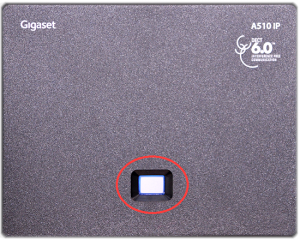
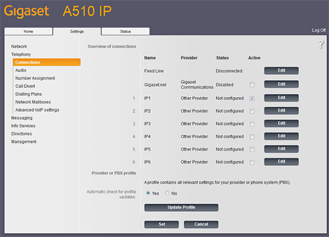

# Gigaset A510: Telnyx Setup

Learn how to use your Telnyx account to set up and configure a SIP profile on the Gigaset A510 IP… See Telnyx guidance and requirements.

C

[Jump to Instructions](#h_56ca90c02f)

The Gigaset A510 IP is an exceptionally versatile VoIP phone with the ability to make up to 3 parallel calls, either via Internet or traditional landline. It allows a caller to switch between 2 VoIP calls and 1 fixed line call at the press of a button.

Additional documentation:

* [Gigaset A510IP user guide](https://gse.gigaset.com/fileadmin/legacy-assets/A31008-M2230-R301-2-6019_en_US_CA.pdf)

---

## Instructions for setting up and configuring your Gigaset A510 IP

In this activity you will:

1. [Get your device's IP address and log into the Gigaset phone's web portal](#h_54ce46ab92)
2. [Configure your IP phone](#h_c85f06f42b)

**Pre-requisites**

* Ensure that your [Telnyx Mission Command Portal is configured properly](https://support.telnyx.com/en/articles/1176636-get-started-with-a-mission-control-account)
* RECOMMENDED: [Enable TLS to encrypt your traffic](https://support.telnyx.com/en/articles/1130711-does-telnyx-encrypt-communication)

**Video Walkthrough**

Setting up your Telnyx SIP portal account so you can make and receive calls:

|  |
| --- |
| ***Note:*** *Video walkthrough for Gigaset A510 IP/Telnyx configuration coming soon. Check back as we update our docs.* |

## 1. Get your device's IP address and log into the Gigaset phone's web portal

In this step, you'll obtain the IP address from your A510, which you'll need to log into the web portal in the next step.

1. Press the paging button on your device's base station. This will display the device's IP address. Take note of this as you'll need it next.

   
2. On a computer connected to the same network as your phone, open a browser and type *http://* followed by the IP address you obtained in step 1.
3. The first screen that appears will require you to enter a system PIN. The default PIN for all new devices is *0000.*

   
4. Click **OK**.

[Back to Top](#h_56ca90c02f)

## 2. Configure your IP phone

1. From here, click on the **Settings** tab at the top of the page.

   
2. Click on the **Telephony** link on the left-hand navigation to expand this menu. Click on **Connections** in the **Telephony** sub-menu and click **Edit** next to the line you want to configure.

   
3. Enter the following information:

   1. **Connection Name or Number:** Create a connection name suitable for your connection.
   2. **Connection Name or Number:** Choose a name that makes sense for the connection you're setting up.
   3. **Authentication Name:** Your Telnyx SIP account username
   4. **Authentication password:** Your Telnyx SIP account password
   5. **Username:** Your Telnyx SIP account username
   6. **Display name:** Your Telnyx SIP account username
   7. **Domain:** *sip.telnyx.com*
   8. **Proxy server address:** *sip.telnyx.com*
   9. **Proxy server port:** If you are using UDP transport, use port *5060*. If you are using TLS transport, use port *5061.*
   10. **Registration server:** *sip.telnyx.com*
   11. **Registration server port:** If you are using UDP transport, use port *5060*. If you are using TLS transport, use port *5061.*
   12. **Registration refresh time:** 300
   13. **STUN enabled:** No
   14. **STUN server address:** (Leave Empty)
   15. **Outbound proxy mode**: Always
   16. **Outbound server address:** *sip.telnyx.com*
   17. **Outbound proxy port:** If you are using UDP or TCP transport, use port *5060*. If you are using TLS transport, use port *5061.*
   18. **Select Network Protocol:** By default, *UDP* is selected. If you enabled TLS and your account is configured to use SRTP encryption as part of your [pre-requisite activities](https://support.telnyx.com/en/articles/5810226-fortifone-fon-570#h_6edc08d8c8) then you should choose *TLS.*

   

   *\*Note that this screenshot shows a UDP setup.*
   ​
4. Still in the **Telephony** section, click on **Number Assignment** and find the **Handsets** section. Look for the line you just created (It will have the same name as the **Connection Name or Number** field you configured previously.

   1. f**or outgoing calls:** Radio button should be CHECKED
   2. **for incoming calls:** Checkbox should be CHECKED

   

That's it! You've finished configuring your Gigaset A510 IP profile, and can now start testing calls!

[Back to Top](#h_56ca90c02f)

---

## Additional Resources

Review our [getting started with guide](https://support.telnyx.com/en/articles/1176636-get-started-with-a-mission-control-account) to make sure your Telnyx Mission Control Portal account is setup correctly!

Additionally, check out:

* [Gigaset A510IP user guide](https://gse.gigaset.com/fileadmin/legacy-assets/A31008-M2230-R301-2-6019_en_US_CA.pdf)

---

Related Articles

[Flyingvoice: Telnyx Setup](https://support.telnyx.com/en/articles/5810663-flyingvoice-telnyx-setup)[Panasonic KX-HDV: Telnyx setup](https://support.telnyx.com/en/articles/5814406-panasonic-kx-hdv-telnyx-setup)[Snom C520: Telnyx Setup](https://support.telnyx.com/en/articles/5815678-snom-c520-telnyx-setup)[Gigaset A690/AS690](https://support.telnyx.com/en/articles/6060646-gigaset-a690-as690)[Fanvil H5: Hotel IP](https://support.telnyx.com/en/articles/6203401-fanvil-h5-hotel-ip)

Did this answer your question?

😞😐😃
