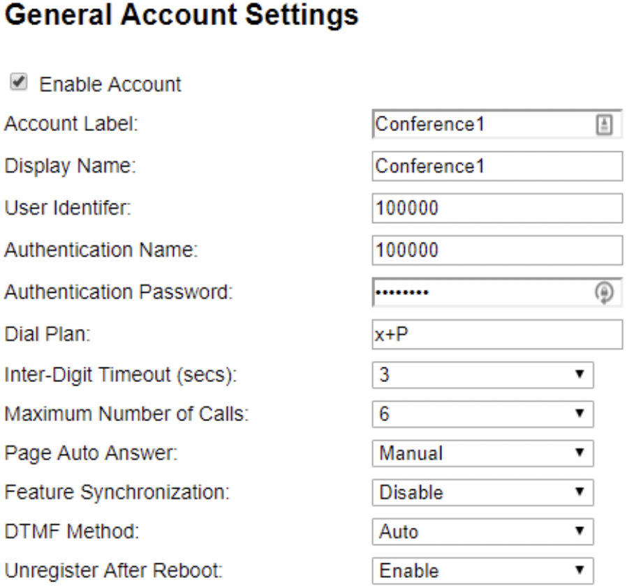
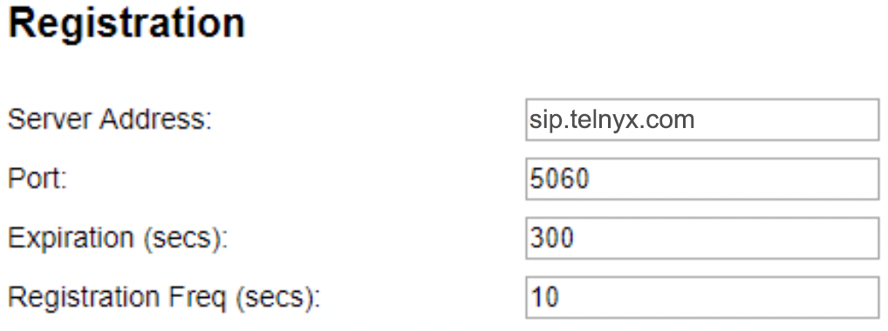
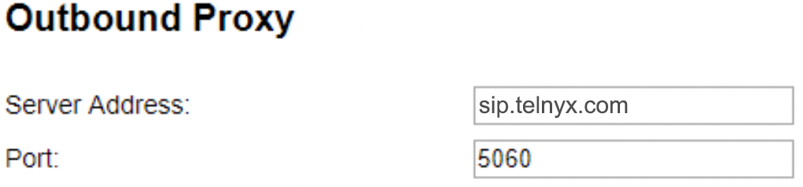
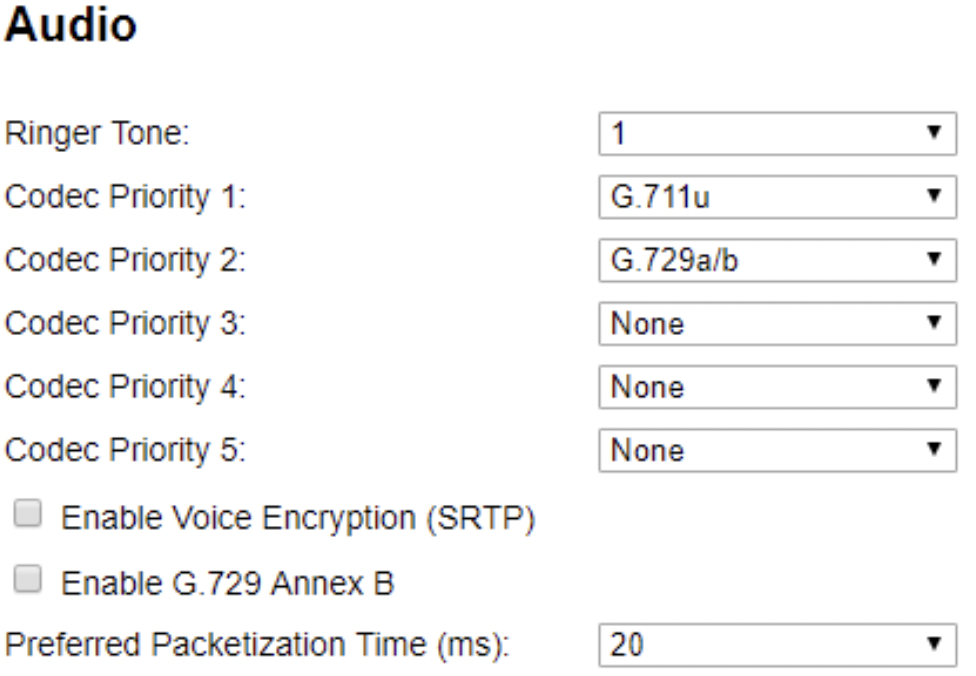

Snom C520: Telnyx Setup | Telnyx Help Center

[Skip to main content](#main-content)

# Snom C520: Telnyx Setup

Learn how to set up and configure a Snom C520 conference phone and connect it to your Telnyx account.

C

Written by Customer Success

January 10, 2024

Table of contents

[Jump to Instructions](#h_df0d35b8f0)

The [Snom C520 SIP conference phone](https://www.snomamericas.com/en/pd/ip-phones/conferencing/c520) uses Bluetooth® and DECT 6.0 technology for frustration-free calls and meetings. The system serves as a personal workspace device, eliminating the need for a separate deskset and conference phone. Connect your cell phone, or pair a Bluetooth or DECT headset with the speakerphone for hands-free and/or private calls. The C520 can go beyond the office, and work in any-size conference room. The system—with one fixed built-in mic and two wireless mics can support nine or more active participants in a small conference room. Or, it can easily scale up with the accessory C52-SP DECT expansion speakerphone to handle 27 or more active participants. Now, you can clearly hear, and spread out and speak without shouting.

Additional documentation:

* [C520 Datasheet](https://www.snomamericas.com/assets/c5d49735-2ad0-4e53-8315-5d36b531b9cf/snom_C520_datasheet_en.pdf)
* [C520 User Manual](https://www.snomamericas.com/assets/0988fbb8-88fd-438c-9957-3828fbcb84e9/UM_C520_en.pdf)
* [C520 Quick-install Guide](https://www.snomamericas.com/assets/7796f36f-3c78-4f9b-b817-b31025915d21/QIG_C520.pdf)
* [Snom support](https://www.snomamericas.com/support/contact/)
* [Snom service hub](https://service.snom.com/)
* [Snom helpdesk](https://jira.snom.com/servicedesk/customer/user/login)

---

# Instructions for configuring the Snom C520 SIP conference phone

In this activity you will:

1. [Get your device's IP address and log into the C520 web portal](#h_1cfade75d7)
2. [Configure your C520](#h_e81abd07cc)

**Pre-requisites:**

* Ensure that your [Telnyx Mission Command Portal is configured properly](https://support.telnyx.com/en/articles/1176636-get-started-with-a-mission-control-account)
* RECOMMENDED: [Enable TLS to encrypt your traffic](https://support.telnyx.com/en/articles/1130711-does-telnyx-encrypt-communication)

**Video Walkthrough**

Setting up your Telnyx SIP portal account so you can make and receive calls:

|  |
| --- |
| ***Note:*** *Video walkthrough for Snom C520 conference phone/Telnyx configuration coming soon. Check back as we update our docs.* |

## 1. Get your device's IP address and log into the C520 web portal

In this step, you'll obtain the IP address from your C520, which you'll need to log into the web portal in the next step.

1. Click on the **Menu** button of the phone.
2. Scroll down to **Status** and select **Network** . You can find the IP address here. Take note of it. You'll need it for the next step.
3. From a computer on the same network as the phone, open a web browser and enter *http://* followed by the IP address you just obtained into the browser's address bar.
4. You'll be asked to log in. Out of the box, the default credentials are:

   1. **User:** *admin*
   2. **Password:** *admin*
5. Once logged in, you'll see this screen:

   

[Back to Top](#h_df0d35b8f0)

## 2. Configure your C520

In this step, you'll create a [SIP trunk](https://telnyx.com/products/sip-trunks) and connect your phone to Telnyx.

1. ### Click on the "**System"** tab in the top navigation.
2. ### From the left-hand menu, expand "**SIP Account Management"** and click on the account you want to configure.
3. ### In this account management screen, find the "**General"** section and provide the following information:

   1. **Account Label:** This is the label you'll attach to this account. Use one that makes sense to you. A lot of people like to give it the same name as their caller ID.
   2. **Display Name**: This is your caller ID. You can choose whatever you like, but keep in mind the following naming conventions:

      1. Caller ID Name should be in capital letters. This will appears more clearly/visible on some devices.
      2. You must NOT use any special characters, as they will not be displayed. Spaces are allowed.
      3. Some of regular Canadian providers will not show more than 15 characters. We suggest shrinking or adapt your caller ID.
   3. **User Identifier:** Your Telnyx account ID
   4. **Authentication Name:** Your Telnyx account ID
   5. **Authentication Password:** Your Telnyx account password
   6. **Dial Plan:** *x+P* (By default)  
      ​

   
4. ### Now find the "**SIP Server"** section and provide the following information:

   1. **Server Address:** *sip.telnyx.com*
   2. **Port:** *5060* if you have not enabled TLS encryption. If you have, choose *5061*.  
      ​

   

   *\*This screenshot shows the settings required for UDP or TCP transport. For TLS, enter* 5061 *in the "**Port"** field.*
5. ### Find the "**Registration"** section and provide the following information:

   1. **Server Address:** *sip.telnyx.com*
   2. **Port:** *5060* if you have not enabled TLS encryption. If you have, choose *5061*.
   3. **Expiration (secs):** *300*
   4. **Registration Freq (secs):** *10*  
      ​

   

   *\*This screenshot shows the settings required for UDP or TCP transport. For TLS, enter* 5061 *in the "**Port"** field.*  
   ​
6. ### Find the "**Outbound Proxy"** section and provide the following information:

   1. **Server Address**: *sip.telnyx.com*
   2. **Port**: *5060* if you have not enabled TLS encryption. If you have, choose *5061*.  
      ​

   

   \**This* *screenshot shows the settings required for UDP or TCP transport. For TLS, enter* 5061 *in the "**Port"** field.*  
   ​
7. ### You can leave the settings in the "**Backup Outbound Proxy"** section BLANK "***unless"*** you have enabled TLS encryption for this account. If you are configuring this account to use TLS encryption, provide the following information:

   1. **Server Address:** *sip.telnyx.com*
   2. **Port:** *5061*  
      ​

   
8. ### Find the "**Audio"** section and set your codecs in priority sequence that meets your needs. Telnyx supports the following codecs:

   1. ulaw(g711u)
   2. alaw(g711a)
   3. g722
   4. g729  
      ​

   
9. ### Find the "**Signaling Settings"** and provide the following information:

   1. **Local SIP Port:** *5060* if you have not enabled TLS encryption. If you have, choose *5061*.
   2. **Transport:** *UDP* or *TCP* if you have not enabled TLS encryption. If you have, choose *TLS/TCP*.

   

That's it! You've finished configuring your Snom C520 profile, and can now start testing calls!

[Back to Top](#h_df0d35b8f0)

---

## Additional Resources

Review our [getting started with guide](https://support.telnyx.com/en/articles/1176636-get-started-with-a-mission-control-account) to make sure your Telnyx Mission Control Portal account is setup correctly!

Additionally, check out:

* [C520 Datasheet](https://www.snomamericas.com/assets/c5d49735-2ad0-4e53-8315-5d36b531b9cf/snom_C520_datasheet_en.pdf)
* [C520 User Manual](https://www.snomamericas.com/assets/0988fbb8-88fd-438c-9957-3828fbcb84e9/UM_C520_en.pdf)
* [C520 Quick-install Guide](https://www.snomamericas.com/assets/7796f36f-3c78-4f9b-b817-b31025915d21/QIG_C520.pdf)
* [Snom support](https://www.snomamericas.com/support/contact/)
* [Snom service hub](https://service.snom.com/)
* [Snom helpdesk](https://jira.snom.com/servicedesk/customer/user/login)

---

Related Articles

[Gigaset A510: Telnyx Setup](https://support.telnyx.com/en/articles/5815209-gigaset-a510-telnyx-setup)[Konftel 300IPx: Telnyx Setup](https://support.telnyx.com/en/articles/5822579-konftel-300ipx-telnyx-setup)[Snom D7xx: Telnyx Setup](https://support.telnyx.com/en/articles/5822706-snom-d7xx-telnyx-setup)[Snom M100 KLE: Telnyx Setup](https://support.telnyx.com/en/articles/5822823-snom-m100-kle-telnyx-setup)[Vtech VCS754: Telnyx Setup](https://support.telnyx.com/en/articles/5822901-vtech-vcs754-telnyx-setup)

Did this answer your question?

😞😐😃

Table of contents
