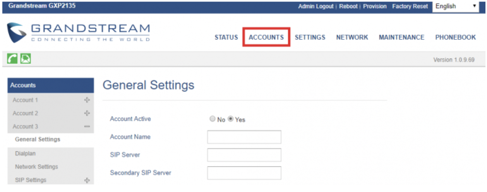
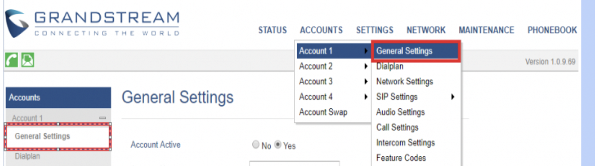

# Grandstream GXP: Telnyx Setup

Learn how to set up and configure a Grandstream GXP1630/GXP2135 IP Phone and connect it to your Telnyx account. See Telnyx guidance and requirements.

C

[Jump to Instructions](#h_5a7ed2c3f5)

|  |  |
| --- | --- |
| Grandstream GXP1630 | Grandstream GXP2135 |
| Our most powerful entry-level Basic IP phone, the [GXP1630](https://www.grandstream.com/products/ip-voice-telephony-gxp-series-ip-phones/gxp-series-basic-ip-phones/product/gxp1630) delivers an effective communications platform for access to quick call control. Delivering a vibrant and clear user-interface, this device is a perfect solution for those who handle low to medium call volume and require access to key call efficiency functionalities. | The [Grandstream GXP2135](https://www.grandstream.com/products/ip-voice-telephony-gxp-series-ip-phones/gxp-series-high-end-ip-phones/product/gxp2135) is the ideal selection for busy users who value call control, productivity and usability, and manage medium to heavy call volumes. Equipped with 8 lines and 4 SIP accounts, a 2.8 inch color LCD display, and 32 digital speed dial/BLF keys, the GXP2135 enables quick and powerful usability.    As all Grandstream IP phones do, the GXP2135 features state-of-the-art security encryption technology (SRTP and TLS). The GXP2135 supports a variety of automated provisioning options, including zero-configuration with Grandstream’s UCM series IP PBXs, encrypted XML files and TR-069, to make mass deployment extremely easy. |
| It boasts such features as:  * 3 SIP accounts, 3 line keys, 4-way conferencing, 3 XML programmable context-sensitive soft keys * HD audio on speakerphone and handset * Dual-switched Gigabit ports, integrated PoE * 8 dual-colored BLF/speed dial keys * EHS support for Plantronics headsets * Up to 1000 contacts, call history up to 200 records  Additional documentation:  * [GXP1630 user guide](https://www.grandstream.com/hubfs/Product_Documentation/gxp16xx_user_guide.pdf) * [GXP1630 Admin manual](https://www.grandstream.com/hubfs/Product_Documentation/gxp16xx_administration_guide.pdf) | It boasts such features as:  * 8 lines, 4 SIP accounts, 4 XML programmable context-sensitive soft keys * Dual switched, auto-sensing Gigabit ports, built-in PoE * 32 digitally programmable and customizable BLF/speed-dial keys * Built-in Bluetooth for syncing headsets and mobile devices for contact books, calendars & call transferring * HD audio on the handset and speakerphone; full duplex speakerphone * Supports EHS compatible Plantronics headsets * 4-way audio conferencing for easy conference calls  Additional documentation:  * [GXP2135 product documentation](https://www.grandstream.com/hubfs/Product_Documentation/gxp21xx_user_guide.pdf) * [GXP2135 user manual](https://www.grandstream.com/hubfs/Product_Documentation/gxp2130_gxp2140_gxp2160_gxp2135_gxp2170_quick_user_guide_english..pdf) * [GXP2135 admin manual](https://www.grandstream.com/hubfs/Product_Documentation/gxp21xx_administration_guide.pdf) |

---

## Instructions for configuring the Grandstream GXP IP Phone to work with Telnyx

|  |
| --- |
| ***Note:*** *The configuration steps for both the Grandstream GXP1630 and the GXP2135 are identical. This guide will satisfy the setup and configuration of either.* |

In this activity you will:

1. [Get your device's IP address and log into the Gigaset phone's web portal](#h_988037d0d8)
2. [Configure your GXP](#h_cf2677162e)

## Pre-requisites

* Ensure that your [Telnyx Mission Command Portal is configured properly](https://support.telnyx.com/en/articles/1176636-get-started-with-a-mission-control-account)
* RECOMMENDED: [Enable TLS to encrypt your traffic](https://support.telnyx.com/en/articles/1130711-does-telnyx-encrypt-communication)

## Video Walkthrough

Setting up your Telnyx SIP portal account so you can make and receive calls:

|  |
| --- |
| ***Note:*** *Video walkthrough for Grandstream GXP/Telnyx configuration coming soon. Check back as we update our docs.* |

## 1. Get your device's IP address and log into your phone's web portal

In this step, you'll obtain the IP address from your GXP, which you'll need to log into the web portal in the next step.

1. From your phone, navigate to **Menu >> Status >­> Network Status >> IPv4 Address** and take note of the IP address on this screen. You'll need it next.
2. On a computer connected to the same network as your phone, open a web browser and type *http://* followed by the phone's IP address into the address bar of your browser.
3. Log into the portal. Out of the box, the default credentials are:

   1. **Username:** *admin*
   2. **Password:** *admin*

   

[Back to Top](#h_5a7ed2c3f5)

## 2. Configure your Grandstream GXP

In this step, you'll create a [SIP trunk](https://telnyx.com/products/sip-trunks) and connect your phone to Telnyx.

1. Click on **Accounts** in the top menu.
2. Expand the account you're looking to configure and click **General Settings**.

   

   You can also use the top navigation to get here if you want.

   
3. On this page, enter the following information:

   1. **Account Name:** Give it a name that makes sense for you

      **SIP Server:** *sip.telnyx.com*

      **SIP User ID:** Your Telnyx SIP account username

      **Authenticate Password:** Your Telnyx SIP account password

      **Name:** This is your caller ID. You can choose whatever you like, but keep in mind the following naming conventions:

      1. Caller ID Name should be in capital letters. This will appears more clearly/visible on some devices.
      2. You must NOT use any special characters, as they will not be displayed. Spaces are allowed.
      3. Some of regular Canadian providers will not show more than 15 characters. We suggest shrinking or adapt your caller ID.
   2. **Voice Mail Access Number:** *\*97*

   
4. Now, while still in **Accounts > Account 1** *(or the account you want to configure)* click on **SIP Settings > Basic Settings** and provide the following information:

   1. **SIP Registration:** *Yes*
   2. **Register Expiration:** *5* (this is in minutes)
   3. **Enable OPTIONS Keep Alive:** *Yes*
   4. **Local SIP Port:** *5060* if you have not enabled TLS encryption. If you have, choose *5061*.
   5. **SIP Transport:** *UDP* or *TCP* if you have not enabled TLS encryption. If you have, choose *TLS/TCP*.

   

   \*This screenshot demonstrates a connection that uses UDP transport.
5. Click **Save and Apply.**

That's it! You've finished configuring your Grandstream GXP profile, and can now start testing calls!

[Back to Top](#h_5a7ed2c3f5)

---

## Troubleshooting

## "I can receive incoming calls, but outgoing call are failing. The error says 'No response'"

**Answer**

1. Log into the web portal and navigate to **Accounts > Account X > SIP > Custom SIP Header** and *disable*:

   1. **Use X-Grandstream-PBX Header**
   2. **Use P-Access-Network-Info Header**
   3. **Use P-Emergency-Info Header**
2. Go to **Accounts > Account X > SIP > Audio Settings,** and choose codec *G729A/B* as preferred Vocoder.

[Back to Top](#h_5a7ed2c3f5)

---

## Additional Resources

Review our [getting started with guide](https://support.telnyx.com/en/articles/1176636-get-started-with-a-mission-control-account) to make sure your Telnyx Mission Control Portal account is setup correctly!

Additionally, check out:

* [GXP1630 user guide](https://www.grandstream.com/hubfs/Product_Documentation/gxp16xx_user_guide.pdf)
* [GXP1630 Admin manual](https://www.grandstream.com/hubfs/Product_Documentation/gxp16xx_administration_guide.pdf)
* [GXP2135 product documentation](https://www.grandstream.com/hubfs/Product_Documentation/gxp21xx_user_guide.pdf)
* [GXP2135 user manual](https://www.grandstream.com/hubfs/Product_Documentation/gxp2130_gxp2140_gxp2160_gxp2135_gxp2170_quick_user_guide_english..pdf)
* [GXP2135 admin manual](https://www.grandstream.com/hubfs/Product_Documentation/gxp21xx_administration_guide.pdf)

---

Related Articles

[Configuring Grandstream GXP16XX with Telnyx](https://support.telnyx.com/en/articles/1130660-configuring-grandstream-gxp16xx-with-telnyx)[Grandstream: IP Auth Setup](https://support.telnyx.com/en/articles/2950523-grandstream-ip-auth-setup)[Grandstream HT802: Telnyx Setup](https://support.telnyx.com/en/articles/5725071-grandstream-ht802-telnyx-setup)[Grandstream GXP21XX](https://support.telnyx.com/en/articles/5819218-grandstream-gxp21xx)[Grandstream GXP1700: SIP Trunk](https://support.telnyx.com/en/articles/6184520-grandstream-gxp1700-sip-trunk)

Did this answer your question?

😞😐😃
