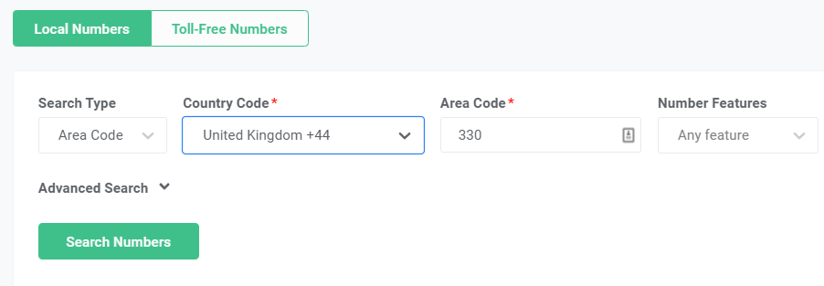
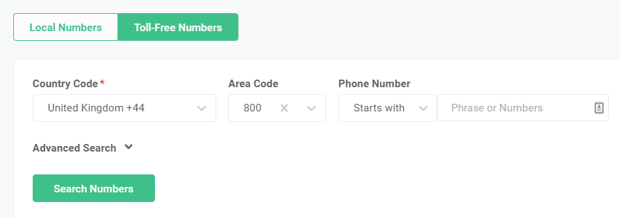
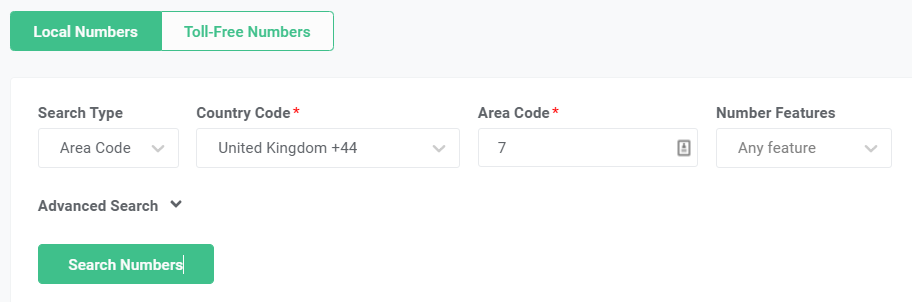
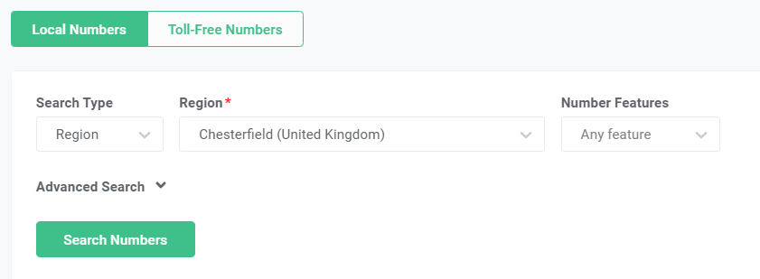
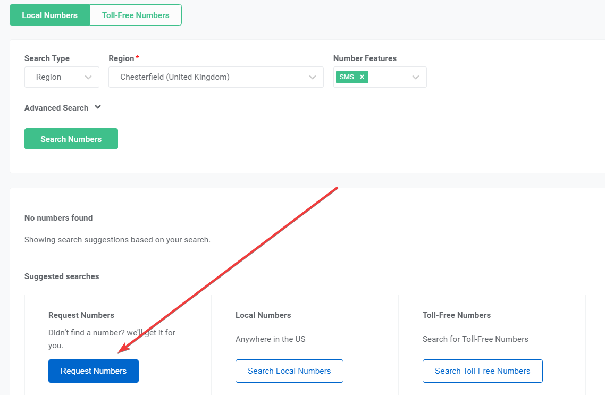

# Find GB Numbers on Telnyx Portal

Navigate the Telnyx portal with ease using our helpful guide to find GB local, national, and Toll-free numbers. See Telnyx guidance and requirements.

If you are having issues with finding GB local, national, and Toll-free numbers on our [portal](https://portal.telnyx.com/), you can use the below-mentioned search queries to find your desired numbers on the Telnyx portal.

**Note:** GB local, national, and Toll-free numbers are NOT SMS supported, only mobile numbers support the SMS feature.

## **GB National numbers:**

## **GB Toll-free numbers**

## **SMS capable GB Mobile numbers**

## **GB Local numbers**

If you want to search GB local numbers, you can put region/city name in the region search to find the numbers for a specific city as shown below.

If you are still facing issues or have any questions regarding finding GB numbers on our [portal](https://portal.telnyx.com/), feel free to reach out to our numbering team by sending an email to [numbering@telnyx.com](mailto:numbering@telnyx.com) OR by opening a numbering request ticket on our [portal](https://portal.telnyx.com/).

---

Related Articles

[Global Number Types](https://support.telnyx.com/en/articles/1458084-global-number-types)[Toll-Free Opt-Out Words](https://support.telnyx.com/en/articles/6989758-toll-free-opt-out-words)[International Number Requirements Tool](https://support.telnyx.com/en/articles/7003167-international-number-requirements-tool)[Chiro8000 and Telnyx Integration](https://support.telnyx.com/en/articles/7885470-chiro8000-and-telnyx-integration)[US / CA Toll Free Number Porting](https://support.telnyx.com/en/articles/8673249-us-ca-toll-free-number-porting)

Did this answer your question?

😞😐😃
