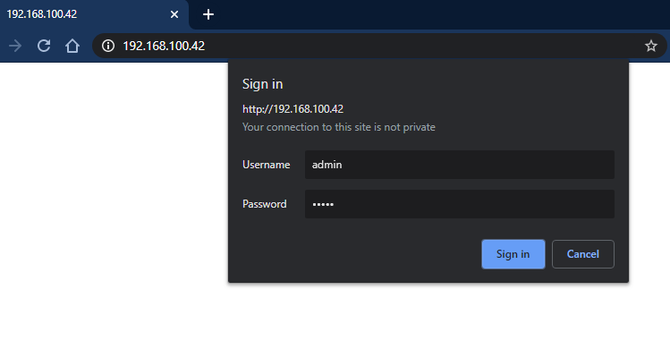
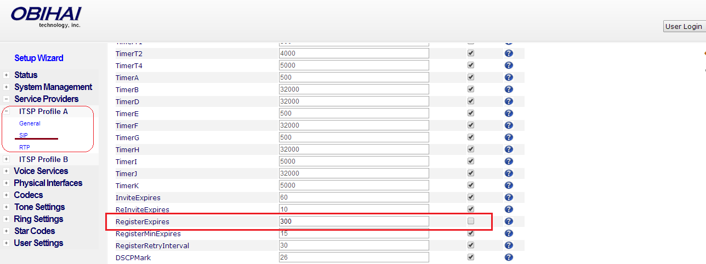

# Plantronics/Polycom: OBi300 Setup

Learn how to configure a Poly OBi300 VoIP phone so that it uses Telnyx. See Telnyx guidance and requirements.

C

[Jump to Instructions](#h_a306c8ed4f)

The [Poly OBi300](https://www.poly.com/br/pt/products/phones/obi/obi300) expands your service portfolio by enhancing the communication possibilities of home offices with flexibility in voice and fax applications as they transition to the digital communications world. Home offices can maximize their current investment by keeping their analog phone or fax machine plus experience the new capabilities of up to four VoIP services.

Features:

* Expand your service portfolio by offering flexible voice and fax applications to home offices
* Easily configure devices and provide better on-going support through the secure OBiTALK device management portal
* The only VoIP adapter that supports optional WiFi accessory to expand phone placement locations
* Connect up to 1 analog phone or fax machine to transition voice communications to the digital world

Additional documentation:

* [Poly OBi300 knowledgebase](https://support.hp.com/us-en/poly)
* [Poly support](https://support.hp.com/us-en/contact?openCLC=true)

---

## Instructions for setting up and configuring the Poly OBi300 VoIP adapter

In this activity you will:

1. [Get your device's IP address and log into the OBi web portal](#h_51269113db)
2. [Disable auto-provisioning](#h_f332f04dc3)
3. [Configure your ITSP profile](#h_915ce47b0e)
4. [Configure your SIP profile](#h_6a5eb28872)
5. [Configure audio codecs](#h_2b7108ca25)

**Pre-requisites**

* Ensure that your [Telnyx Mission Command Portal is configured properly](https://support.telnyx.com/en/articles/1176636-get-started-with-a-mission-control-account)
* RECOMMENDED: [Enable TLS to encrypt your traffic](https://support.telnyx.com/en/articles/1130711-does-telnyx-encrypt-communication)
* Connect a phone to the OBi300

**Video Walkthrough**

Setting up your Telnyx SIP portal account so you can make and receive calls:

|  |
| --- |
| ***Note:*** *Video walkthrough for OBi300/Telnyx configuration coming soon. Check back as we update our docs.* |

## 1. Get your device's IP address and log into the OBi web portal

In this section, you'll obtain the IP address from your 400HD, which you'll need to log into the web portal in the next step.

1. From the phone connected to the OBi300, dial \*\*\* and press 1 when asked to confirm your choice to get the IP address. Hang onto this. You'll need it next.
2. Open a web browser from a computer on the same network on the OBi300 and enter *http://* followed by the IP address you obtained in the previous step. You'll be taken to a login screen. Out of the box, the default credentials are:

   1. **Username:** *admin*
   2. **Password:** *admin*

   

[Back to Top](#h_a306c8ed4f)

## 2. Disable auto-provisioning

In this section, you'll disable auto-provisioning in order to ensure that there will be no conflicts between this manual configuration and the OBi300 dashboard.

1. From the left-hand navigation, follow these paths and adjust the settings as follows:

   1. S**ystem Management > Auto Provisioning > Auto Firmware Update**

      1. **Method:** *Disabled*
   2. S**ystem Management > Auto Provisioning > ITSP Provisioning**

      1. **Method :** *Disabled*
   3. **System Management - Auto Provisioning > OBiTALK Provisioning**

      1. **Method :** *Disabled*
   4. **Voice Services > OBiTALK Service**

      1. **Enable :** Uncheck this

[Back to Top](#h_a306c8ed4f)

## 3. Configure your ITSP profile

In this section you will set the name and the DigiMap you will use in the profile you configure.

1. In the left-hand navigation, expand the **Service Providers** section, then expand the profile you're configuring and click **General** and provide the following information:

   1. **Name**: Your Telnyx account ID
   2. **DigitMap**: Copy the line, including parenthesis, in the Digitmap field in the ITSP Profile and replace the "555" digits in the following lines by the area code of your choice:

   

[Back to Top](#h_a306c8ed4f)

## 4. Configure your SIP profile

In this section you can set your Main account/sub\_account credentials like User name and Password. The Main account password by default is the same password as the Customer Portal.

1. From the left-hand navigation, expand **Service Providers**, then expand the profile you want to configure and click on **SIP**.

   1. **AuthUserName**: Your Telnyx account ID
   2. **AuthPassword**: Your Telnyx account password
   3. **ProxySeverPort**: *5060* if you have not enabled TLS encryption. If you have, choose *5061*.
   4. **ProxyServerTransport**: *UDP* or *TCP* if you have not enabled TLS encryption. If you have, choose *TLS/TCP*.
   5. **RegistrarServerPort**: *5060* if you have not enabled TLS encryption. If you have, choose *5061*.
   6. **OutboundProxyPort**: *5060* if you have not enabled TLS encryption. If you have, choose *5061*.
   7. **X\_OutboundProxyTransport**: *UDP* or *TCP* if you have not enabled TLS encryption. If you have, choose *TLS/TCP*.
   8. **RegisterExpires:** *300*

   

   

   *\*Note that these screenshots show a profile configured for UDP transport.*
   ​
2. Additionally, if you are configuring your account for TLS transport, expand Voice Services and click on the service you're configuring and ensure that:

   1. **X\_KeepAliveServerPort:** *5061*
   2. **X\_SRTP**: *Use SRTP Only*

[Back to Top](#h_a306c8ed4f)

## 5. Configure Audio Codecs

1. Expand **Codecs** and set your codecs in priority sequence that meets your needs.
   ​
   Telnyx supports the following codecs:

   1. ulaw(g711u)
   2. alaw(g711a)
   3. g722
   4. g729

That's it! You've finished configuring your OBi300 profile, and can now start testing calls!

[Back to Top](#h_a306c8ed4f)

---

## Additional Resources

Review our [getting started with guide](https://support.telnyx.com/en/articles/1176636-get-started-with-a-mission-control-account) to make sure your Telnyx Mission Control Portal account is set up correctly!

Additionally, check out:

* [Poly OBi300 knowledgebase](https://support.hp.com/us-en/poly)
* [Poly support](https://support.hp.com/us-en/contact?openCLC=true)

---

Related Articles

[Panasonic KX-HDV: Telnyx setup](https://support.telnyx.com/en/articles/5814406-panasonic-kx-hdv-telnyx-setup)[Snom C520: Telnyx Setup](https://support.telnyx.com/en/articles/5815678-snom-c520-telnyx-setup)[Vtech VCS754: Telnyx Setup](https://support.telnyx.com/en/articles/5822901-vtech-vcs754-telnyx-setup)[Fanvil H5: Hotel IP](https://support.telnyx.com/en/articles/6203401-fanvil-h5-hotel-ip)[Fanvil X-Series: IP Phone](https://support.telnyx.com/en/articles/6209971-fanvil-x-series-ip-phone)

Did this answer your question?

😞😐😃
