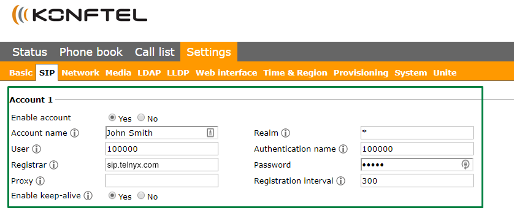
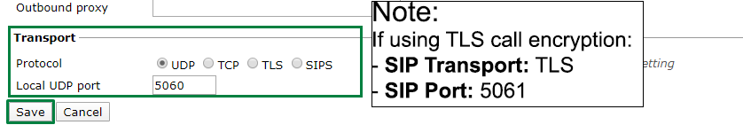
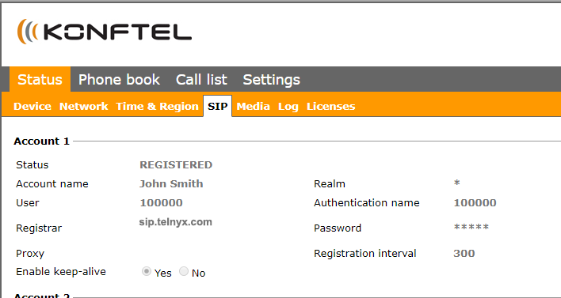

Konftel 300IPx: Telnyx Setup | Telnyx Help Center

[Skip to main content](#main-content)

# Konftel 300IPx: Telnyx Setup

Learn how to set up and configure the Konftel 300IPx conference phone so that you can use it with your Telnyx account.

C

Written by Customer Success

January 10, 2024

Table of contents

[Jump to Instructions](#h_59befaf48b)

The [KONFTEL 300IPx](https://www.konftel.com/en/products/konftel-300ipx) together with the [Konftel Unite app](https://www.konftel.com/en/accessories/konftel-unite) brings a whole new easiness to conference calls. It is highly intuitive and based on our natural mobile behavior. The new generation of IP conference phone is – The Art of Easiness.

Additional documentation:

* [Product data sheet](https://www.konftel.com/en/products/konftel-300ipx)
* [User guide](https://www.konftel.com/-/media/konftel/files/user-guide/konftel-300ipx/konftel300ipx-ug_eng.pdf?la=en)
* [Admin and installation guide](https://www.konftel.com/-/media/konftel/files/administration-and-quick-installation-guide/konftel-300ipx-ag-rev-1a_eng.pdf?la=en)
* [Konftel support](https://www.konftel.com/en/support/konftel-300ipx)

---

# Instructions for setting up and configuring the Konftel 300IPx

In this activity you will:

1. [Get your device's IP address and log into the phone's web portal](#h_e2440f5524)
2. [Configure a SIP extension](#h_3715b74f3e)
3. [Verify the status of your new SIP account](#h_3e50d065db)

**Pre-requisites**

* Ensure that your [Telnyx Mission Command Portal is configured properly](https://support.telnyx.com/en/articles/1176636-get-started-with-a-mission-control-account)
* RECOMMENDED: [Enable TLS to encrypt your traffic](https://support.telnyx.com/en/articles/1130711-does-telnyx-encrypt-communication)

**Video Walkthrough**

Setting up your Telnyx SIP portal account so you can make and receive calls:

|  |
| --- |
| ***Note:*** *Video walkthrough for the Konftel 300IPx/Telnyx configuration coming soon. Check back as we update our docs.* |

## 1. Get your device's IP address and log into your phone's web portal

In this step, you'll obtain the IP address from your phone, which you'll need to log into the web portal in the next step.

1. From your phone, click on the **Menu** button on the phone and navigate to **Status > Network** and take note of the IP address on this screen. You'll need it next.
2. On a computer connected to the same network as your phone, open a web browser and type *http://* followed by the phone's IP address into the address bar of your browser.
3. Log into the portal. Out of the box, the default login credentials are:

   1. **Username:** *ADMIN*
   2. **Password:** *1234*

[Back to Top](#h_59befaf48b)

## 2. Configure a SIP extension

In this section, you'll configure your extension and connect your phone to Telnyx.

1. Click on **Settings** in the top navigation.
2. Click on the **SIP** tab.
3. Click **Edit** next to the profile you want to configure.
4. On the edit screen, find the **Account 1** section and provide the following information:

   1. **Enable Account**: *Yes*
   2. **Account Name**: The name your account will be displaying
   3. **User**: Your Telnyx account ID
   4. **Registrar**: *sip.telnyx.com*
   5. **Proxy**: You can leave it blank or use *sip.telnyx.com*
   6. **Enable Keep Alive**: *Yes*
   7. **Realm**: You can leave it blank or use *sip.telnyx.com*
   8. **Authentication Name**: Your Telnyx account ID
   9. **Password**: Your Telnyx account password
   10. **Registration Interval**: *300*

   
5. Find the **Transport** section and provide the following information:

   1. **Protocol:** *UDP* or *TCP* if you have not enabled TLS encryption. If you have, choose *TLS*.
   2. **Local port:** *5060* if you have not enabled TLS encryption. If you have, choose *5061*.

   

[Back to Top](#h_59befaf48b)

## 3. Verify the status of your new SIP account

Finally, let's confirm the status of your new account to ensure that it's properly set up and is now connected.

1. Click on **Status** in the top navigation.
2. Click on the **SIP** tab below and make sure everything looks good.

   

That's it! You've finished configuring your Konftel 300IPx profile, and can now start testing calls!

[Back to Top](#h_59befaf48b)

---

## Additional Resources

Review our [getting started with guide](https://support.telnyx.com/en/articles/1176636-get-started-with-a-mission-control-account) to make sure your Telnyx Mission Control Portal account is set up correctly!

Additionally, check out:

* [Product data sheet](https://www.konftel.com/en/products/konftel-300ipx)
* [User guide](https://www.konftel.com/-/media/konftel/files/user-guide/konftel-300ipx/konftel300ipx-ug_eng.pdf?la=en)
* [Admin and installation guide](https://www.konftel.com/-/media/konftel/files/administration-and-quick-installation-guide/konftel-300ipx-ag-rev-1a_eng.pdf?la=en)
* [Konftel support](https://www.konftel.com/en/support/konftel-300ipx)

---

Related Articles

[Konftel 300Wx: Telnyx Setup](https://support.telnyx.com/en/articles/5807979-konftel-300wx-telnyx-setup)[Flyingvoice: Telnyx Setup](https://support.telnyx.com/en/articles/5810663-flyingvoice-telnyx-setup)[Gigaset A510: Telnyx Setup](https://support.telnyx.com/en/articles/5815209-gigaset-a510-telnyx-setup)[Snom C520: Telnyx Setup](https://support.telnyx.com/en/articles/5815678-snom-c520-telnyx-setup)[Vtech VCS754: Telnyx Setup](https://support.telnyx.com/en/articles/5822901-vtech-vcs754-telnyx-setup)

Did this answer your question?

😞😐😃

Table of contents
