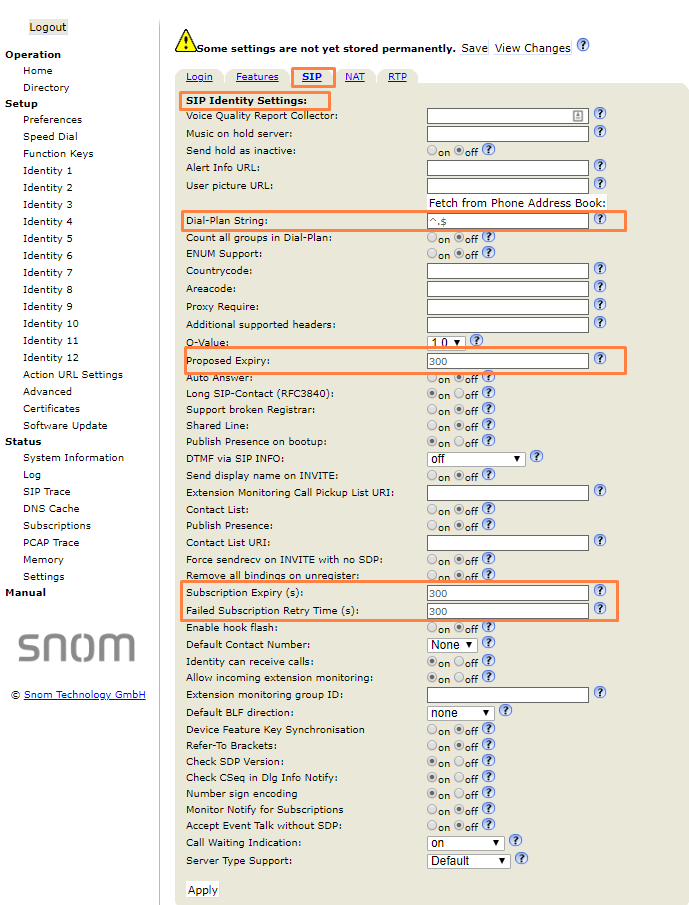

Snom D7xx: Telnyx Setup | Telnyx Help Center

[Skip to main content](#main-content)

# Snom D7xx: Telnyx Setup

Learn how to configure a Snom Professional D7xx desk phone to worth with Telnyx.

C

Written by Customer Success

January 10, 2024

Table of contents

[Jump to Instructions](#h_4a6981fca8)

The [SNOM Professional D7XX](https://www.snomamericas.com/en/ip-phones/desk-phones/d7xx-series-next-gen) Series telephones are both aesthetically appealing and highly practical, meeting business requirements when the telephone is a key tool in daily work. These high performance devices are future proofed and provide the best in Wideband HD audio, ensuring crystal clear sound quality. They are Bluetooth compatible to meet the connectivity requirements of today’s offices

Support for programmable keys ensures a continual overview of numerous extensions. These phones come with the very best in security options as well as a preinstalled certificate to enable secure provisioning of the phone without manual intervention. Snom telephone management and auto provisioning are included, and these telephones support Snom’s unique, proven software.

While the screenshots used for this guide were taken from a Snom D735, the steps and configuration apply for the Snom IP phone D-series models:

* D120
* D717
* D735
* D785

Additional documentation:

* [D735 datasheet](https://www.snomamericas.com/assets/2fa680f5-dba0-4469-8db2-57b36b38e733/snom_D735_datasheet_en_20210210.pdf)
* [D735 product brochure](https://www.snomamericas.com/assets/2b70597b-c8a3-4fb7-8692-4f67b7d080f1/snomamericas_product_catalog_en.pdf)
* [D735 instruction manual](https://www.snomamericas.com/assets/a2344b3a-44b0-4102-8ebd-f746a0a91506/UM_D735_en.pdf)
* [D735 quick reference guide](https://www.snomamericas.com/assets/a95d9ab1-7175-46bf-bd1c-b6fcb7f7dcc2/Snom_D735_Quick_Reference_Guide__Default_variant.pdf)
* Find all D717 documents [here](https://www.snomamericas.com/en/pd/ip-phones/desk-phones/d7xx-series-next-gen/d717).
* Find all D785 documents [here](https://www.snomamericas.com/en/pd/ip-phones/desk-phones/d7xx-series-next-gen/d785).
* [Snom support](https://www.snomamericas.com/support/contact/)
* [Snom service hub](https://service.snom.com/)
* [Snom helpdesk](https://jira.snom.com/servicedesk/customer/user/login)

---

# Instructions for configuring the Snom Professional D7xx SIP desk phone

In this activity you will:

1. [Get your device's IP address and log into the web portal](#h_280beebfdc)
2. [Configure your D7xx phone](#h_4261bf3cae)
3. [Configure your codecs](#h_87427cbe1b)

**Pre-requisites:**

* Ensure that your [Telnyx Mission Command Portal is configured properly](https://support.telnyx.com/en/articles/1176636-get-started-with-a-mission-control-account)
* RECOMMENDED: [Enable TLS to encrypt your traffic](https://support.telnyx.com/en/articles/1130711-does-telnyx-encrypt-communication)

**Video Walkthrough**

Setting up your Telnyx SIP portal account so you can make and receive calls:

|  |
| --- |
| ***Note:*** *Video walkthrough for Snom Professinoal D7xx desk phone/Telnyx configuration coming soon. Check back as we update our docs.* |

## 1. Get your device's IP address and log into the web portal

In this step, you'll obtain the IP address from your D7xx, which you'll need to log into the web portal in the next step.

1. Click on the **Settings** button of the phone.
2. Scroll down and select **Information** and from here, select **System Information** . You can find the IP address here. Take note of it. You'll need it for the next step.
3. From a computer on the same network as the phone, open a web browser and enter *http://* followed by the IP address you just obtained into the browser's address bar.
4. You'll be asked to log in. Out of the box, the default credentials are:

   1. **User:** *admin*
   2. **Password:** *0000*
5. Once logged in, you'll see this screen:

   
6. Click on **Identity 1** (Or whatever identity you wish to configure).

[Back to Top](#h_4a6981fca8)

## 2. Configure your D7xx phone

In this step, you'll create a [SIP trunk](https://telnyx.com/products/sip-trunks) and connect your phone to Telnyx.

1. On the **Login** tab, provide the following information:

   1. **Displayname**: This is your caller ID. You can choose whatever you like, but keep in mind the following naming conventions:

      1. Caller ID Name should be in capital letters. This will appears more clearly/visible on some devices.
      2. You must NOT use any special characters, as they will not be displayed. Spaces are allowed.
      3. Some of regular Canadian providers will not show more than 15 characters. We suggest shrinking or adapt your caller ID.
   2. **Account**: Your Telnyx account ID
   3. **Password**: Your Telnyx account password
   4. **Registrar**: If you are using UDP or TCP transport, enter *sip.telnyx.com.* Otherwise, if you are using TLS, enter *sip.telnyx.com:5061*
   5. **Outbound Proxy**: If you are using UDP or TCP transport, enter *sip.telnyx.com.* Otherwise, if you are using TLS, enter *sip.telnyx.com:5061*
   6. **Authentication Username**: Your Telnyx account ID
   7. **Mailbox**: \**97*

   
2. Click **Apply**.
3. Click on the **SIP** tab and provide the following information:

   1. **Dial-Plan String**: *^.$*
   2. **Proposed Expiry**: *300*
   3. **Subscription Expiry**: *300*
   4. **Failed Subscription Retry Time**: *300*

   
4. Click **Apply**.

[Back to Top](#h_4a6981fca8)

## 3. Configure your codecs

In this section, you'll configure all your [audio codec](https://telnyx.com/resources/codecs-affect-voip-sound-quality) information.

1. In the RTP Identity Settings field, you'll add the codecs you want to/can use. Set your codecs in priority sequence that meets your needs.   
   ​  
   Telnyx supports the following codecs:

   1. ulaw(g711u)
   2. alaw(g711a)
   3. g722
   4. g729
2. If you are using TLS encryption, yo'll also need to set:

   1. **RTP Encryption:** *on*
   2. **RTP/SAVP:** *Mandatory*
3. Click **Apply**.
4. Click **Save** at the top of the page.

   

That's it! You've finished configuring your Snom D7xx profile, and can now start testing calls!

[Back to Top](#h_4a6981fca8)

---

## Additional Resources

Review our [getting started with guide](https://support.telnyx.com/en/articles/1176636-get-started-with-a-mission-control-account) to make sure your Telnyx Mission Control Portal account is setup correctly!

Additionally, check out:

* [D735 datasheet](https://www.snomamericas.com/assets/2fa680f5-dba0-4469-8db2-57b36b38e733/snom_D735_datasheet_en_20210210.pdf)
* [D735 product brochure](https://www.snomamericas.com/assets/2b70597b-c8a3-4fb7-8692-4f67b7d080f1/snomamericas_product_catalog_en.pdf)
* [D735 instruction manual](https://www.snomamericas.com/assets/a2344b3a-44b0-4102-8ebd-f746a0a91506/UM_D735_en.pdf)
* [D735 quick reference guide](https://www.snomamericas.com/assets/a95d9ab1-7175-46bf-bd1c-b6fcb7f7dcc2/Snom_D735_Quick_Reference_Guide__Default_variant.pdf)
* Find all D717 documents [here](https://www.snomamericas.com/en/pd/ip-phones/desk-phones/d7xx-series-next-gen/d717).
* Find all D785 documents [here](https://www.snomamericas.com/en/pd/ip-phones/desk-phones/d7xx-series-next-gen/d785).
* [Snom support](https://www.snomamericas.com/support/contact/)
* [Snom service hub](https://service.snom.com/)
* [Snom helpdesk](https://jira.snom.com/servicedesk/customer/user/login)

---

Related Articles

[Konftel 300Wx: Telnyx Setup](https://support.telnyx.com/en/articles/5807979-konftel-300wx-telnyx-setup)[Flyingvoice: Telnyx Setup](https://support.telnyx.com/en/articles/5810663-flyingvoice-telnyx-setup)[Panasonic KX-HDV: Telnyx setup](https://support.telnyx.com/en/articles/5814406-panasonic-kx-hdv-telnyx-setup)[Snom C520: Telnyx Setup](https://support.telnyx.com/en/articles/5815678-snom-c520-telnyx-setup)[MicroSIP: Setup with Telnyx](https://support.telnyx.com/en/articles/6133145-microsip-setup-with-telnyx)

Did this answer your question?

😞😐😃

Table of contents
