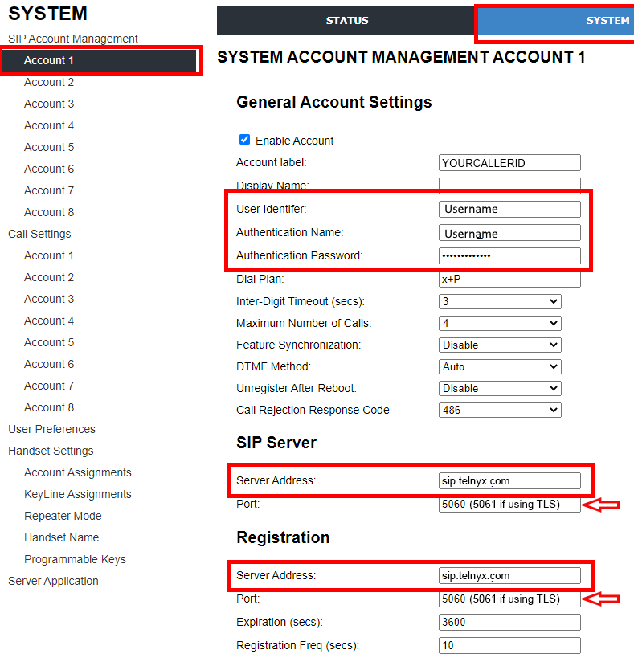
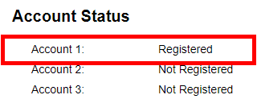

# Snom M100 KLE: Telnyx Setup

Learn how to set up and configure your Snom M100 KLE base station and connect it to Telnyx. See Telnyx guidance and requirements.

C

[Jump to Instructions](#h_eb55fd1e30)

The [Snom M100 KLE SIP DECT 4-Line Base Station](https://www.snomamericas.com/en/pd/ip-phones/m-series/m-kle-series/m100-kle) is a powerful base station that features key system emulation, providing for the ability to share line appearances locally without the need to add in the service provider. Users can easily see incoming calls, hold calls and resume calls from any handset or deskset in the system with a simple press of a button. The M100 base supports up to 10 Snom KLE DECT Series of phones, which include the M10 and M10R SIP DECT 4-Line handsets and the M18 KLE SIP DECT 4-Line deskset.

## **Snom M100 Base Station Features and Specifications**

* Supports up to 8 SIP account registrations (individual or shared among handsets)
* Supports 4 programmable line keys on cordless accessories
* Supports up to 4 outgoing calls in parallel(system-wide)
* Base phonebook up to 1,000 entries
* Call history up to 200 entries
* Phonebook import/export
* XML/LDAP remote phonebook
* Do Not Disturb (DND)
* 3-way local conference
* N-way network conference
* External/Internal call transfer between DECT phones1
* Intercom between DECT phones1
* Call barring/blocking (block anonymous/blacklist)
* Dial plan/digit map
* Mute
* Redial
* 10 speed dial entries
* Call transfer: blind/attended
* Call hold
* Call forwarding: per-line basis (busy/always/no answer)
* Call timer (call duration)
* Caller ID
* Phonebook matching (incoming and outgoing calls)
* Multi-language support
* Three year manufacturer warranty

Additional documentation:

* [Product specs](https://www.snomamericas.com/en/pd/ip-phones/m-series/m-kle-series/m100-kle#specifications)
* [Product datasheet](https://www.snomamericas.com/assets/0a504990-0017-40bf-a8d4-692cca8e7bc6/snom_M100-KLE_datasheet_en.pdf)
* [Admin provisioning manual](https://www.snomamericas.com/assets/8cfc3c61-4d11-4e71-b70e-8a2f64da9d18/Snom_US_M100%20KLE_Admin_Provisioning_Manual.pdf)
* [Quick reference guide](https://www.snomamericas.com/assets/cbe43ee7-7695-416c-8881-f0ba88825ebf/Snom_US_M100%20KLE_QIG(print-ready).pdf)
* [Snom support](https://www.snomamericas.com/support/contact/)
* [Snom service hub](https://service.snom.com/)
* [Snom helpdesk](https://jira.snom.com/servicedesk/customer/user/login)

---

## Instructions for configuring the Snom M100 KLE Base Station

In this activity you will:

1. [Get your device's IP address and log into the M100 KLE web portal](#h_4eade0f620)
2. [Configure your M100 KLE base station](#h_5d5d168f7a)

**Pre-requisites:**

* Ensure that your [Telnyx Mission Command Portal is configured properly](https://support.telnyx.com/en/articles/1176636-get-started-with-a-mission-control-account)
* RECOMMENDED: [Enable TLS to encrypt your traffic](https://support.telnyx.com/en/articles/1130711-does-telnyx-encrypt-communication)

**Video Walkthrough**

Setting up your Telnyx SIP portal account so you can make and receive calls:

|  |
| --- |
| ***Note:*** *Video walkthrough for Snom M100 KLE Base Station/Telnyx configuration coming soon. Check back as we update our docs.* |

## 1. Get your device's IP address and log into the M100 KLE web portal

In this step, you'll obtain the IP address from your M100 KLE, which you'll need to log into the web portal in the next step.

1. Click on the **Menu** button of the phone (also may say **Select**).
2. Scroll down to **Status** and hit **Menu/Select** again.
3. Find and highlight **Network** and hit **Menu/Select** again. You can find the IP address here. Take note of it. You'll need it for the next step.
4. From a computer on the same network as the phone, open a web browser and enter *http://* followed by the IP address you just obtained into the browser's address bar.
5. You'll be asked to log in. Out of the box, the default credentials are:

   1. **User:** *admin*
   2. **Password:** *admin*

[Back to Top](#h_eb55fd1e30)

## 2. Configure your M100 KLE base station

In this step, we'll configure your first SIP account on the M100 KLE.

1. Click on the **System** tab at the top of the screen to access the configuration settings.
2. Find the **General Account Settings** and provide the following information:

   1. User Identifer: (Your Main SIP account or Subaccount UserID, e.g. 100000 or 100000\_sub)
   2. Authentication Name: (Your Main SIP account or Subaccount
   3. UserID, e.g. 100000 or 100000\_sub)Authentication
   4. Password: (The password for the SIP account to be used)
3. Find the **SIP Server** section and provide the following information:

   1. **Server address:** *sip.telnyx.com*
   2. **Port:** *5060* if you have not enabled TLS encryption. If you have, choose *5061*.
4. Find the **Registration** section and provide the following information:

   1. **Server Address:** *sip.telnyx.com*
   2. **Port:** *5060* if you have not enabled TLS encryption. If you have, choose *5061*.

   
5. Click on the **Status** tab. You should see your account status as *Registered*.

   

That's it! You've finished configuring your Snom MK100 KLE and connecting it to Telnyx.

[Back to Top](#h_eb55fd1e30)

---

**Additional Resources**

Review our [getting started with guide](https://support.telnyx.com/en/articles/1176636-get-started-with-a-mission-control-account) to make sure your Telnyx Mission Control Portal account is setup correctly!

Additionally, check out:

* [Product specs](https://www.snomamericas.com/en/pd/ip-phones/m-series/m-kle-series/m100-kle#specifications)
* [Product datasheet](https://www.snomamericas.com/assets/0a504990-0017-40bf-a8d4-692cca8e7bc6/snom_M100-KLE_datasheet_en.pdf)
* [Admin provisioning manual](https://www.snomamericas.com/assets/8cfc3c61-4d11-4e71-b70e-8a2f64da9d18/Snom_US_M100%20KLE_Admin_Provisioning_Manual.pdf)
* [Quick reference guide](https://www.snomamericas.com/assets/cbe43ee7-7695-416c-8881-f0ba88825ebf/Snom_US_M100%20KLE_QIG(print-ready).pdf)
* [Snom support](https://www.snomamericas.com/support/contact/)
* [Snom service hub](https://service.snom.com/)
* [Snom helpdesk](https://jira.snom.com/servicedesk/customer/user/login)

---

Related Articles

[Konftel 300Wx: Telnyx Setup](https://support.telnyx.com/en/articles/5807979-konftel-300wx-telnyx-setup)[Snom C520: Telnyx Setup](https://support.telnyx.com/en/articles/5815678-snom-c520-telnyx-setup)[Grandstream GXP: Telnyx Setup](https://support.telnyx.com/en/articles/5815720-grandstream-gxp-telnyx-setup)[Konftel 300IPx: Telnyx Setup](https://support.telnyx.com/en/articles/5822579-konftel-300ipx-telnyx-setup)[MicroSIP: Setup with Telnyx](https://support.telnyx.com/en/articles/6133145-microsip-setup-with-telnyx)

Did this answer your question?

😞😐😃
