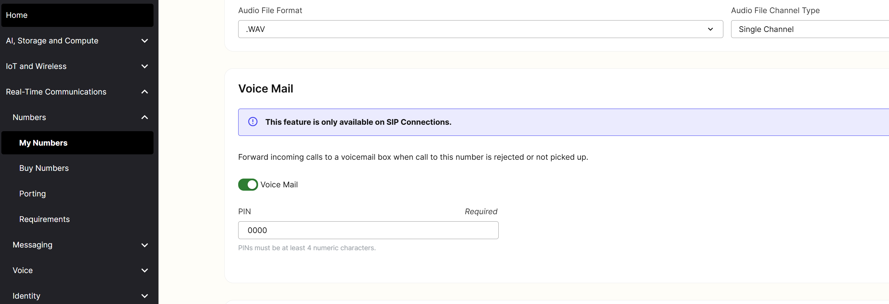

# Setting Up Telnyx Voicemail

Introducing Telnyx's Voicemail feature: Forward missed or rejected calls to voicemail and access messages with a PIN. See Telnyx guidance and requirements.


## **Voicemail**

**⚠️ This feature should only be enabled on numbers that are assigned to SIP Connections. ⚠️**

In this early version of the feature you will be able to forward incoming calls to a voicemail box when a call is rejected or missed.



You will then be able to consult deposited voicemail messages by dialing \*98 from a voicemail enabled number and authenticating with an access PIN that you set. Please make sure that the device you are calling from has the voicemail enabled number set as the Caller ID before dialling \*98.

## Setting Voicemail PIN

Setting a voicemail PIN is required in order to enable the voicemail service.

Customers will be able to enable voicemail features today through the number settings on your [portal](https://portal.telnyx.com/) account following these steps:

1. Go to ‘My Numbers’ in the ‘Numbers’ section.
2. Filter for the number you wish to configure voicemail.
3. Click the pencil icon, under the actions column, to be brought to the number settings.
4. Click the "voice" sub tab to access the voice related settings of your number.
5. Scroll down until you find the Voice Mail section.
6. Click the toggle to enable voicemail.
7. Set your PIN

## Calls Voicemail Completed Event

If you have set a [webhook url on your SIP Connection](https://support.telnyx.com/en/articles/4351104-sip-connection-settings#h_60fe950d9b), we now deliver a new webhook event so you can stay informed about any voicemails that have been left through calls.voicemail.completed.

Example:

```
{
  "data": {
    "event_type": "calls.voicemail.completed",
    "id": "93958804-6787-4623-bb59-a4e4ce1c44de",
    "occurred_at": "2023-11-15T08:00:33.589698Z",
    "payload": {
      "call_session_id": "036c8492-838d-11ee-b3bb-02420a0d3a69",
      "connection_id": "1635420769989166414",
      "from": "+13121234567",
      "recording_url": "url of recording to download file",
      "to": "+13127654321"
    },
    "record_type": "event"
  },
  "meta": {
    "attempt": 1,
    "delivered_to": "https://webhook.site/0a6718c8-e59a-4921-8119-c395d631a99b"
  }
}
```

## Limitations

* You can not currently customise the voicemail box greeting message.
* You can not trigger an email to be sent upon a voicemail being deposited.

These are two features that Telnyx is considering the introduce in the future.

## **Voicemail API**

Want to programmatically update a phone numbers voicemail settings?

Check out our developer documentation here:

* <https://developers.telnyx.com/api/voicemail/get-voicemail>
* <https://developers.telnyx.com/api/voicemail/create-voicemail>
* <https://developers.telnyx.com/api/voicemail/update-voicemail>

---

Related Articles

[FreePBX Trunk Settings With Telnyx](https://support.telnyx.com/en/articles/1130620-freepbx-trunk-settings-with-telnyx)[Telnyx + Vapi Integration](https://support.telnyx.com/en/articles/12538402-telnyx-vapi-integration)[TeXML Bin Simple Voicemail and Call Forwarding](https://support.telnyx.com/en/articles/13386198-texml-bin-simple-voicemail-and-call-forwarding)[Twilio TwiML Conference on Telnyx](https://support.telnyx.com/en/articles/13389311-twilio-twiml-conference-on-telnyx)[Custom Voicemail Greetings](https://support.telnyx.com/en/articles/15864441-custom-voicemail-greetings)

Did this answer your question?

😞😐😃
