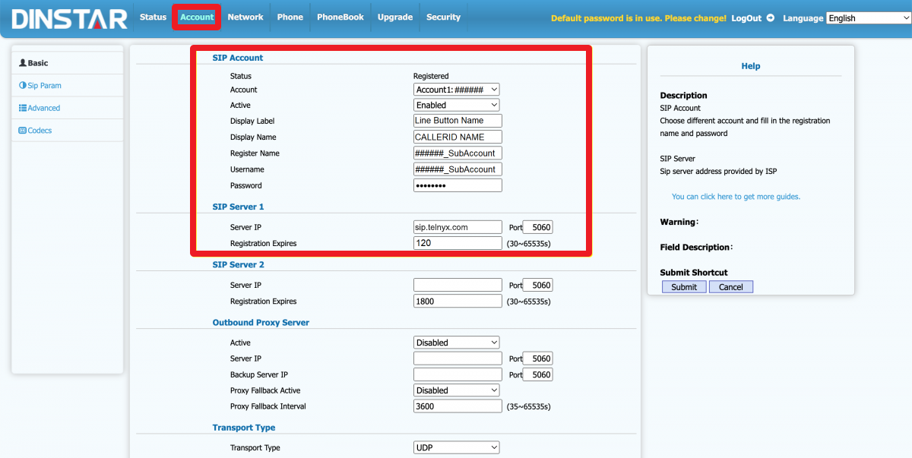

# Dinstar C60: Setup & Config

Learn how to set up and configure the Telco AC-211 SIP ATA in order to use it with your Telnyx account. See Telnyx guidance and requirements.

C

[Jump to Instructions](#h_cd92a12bd5)

[The Dinstar C60 series](https://www.dinstar.com/ip-phone/c60/) delivers innovative SIP technology, ideal to meet a wide variety of business communication needs. It boasts many delightful features, such as:

* 132x64-pixel graphical LCD with back-light
* An elegant and intuitive user interface
* Excellent HD voice quality
* Various system functions to meet the different needs of SMEs, Call centers, and industry users.
* Easy to install, configure, and use
* Supports 2 SIP accounts and 5-party conference
* Achieves rich business functions by seamlessly cooperating with IP PBX

**Additional documentation:**

* [Dinstar downloads](https://www.dinstar.com/download/) (datasheets, install guides, and user manuals)
* [Dinstar FAQs](https://www.dinstar.com/faq/)
* Dinstar Wiki
* [Dinstar contact and support](https://www.dinstar.com/contact-us/)

---

## Instructions for setting up and configuring Dinstar C60 series with Telnyx as provider

In this activity you will:

1. [Obtain your device's IP address and log into the web portal](#h_56f4a09995)
2. [Configure a Telnyx SIP trunk](#h_627c8750d9)

**Pre-requisites**

* Your Telnyx Portal must be correctly [set up and configured for use](https://support.telnyx.com/en/articles/1176636-get-started-with-a-mission-control-account)
* Have your SIP Credentials (The username/password for your main SIP account or SIP sub-account)
* Have [DID(s) available](https://support.telnyx.com/en/articles/4380325-search-and-buy-numbers) to assign
* Make sure your c60 series device is connected to your local network

**Video Walkthrough**

Setting up your Telnyx SIP portal account so you can make and receive calls:

## 1. Obtain your device's IP address and log into the web portal

In this section, you will use your phone to find its IP address. You'll then use this address to log into the web portal.

1. Once your phone is connected to your local network, from the phone screen, press the **OK** button. Then select **IPV4**.
2. Record the IP address here. You'll need it in the next step.
3. Open a browser and input the IP address into the address bar and hit **Enter**.
4. You'll be asked to enter user credentials. Out of the box, the default login credentials are

   1. **Username:** *admin*
   2. **Password:** *admin*

[Back to Top](#h_cd92a12bd5)

## 2. Configure a Telnyx SIP trunk

In this section, you'll configure a [SIP trunk](https://telnyx.com/products/sip-trunks) to connect your Dinstar phone to your Telnyx account.

1. From the phone's web portal, navigate to **Account > Basic Page**.
2. In the **SIP Account** section, provide the following:

   1. **Account:**Your accountID, being either your main account or sub account.
   2. **Active:** *Enabled*
   3. **Display Label:** The name you want to give to the line.
   4. **Display Name:** Set your callerID name here. Caller ID naming conventions:

      1. Name should be in capital letters. This will appears more clearly/visible on some devices.
      2. You must NOT use any special characters, as they will not be displayed. Spaces are allowed.
      3. Some of regular Canadian providers will not show more than 15 characters. We suggest shrinking or adapt your caller ID.
   5. **Register Name:** Either your main account or sub-account.
   6. **Username:** The username associated with the Telnyx account you used in step e.
   7. **Password:** The password associated with the Telnyx account you used in step e.
3. In the **SIP Server** section, provide the following:

   1. **Server IP:** *[sip.telnyx.com](https://sip.telnyx.com/)*
   2. **Port:** *5060*
   3. **Registration Expires:** *120*

   

That's it! You've finished configuring your Dinstar C60 series phone, and can now start testing calls!
​

[Back to Top](#h_cd92a12bd5)

---

## Additional Resources

Review our [getting started with guide](https://support.telnyx.com/en/articles/1176636-get-started-with-a-mission-control-account) to make sure your Telnyx Mission Control Portal account is setup correctly!

Additionally, check out:

* [Dinstar downloads](https://www.dinstar.com/download/) (datasheets, install guides, and user manuals)
* [Dinstar FAQs](https://www.dinstar.com/faq/)
* Dinstar Wiki
* [Dinstar contact and support](https://www.dinstar.com/contact-us/)

---

Related Articles

[Wildix: SIP Trunk Setup](https://support.telnyx.com/en/articles/5799830-wildix-sip-trunk-setup)[Flyingvoice: Telnyx Setup](https://support.telnyx.com/en/articles/5810663-flyingvoice-telnyx-setup)[Gigaset A510: Telnyx Setup](https://support.telnyx.com/en/articles/5815209-gigaset-a510-telnyx-setup)[Fanvil A32i: Telnyx Setup](https://support.telnyx.com/en/articles/6056428-fanvil-a32i-telnyx-setup)[Alcatel: SD601/SD602 SIP Door](https://support.telnyx.com/en/articles/6281943-alcatel-sd601-sd602-sip-door)

Did this answer your question?

😞😐😃
