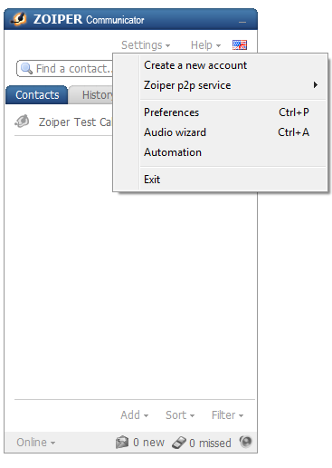
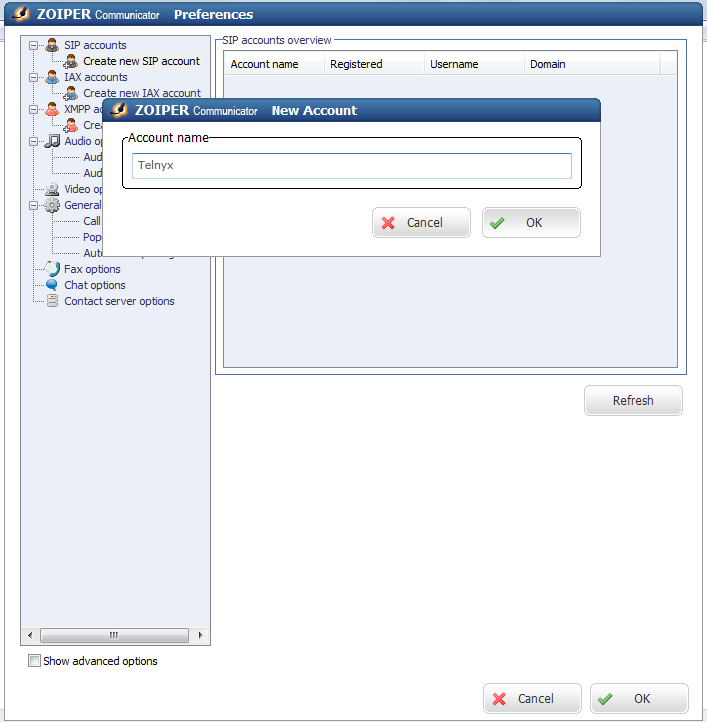
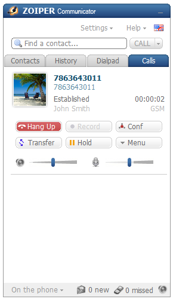

Zoiper Communicator | Telnyx Help Center

[Skip to main content](#main-content)

# Zoiper Communicator

Maximize your online communication with the Zoiper Communicator IAX & SIP softphone, a free, multi-functional tool.

C

Written by Customer Success

June 6, 2024

Table of contents

[Jump to Instructions](#h_9def290ce2)

[Zoiper Communicator](https://digitalvoice.ca/softphone_zoiper_dl.php) IAX & SIP softphone is a free converged Internet communication tool combining high-quality voice and video calls, fax, instant messaging and presence through a contact-centric intuitive interface. The [Zoiper](https://support.telnyx.com/en/articles/6133517-zoiper-communicator) Service is embedded in your Zoiper Communicator and assures free advanced Zoiper-to-Zoiper communication.

|  |
| --- |
| ***Note:*** *You can choose not to use the Zoiper service with Zoiper Communicator. Simply choose "I don't want to use this service" from the interface on initial startup. You can also just not log into the service on startup as well.* |

|  |
| --- |
| ***Note:*** *Zoiper does not advertise or offer Zoiper Communicator at this time, however it is still available for use via the link above.* |

Additional Resources:

* [Zoiper help](https://www.zoiper.com/en/support/questions)  
  ​

---

# Instructions for Configuring Zoiper Communicator

In this activity you will:

1. [Add Telnyx as your SIP provider and create a trunk](#h_04c5d08d3f)  
   ​

**Pre-requisites**

* Your Telnyx Portal must be correctly [set up and configured for use](https://support.telnyx.com/en/articles/1176636-get-started-with-a-mission-control-account)
* Have your SIP Credentials (The username/password for your main SIP account or SIP sub-account)
* Have [DID(s) available](https://support.telnyx.com/en/articles/4380325-search-and-buy-numbers) to assign
* A PC running a Windows OS
* [Download](https://digitalvoice.ca/softphone_zoiper_dl.php) and install Zoiper Communicator  
  ​

**Video Walkthrough**

Setting up your Telnyx SIP portal account so you can make and receive calls:

|  |
| --- |
| ***Note:*** *We are trying to find a Zoiper Communicator video and have it available soon! Check back frequently as we are updating our documentation.* |

## 1. Add Telnyx as your SIP provider and create a trunk

In this section, you'll configure your first [SIP trunk](https://telnyx.com/products/sip-trunks) on your Zoiper Communicator softphone.

1. Start Zoiper Communicator and select **Settings**.
2. Select **Create New Account**.

   
3. Enter a name for your new account and click **OK**.

   
4. On the **SIP Account Options** page, provide the following information:

   1. **Domain:** *sip.telnyx.com*
   2. **Username:** Your main Telnyx account or sub-account username
   3. **Password:** Your main Telnyx account or sub-account password
   4. **Caller ID Name:** Choose whatever name you prefer. Note the following caller ID naming conventions:

      1. Caller ID Name should be in capital letters. This will appears more clearly/visible on some devices.
      2. You must NOT use any special characters, as they will not be displayed. Spaces are allowed.
      3. Some of regular Canadian providers will not show more than 15 characters. We suggest shrinking or adapt your caller ID.

      
5. Click **OK** to complete the setup.

   

That's it! You've finished configuring your Zoiper Communicator softphone, and can now start testing calls!  
​

[Back to Top](#h_9def290ce2)

---

## Additional Resources

Review our [getting started with guide](https://support.telnyx.com/en/articles/1176636-get-started-with-a-mission-control-account) to make sure your Telnyx Mission Control Portal account is setup correctly!

Additionally, check out:

* [Zoiper help](https://www.zoiper.com/en/support/questions)

---

Related Articles

[SIP URI Calling](https://support.telnyx.com/en/articles/2925713-sip-uri-calling)[Zoiper 5 Pro: Telnyx Setup](https://support.telnyx.com/en/articles/5717957-zoiper-5-pro-telnyx-setup)[Zoiper 3: Telnyx Setup (Mac)](https://support.telnyx.com/en/articles/5720999-zoiper-3-telnyx-setup-mac)[MicroSIP: Setup with Telnyx](https://support.telnyx.com/en/articles/6133145-microsip-setup-with-telnyx)[MS Teams: Call2Teams & Telnyx](https://support.telnyx.com/en/articles/6133589-ms-teams-call2teams-telnyx)

Did this answer your question?

😞😐😃

Table of contents
