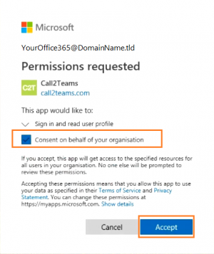
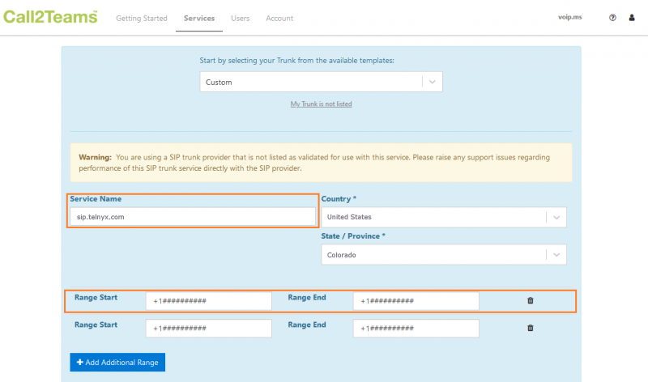
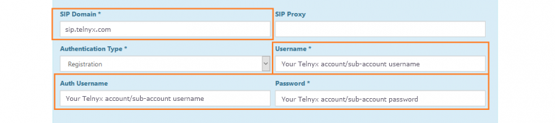
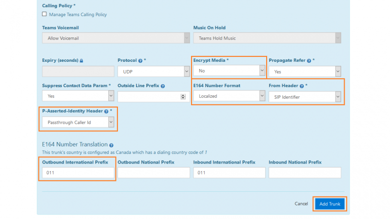
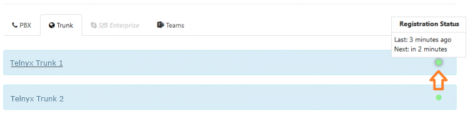
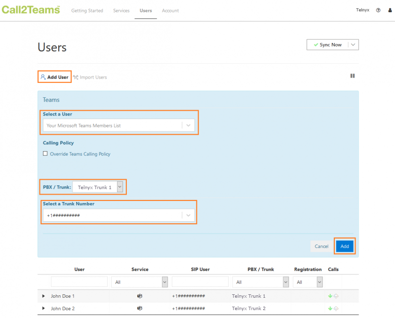

# MS Teams: Call2Teams & Telnyx

Learn how to set up and configure Call2Teams and connect Microsoft Teams to a PBX/SIP trunk. See Telnyx guidance and requirements.

C

[Jump to Instructions](#h_8d2da11584)

[Microsoft Call2Teams](https://www.call2teams.com/)™ is an add-on for Office 365 that connects Microsoft Teams to any PBX or [SIP Trunk](https://telnyx.com/products/sip-trunks), allowing you to make and receive calls on any device using the Microsoft Teams App.

**Additional resources:**

* Features and benefits for the end user
* [Features and benefits for partners](https://www.call2teams.com/partners/)
* Call2Teams support (partner login required)

---

## Instructions for setting up and configuring Call2Teams to work with Telnyx

In this activity you will:

1. [Set up the Office 365 Tenant](#h_829aeeb8ab)
2. [Connect to Telnyx and create a SIP trunk](#h_829aeeb8ab)
3. [Assign a phone number to a team member](#h_927d8477c5)

**Pre-requisites**

* Your Telnyx Portal must be correctly [set up and configured for use](https://support.telnyx.com/en/articles/1176636-get-started-with-a-mission-control-account)
* Have your SIP Credentials (The username/password for your main SIP account or SIP sub-account)
* Have [DID(s) available](https://support.telnyx.com/en/articles/4380325-search-and-buy-numbers) to assign
* A PC running a Windows OS
* Create a temporary spare user license on Microsoft 365
* Global admin access to your Microsoft 365 tenant
* Create a Call2Teams subscription
  ​

**Video Walkthrough**

Setting up your Telnyx SIP portal account so you can make and receive calls:

## 1. Set up the Office 365 tenant

In this section you will log into the Call2Teams portal and set up your

1. Once you've created your subscription to Call2Teams, you'll receive an email inviting you to the portal. When you click Accept Invitation, you'll need to use your Office 365 account to log in. Make sure this account is associated with the organization you're configuring Call2Teams for and that you have global-level; access.
2. Give Call2Teams permission to connect to your 365 account.

   1. You MUST check the **Connect on behalf of your organization** checkbox.

      
3. Click **Accept**.

[Back to Top](#h_8d2da11584)

## 2. Connect to Telnyx and Create a SIP trunk

In this activity, you will set Telnyx as your SIP provider and create your first trunk that will be connected by Call2Teams to Microsoft Teams.

1. ### **From the Call2Teams admin portal, click on the "Service" tab in the top navigation.**
2. ### **From here, find the "Trunk" tab. Click on this, then click "Add New Trunk".**
3. ### **Here you will see a drop-down menu where you can select from a list of verified providers with pre-configured profiles that will set your trunk up for you.**

   1. As of the time of writing, Telnyx is not yet on this list, so you'll need to select **Custom** from this list. You'll get a message telling you that any Telnyx-specific support can't be handled by Microsoft at this time. Click the **Proceed with Unsupported Configuration** button.

      
4. ### **You'll now be able to enter your Telnyx account information. Provide the following:**

   * **Service Name**: *Telnyx Trunk 1*
   * **Country**: Your Country
   * **State/Province**: Your State/Province
   * **Range Start/Range End**: You'll use your Telnyx DIDs. Ensure that you add + plus your country code before entering your DID.

     + If you have more than one DID that you would like to add and they are not sequential, add each of these DIDs on both the **START Range** and the **Range END** fields.
     + You will need to add each DID separately by adding a new range by clicking on **+ Add Additional Range.**
   * **SIP Domain**: *sip.telnyx.com*
   * **Authenticate Type**: *Registration*
   * **Username**: Your Telnyx account/sub-account username
   * **Auth Username**: Your Telnyx account/sub-account username
   * **Password**: Your Telnyx account/sub-account password
   * **Expiry (seconds)**: If you want, click on the padlock, and enter *300*. You can also leave this blank.
   * **Protocol**: *UDP* or *TCP*.
   * **Encrypt Media**: *No*
   * **Propagate Refer:** *Yes*
     ​
     ​**Note:** Select *Yes* to propagate received SIP REFER messages from Microsoft upstream to this service.

     + If set to *No* then transfers are bridged out as new calls.On the 2nd Gen OneClick Teams connector you should select *Yes* if you have users in a Call Center, but otherwise select *No* as this will allow consultative transfers to work better.

   * **Propagate Refer**: *No*
   * **Outside Line Prefix**: Leave this option blank
   * **E164 Number Format**: *Localized*

   * **From Header**: *SIP Identifier*
   * **P-Asserted-Identity Header**: This will be the outbound caller ID Name. You can choose:

     + *Passthrough Caller Id:* This will be the caller ID given by the far end (e.g. Teams (The user extension name)),
     + *Trunk User Number:* To display the phone number assigned to the user in the portal

   * **E164 Number Translation** (The incoming number needs to be converted to E164 format)

     + **Outbound International Prefix**: *011*
     + **Outbound National Prefix**: Leave blank
     + **Inbound International Prefix**: Indicate
     + **Inbound National Prefix**: Leave blank

     

     

     
5. ### **Click the "Add Trunk" button.**
6. ### **You'll now see your new trunk in your list. Click on the Trunk tab to see your list at any time. You can also monitor the health of your Trunk and ensure it's still up and running from this list.**

   

[Back to Top](#h_8d2da11584)

## 3. Associate a number with a team member

In this section, you'll add users to Call2Teams and associate numbers with them. These numbers will be the DIDs you entered in [section 2](#h_829aeeb8ab).

1. Click on the **Users** tab in the top navigation.
2. From this tab, click **Add New User** and provide the following information:

   1. **Select a User:** Select the user intended for the number.
   2. **PBX/Trunk:** Select a trunk you've created
   3. **Select a Trunk Number:** Select the DID intended for this user.

      
3. Click the **Add** button, followed by the **Sync Now** button in the upper right.

That's it! You've finished configuring Call2Teams, and can now start testing calls!
​
​

[Back to Top](#h_8d2da11584)

---

## Additional Resources

Review our [getting started with guide](https://support.telnyx.com/en/articles/1176636-get-started-with-a-mission-control-account) to make sure your Telnyx Mission Control Portal account is setup correctly!

Additionally, check out:

* Features and benefits for the end user
* [Features and benefits for partners](https://www.call2teams.com/partners/)
* Call2Teams support (partner login required)

---

---

Related Articles

[Configuring Telnyx with Microsoft Teams Direct Routing](https://support.telnyx.com/en/articles/5253876-configuring-telnyx-with-microsoft-teams-direct-routing)[PBXes: Connecting a PBXes Trunk to Telnyx](https://support.telnyx.com/en/articles/5798240-pbxes-connecting-a-pbxes-trunk-to-telnyx)[Wildix: SIP Trunk Setup](https://support.telnyx.com/en/articles/5799830-wildix-sip-trunk-setup)[Fanvil A32i: Telnyx Setup](https://support.telnyx.com/en/articles/6056428-fanvil-a32i-telnyx-setup)[BYOC: Telnyx & Genesys](https://support.telnyx.com/en/articles/8268122-byoc-telnyx-genesys)

Did this answer your question?

😞😐😃
