# 3CX: Configuring a 3CX V18 PBX

Learn how to configure a 3CX V18 PBX SIP Trunk (Calls & Messaging) with Telnyx through their import provider option… See Telnyx guidance and requirements.

[Jump to Instructions](#:~:text=Instructions%20for%20Configuring%20a%203CX%20V18%20PBX%20Trunk)

[3CX](https://www.3cx.com/) is an open standards IP PBX that offers complete Unified Communications, out of the box. Suitable for any business size or industry 3CX can accommodate to your every need; from mobility and status to advanced contact center features and more, at a fraction of the cost.
​
3CX makes installation, management and maintenance of your PBX so easy that you can effortlessly manage it yourself, whether on an appliance or server at your premise or in the cloud. This article guides you on how to configure this PBX for making and receiving calls over the internet through a next generation carrier like Telnyx!

|  |
| --- |
| ***NOTE****: you'll need to acquire a license when installing this version of 3CX. You'll be prompted to fill out a [form](https://www.3cx.com/phone-system/download-phone-system/) and include your email address so they can verify your email and send you the license key.*  ***NOTE:*** Telnyx is no longer a supported vendor on 3CX and 3CX has decided to shut down support for third party vendors altogether in some of their versions and to only offer their customers the option to connect with their supported vendors. Please check your 3CX version and make sure third party vendors (non-supported providers from 3CX's perspective) are available in your version. |

---

## Instructions for Configuring a 3CX V18 PBX Trunk

In this guide you will:

1. [Perform a basic setup](#h_9535a5e87f)
2. [Configure your PBX](#h_a477259f1f)

   1. [Confirm your network settings](#h_8036cfb560)
   2. [Create a Telnyx SIP trunk](#:~:text=2.2.%20Create%20a%20Telnyx%20SIP%20Trunk)
   3. [Configure inbound rule](#h_4c36c30479)
   4. [Configure outbound rule](#h_af8b85c3d2)
   5. [See an important example of an outbound rule](#h_15d20e720d)
   6. [Configure an extension for inbound / outbound messaging](#h_c1201e552a)
   7. [Test the 3CX webclient](#h_dd546b7f5a)

## Pre-requisites

* [Set up and configure your Telnyx Mission Control Portal](https://support.telnyx.com/en/articles/5717957-zoiper-5-pro-telnyx-setup#h_dc5df9cfdf)
* Have created a credentials-based or IP based [SIP connection](https://portal.telnyx.com/#/voice/connections) on your Telnyx Mission Control Portal account, assigned this connection to a DID and outbound profile in order to make and receive calls.
* Have created a [messaging profile](https://portal.telnyx.com/#/programmable-messaging/profiles) on your Telnyx Mission Control Portal account, assigned this connection to a DID in order to send and receive messages.
* [Download](https://www.3cx.com/phone-system/download-links/) and [install](https://www.3cx.com/docs/manual/) 3CX

  + Note that during installation, 3CX will provide you with a username and password. You will need these to log into the web interface.

|  |
| --- |
| ***Note:***  *3CX will detect your pubic IP address and you can specify if this is a static or dynamic IP.*    *You can configure your 3CX with an FQDN; 3CX will provide you with one - they do this to ensure your FQDN is set to resolve to your Public IP and for generating certificates.*    *You'll then choose your default network adapter and decide whether you want the extensions to use the local IP of your PBX or the FQDn you created.*    *At the end, you'll choose your preferred http/https port numbers which will be used to allow you to access the 3CX web interface via your FQDN or Public IP.* |

## 1. Perform the basic setup

In this step, you'll do a basic configuration before creating your Telnyx [SIP trunk](https://telnyx.com/products/sip-trunks).

1. Log into 3CX with the username and password provided to you during the installation process.

   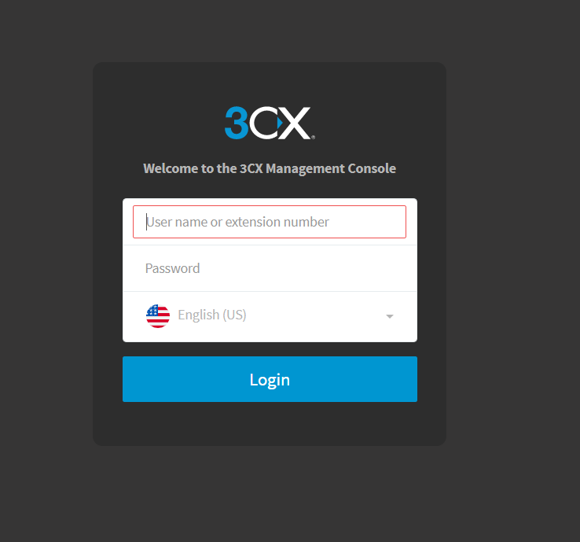
2. On the "**Extension Length"** tab, specify your extension length by choosing how many digits your extension should have (default is 3). Note that this CANNOT be changed later.
   ​

   ### Extension Length Tab:

   
3. Click "**Next"**.
4. On the "**Admin Email"** tab and enter an email you want to use to receive system notifications and other important information.
   ​

   ### Admin Email Tab:

   
5. Click "**Next"**.
6. On the "**Timezone"** tab, set your timezone.

   ### Timezone Tab:

   
7. Click "**Next"**.
8. On the Operator tab, you can specify a default operator extension. This will be the default destination for all inbound calls, as well as a voicemail extension.

   ### Operator Tab:

   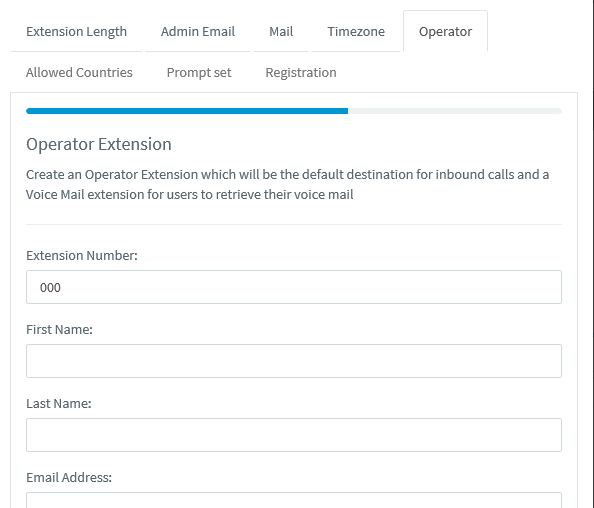
9. Click "**Next"**.
10. On the "**Allowed Countries"** tab, you can select all regions permitted for outgoing call.

    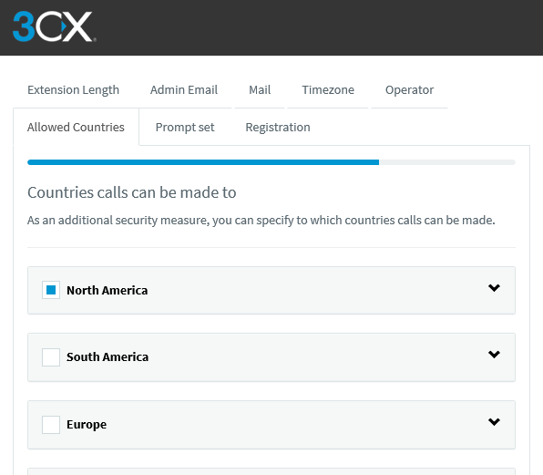
11. Click "**Next"**.
12. On the "**Prompt set"** tab, you can select the language spoken by your automated prompts.

    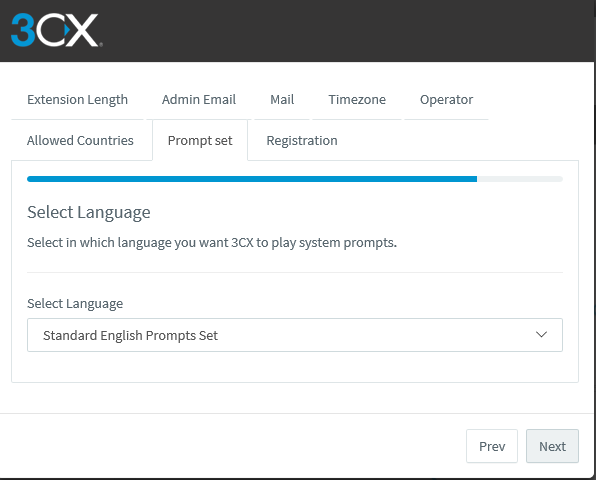
13. Click "**Next"**.
14. On the "**Registration"** tab, enter your personal detail to register your setup.

[Back to Top](#h_87213f8535)

## 2. Configure your PBX

In this step, you'll configure everything needed to start making and receiving calls with 3CX through Telnyx, including network settings, SIP trunks, inbound/outbound routes etc.

## 2.1. Confirm your network settings

1. Click on the **Ports** tab and ensure your SIP port is set to 5060.
2. Click on the **Public IP** tab and ensure that your Public IP is correct and that you have selected the proper Network card Interface.
3. Click on the **Settings** tab and click on **Network Settings** and then on the Public IP tab. Find the **External IP Configuration** section and ensure that the connection IP on the portal matches the Static Public IP.

## 2.2. Create a Telnyx SIP Trunk

1. Click on "**SIP Trunks"** in the left-hand navigation menu.
2. Click "**Import Provider"** near the top of the screen.
3. A new pop up will open. Enter/select the following:

   1. Upload the **telnyx.pv.xml** file attachment at the end of this article.

      1. Try your browser in incognito mode or clear cache/cookies if you can't access the file otherwise, please try another browser.
      2. Our support team can also help provide the file if you can't access it.
      3. This will pre-populate the trunk settings.
   2. Enter the main trunk number.

      
4. Click "**OK"**. This will open the trunk configuration window.
5. Click on the the "**General"** tab and find "**Trunk Details":**

   1. **Enter name of Trunk:** *Telnyx LLC*
   2. **Registrar/Server/Gateway Hostname or IP:** *sip-anycast1.telnyx.com:5060 or sip.telnyx.com:5060*
   3. **Outbound Proxy:** *<leave blank unless you are using a proxy to send calls to first>*
   4. **Number of SIM Calls:** <set your preferred amount of simultaneous calls>
   5. 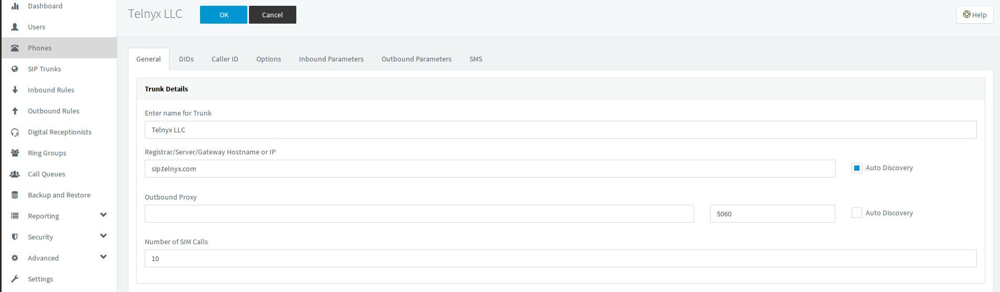
6. ### **Authentication** section:

   1. **Type of Authentication:** Register/Account based

      1. **Authentication ID:** <You need to use the username from the connection which you have created in the Telnyx portal>
      2. **Authentication Password:** <You need to use password from the connection which you have created in the Telnyx portal>
      3. **3 Way Authentication:** Do not enable

         
   2. **Type of Authentication:** Do not require - IP based

      1. Select this option if you would prefer to send and receive calls from the public IP address of your 3CX instance.
      2. **Authentication ID:** Leave empty
      3. **Authentication Password:** Leave empty
      4. **3 Way Authentication:** Do no enable
         ​
7. Find the "**Route calls to"** section.

   1. **Main Trunk number :**<By default number will be shown. You need cross verify with the number which you have purchased on telnyx portal>
   2. **Destination for calls during the office hours :** <Based on your requirement>
   3. **Destination for calls outside the office hours :** <Based on your requirement>

      
8. For the other "**sub tabs"** available, these will have been pre-populated with general settings that Telnyx recommends from the xml file uploaded.

   1. Click **OK** when you are happy with the trunk settings.
9. Lastly, this provider trunk pre-populates information in the "**SMS sub tab"**.

   1. **API Key**: Visit <https://portal.telnyx.com/#/api-keys> to generate a key and paste into the field.
   2. **Provider URL**: <https://api.telnyx.com/v2/messages>
   3. **Copy webhook URL**: Visit <https://portal.telnyx.com/#/programmable-messaging/profiles> and make sure to copy and paste this URL into your messaging profile that you've created to allow for inbound and outbound messaging.
   4. 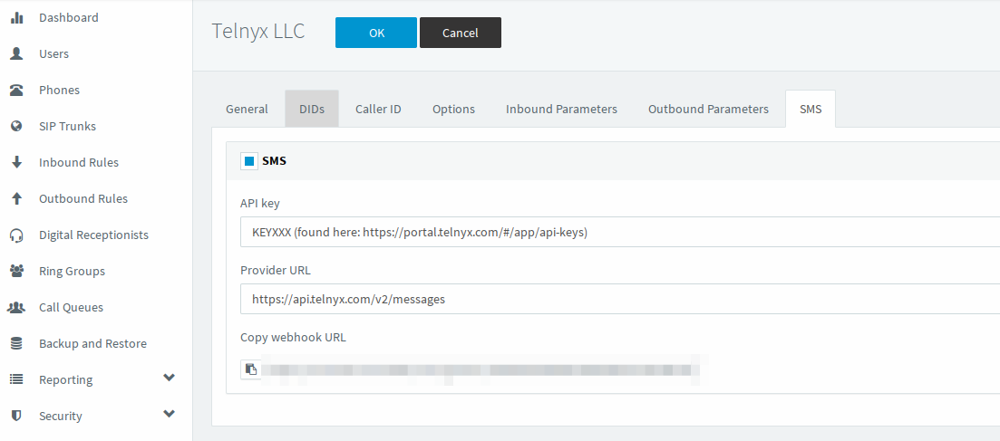
   5. Click **OK** when you are happy with the trunk settings.
      ​
10. Your Telnyx trunk is now live!

## 2.3. Configure inbound rule

1. Click on "**Inbound Rules**" from the navigation menu on the left.
2. Click on "**+Add DID Rule**" near the top of the screen.
3. Find the **General** section and ensure the following:

   1. **Name:** *IB\_Telnyx* (or any name that can identify your inbound rule)

      
4. Find the **Route calls to** section and ensure that:

   1. **Destination for calls during office hours:** *Extension* and ensure that your desired extension is selected (is usually *000*).

      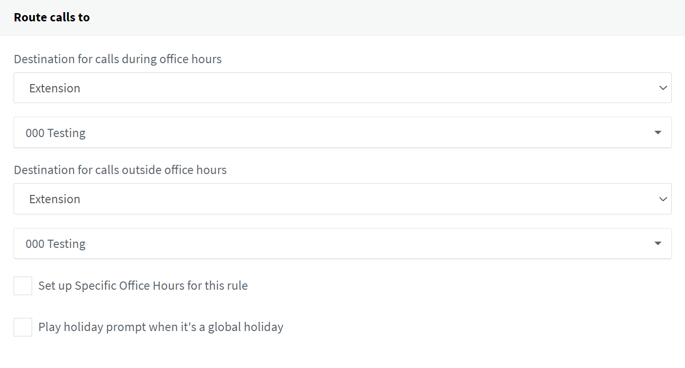

## 2.4. Configure outbound rule

1. Click on **Outbound Rules** from the navigation menu on the left.
2. Click on **+Add** near the top of the screen.
3. Find the **General** section and ensure the following:

   1. **Name:** *OB\_Telnyx* (or any name that can identify your outbound rule)

      
4. Find the **Apply this rule to these calls** section and fill in the following:

   1. **Calls to numbers starting with prefix :** <leave empty>
   2. **Calls from extension(s) :** <You need to give the extension numbers>

      1. **NOTE**: ‘000’ is the extension I have used as an example.
   3. **Calls to Numbers with a length of :** <leave empty>

      
5. Find the **Make outbound calls on** section. This is where you will configure your routes. You can configure up to 3 routes for calls. The second and third route will be used as backup. For each route, digits can be stripped or added. Strip Digits 0 on Route 1 and Strip Digits 1 digit for remaining 2 routes.
   ​
   This is also one of the many ways an **outbound caller ID** can be applied within 3CX. If you choose to apply an outbound caller ID on your Outbound Route, it will be applied to all calls that proceed through this route.

   

|  |
| --- |
| ***Note:*** *If you choose not to add an outbound caller ID on your outbound route, you can instead apply it for each user or extension.*    *If a caller ID is not set through 3CX, it is likely that the calls will reach us without a caller ID. If this is the case, you may choose to apply a Caller ID Override from your SIP Connection’s outbound options in the Telnyx Portal. Otherwise, your calls will be rejected. Please review our [caller ID number policy](https://support.telnyx.com/en/articles/3546251-caller-id-number-policy) for accepted formats.* |

Depending on your use case, you may have specific dialling format rules and 3CX provides a great overview [here](https://www.3cx.com/blog/voip-howto/outbound-rules-a-complete-example/).

After completing this configuration, click "**OK**".

## **An important example of an outbound rule**

The outbound rule feature in 3cx is a powerful tool for configuring your 3CX phone system that extra mile allowing you to create much more complex rules – allowing you to not only select backup routes which come into effect when other routes fail, but also to select a different set of routes, depending on the type of number being dialed. Below you will find an example outbound rule for handling 911 Emergency Calls:

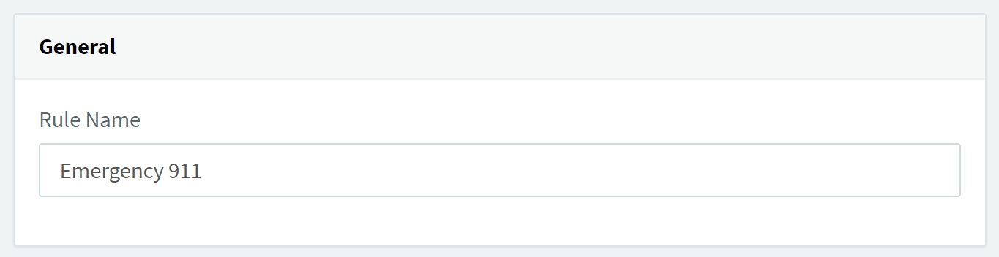

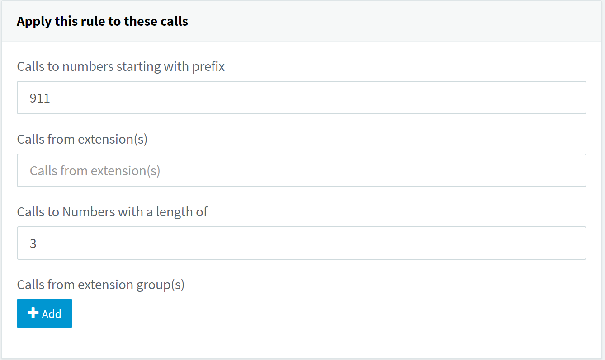

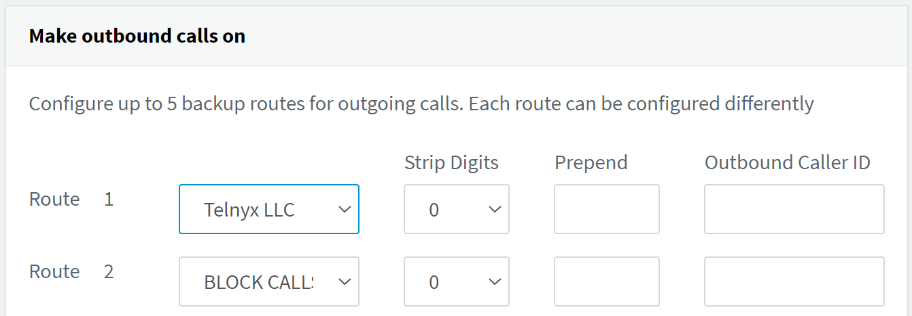

For additional outbound rule examples which you may find useful please see the following [support article](https://www.3cx.com/blog/voip-howto/outbound-rules-a-complete-example/) from 3CX.

That's it, you've now completed the configuration of 3CX V18 PBX Credential Trunk and can now make and receive calls by using Telnyx as your SIP provider!

## 2.5. Configure extension for inbound and outbound messaging.

1. An existing extension/user will have been created during the initial setup.

   1. Visit the "users" section where you can add more extensions or edit existing extensions.
   2. In our example below, we're going to click into extension 101 so we can enable messaging on the extension which is associated with one of the numbers we configured in our inbound routes.
   3. 
   4. You will be brought to the "**General**" tab.

      1. Visit the end of the page and make sure to assign the DID to the extension. **Previously in V18 Update 5 you would have to enable SMS on the associated DID but this is no longer a requirement.**

         
      2. Click **OK** at the top of the page which will make inbound and messaging live for the extension.

## 2.6. Access 3CX Native WebClient to send and receive messages.

1. During the extension creation process at the initial setup, you would have received an email from 3CX "**Your User Account on your New 3CX System"** with a link to their webclient along with the extensions username and password.
2. Visit the link and login.

   1. This is an app you can use on the web for making and receiving calls/sms for each given extension that is created.
3. Once logged in visit the contacts section.

   1. Click “+” icon to add a contact.
   2. Enter in the name and mobile number of the contact.
   3. Click the “save” icon on the top right.
   4. 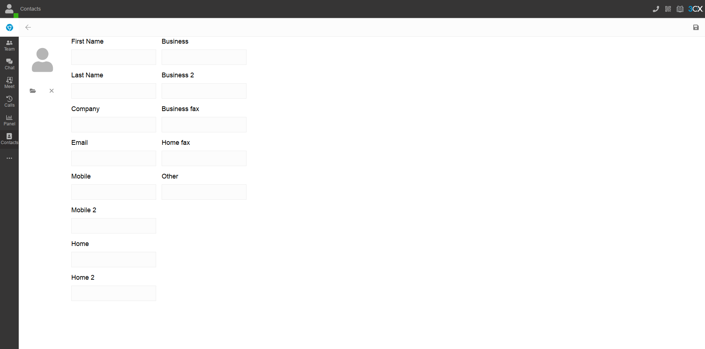
   5. Once the contacts are saved, you can now use them in the chat section.
4. Visit the chat section

   1. Click “+” symbol
   2. and then “Send SMS”
   3. 
   4. choose the contact you want to send an SMS to.
   5. 
   6. type your message and hit enter to send.
   7. The message will send to the destination.
   8. Once the destination responds, you’ll see it in the chat.
   9. 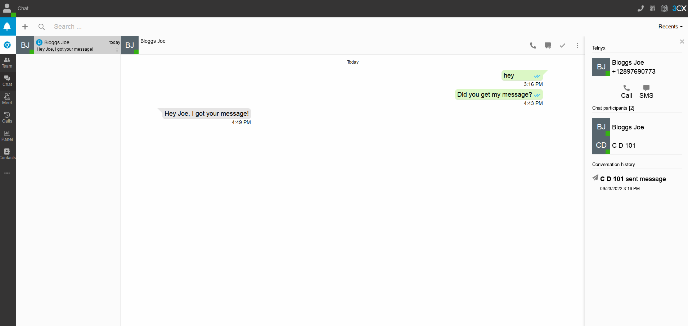

That's it, you've now completed the configuration of 3CX V18 PBX and can now make and receive calls & messages by using Telnyx as your SIP provider!

[Back to Top](#h_87213f8535)

---

## Additional Resources

Review our [getting started with guide](https://support.telnyx.com/en/articles/1176636-get-started-with-a-mission-control-account) to make sure your Telnyx Mission Control Portal account is setup correctly!

Additionally, you can check out:

* 3CX's [help section](https://www.3cx.com/support/) for extra support!
* Latest information on [3CX V18 Updates](https://www.3cx.com/blog/releases/).

[telnyx.pv.xml](https://telnyx-48416ce2297b.intercom-attachments-7.com/i/o/997239819/230a8f6b1b503d635675fed1/telnyx_pv.xml?expires=1783507500&signature=611430fa070f6f1044efbbdcce41bddc378b2954b85bf350403bc4adc9921438&req=fSkgFMp3lYBWFb4f3HP0gJNSzxnGynWEHaYGLCbAoF4XiGRoPYfDbjqi7yXl%0AFVFeAcjOpw%3D%3D%0A)

---

Related Articles

[Configuring an Elastix 4 PBX IP Trunk](https://support.telnyx.com/en/articles/1130622-configuring-an-elastix-4-pbx-ip-trunk)[How to configure a Thirdlane PBX](https://support.telnyx.com/en/articles/1130631-how-to-configure-a-thirdlane-pbx)[Configuring an Elastix 4 PBX Trunk](https://support.telnyx.com/en/articles/1130654-configuring-an-elastix-4-pbx-trunk)[Xorcom PBX: SIP Trunk](https://support.telnyx.com/en/articles/5754127-xorcom-pbx-sip-trunk)[3CX: Configuring a 3CX V20 PBX 20.0 Update 5 (Build 20.0.5.551) (March 2025 Update)](https://support.telnyx.com/en/articles/8683996-3cx-configuring-a-3cx-v20-pbx-20-0-update-5-build-20-0-5-551-march-2025-update)

Did this answer your question?

😞😐😃
