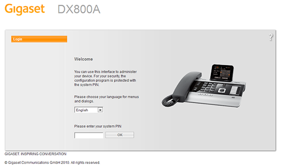
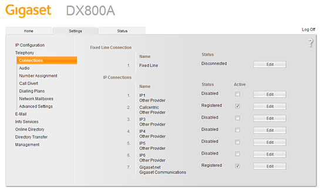
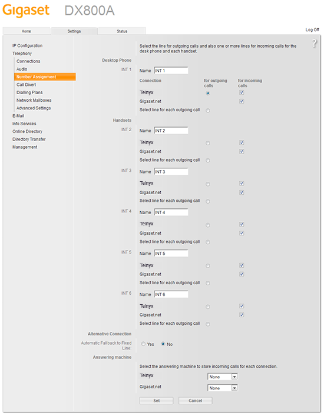

# Gigaset: Configuring the Gigaset DX800a

Learn how to connect a legacy Gigaset DX800a IP phone to a Telnyx SIP trunk. See Telnyx guidance and requirements.

C

[Jump to Instructions](#h_a2ef987d0c)

The [Gigaset DX800a](https://www.gigaset.com/hq_en/) (LEGACY DEVICE) is an all in one multiline desktop phone ideal for small offices and home offices. It offers a large 3.5 TFT color display and HD sound quality.

Being a hybrid phone means the Gigaset DX800A all in one can be configured to either IP with ISDN, or IP with fixed line. It's a multiline phone that can support up to 4 parallel calls and expand with multiple handsets – up to 6 in total. You can manage contacts with up to 1.000 vCard entries. You can also synchronise this phone with your PC to access Outlook contacts3 and locate details easily with auto look-up4. Additionally, the three integrated answering machines have a combined recording time of up to 55 minutes.

**Additional resources:**

* [User manual](https://gse.gigaset.com/fileadmin/legacy-assets/Gigaset%20DX800A%20all%20in%20one_Web_en_GBR.pdf)

---

## Configuration instructions

In this activity you will:

1. [Configure a Telnyx SIP trunk for your phone](#h_52b6712e1e)
2. [Configure audio settings](#h_692dddbb27)
3. [Configure call routing](#h_8d758eedc4)
4. [Create a dial plan](#h_048397817b)

**Pre-requisites**

* Ensure that your [Telnyx Mission Command Portal is configured properly](https://support.telnyx.com/en/articles/1176636-get-started-with-a-mission-control-account)
* [Purchase a DID](https://portal.telnyx.com/#/app/numbers/search-numbers)
* [Set up your Telnyx SIP connection](https://portal.telnyx.com/#/app/connections)
* [Provision your number](https://portal.telnyx.com/#/app/numbers/my-numbers) (Assign it to a SIP connection)
* [Create an outbound voice profile](https://portal.telnyx.com/#/app/outbound)
* Create a [credentials-based connection](https://portal.telnyx.com/#/app/connections) on your Telnyx Mission Control Portal
* RECOMMENDED: [Enable TLS to encrypt your traffic](https://support.telnyx.com/en/articles/1130711-does-telnyx-encrypt-communication)
* Connect your device to an ethernet port to establish an internet connection
* Use your phone's base or handset to find the device IP address. This IP address will link you to the web portal, where you will complete your configuration. See page 6 of the [Gigaset DX800a user manual](https://gse.gigaset.com/fileadmin/legacy-assets/Gigaset%20DX800A%20all%20in%20one_Web_en_GBR.pdf) to find your phone's IP address and obtain the default portal login credentials.
  ​

**Video Walkthrough**

Setting up your Telnyx SIP portal account so you can make and receive calls:

|  |
| --- |
| ***Note:*** *Video walkthrough for Gigaset DX800a/Telnyx configuration coming soon. Check back as we update our docs.* |

## 1. Configure Telnyx SIP trunk for your phone

In this section, you'll use the web portal to configure Telnyx as your SIP provider and connect to your phone. At this point, you should have found your phone's IP address and used it to open your web portal. See page 6 of the [Gigaset DX800a user manual](https://gse.gigaset.com/fileadmin/legacy-assets/Gigaset%20DX800A%20all%20in%20one_Web_en_GBR.pdf) if you have not already completed this.

1. On the welcome screen of the portal, you'll be asked to enter a PIN. The default system PIN for the DX800A is *0000*.

   
2. Click on the **Settings** tab at the top, then click the **Telephony** link in the side menu bar.
3. Click **Edit** next to the connection you want to configure.

   
4. Click on the **Show Advanced Settings** button, and use the following settings to set up your configuration:

   1. **Connection name or number:** Enter a name that makes sense for you.
   2. **Authentication Name:** The SIP connection username. Learn more [here](https://support.telnyx.com/en/articles/4245868-sip-connection-types) in the Credentials Connection Setup section.
   3. **Authentication Password:** The SIP connection password. Learn more [here](https://support.telnyx.com/en/articles/4245868-sip-connection-types) in the Credentials Connection Setup section.
   4. **Username:** The SIP connection username. Learn more [here](https://support.telnyx.com/en/articles/4245868-sip-connection-types) in the Credentials Connection Setup section.
   5. **Display Name:** This is your caller ID. You can choose whatever you like, but keep in mind the following naming conventions:

      1. Caller ID Name should be in capital letters. This will appears more clearly/visible on some devices.
      2. You must NOT use any special characters, as they will not be displayed. Spaces are allowed.
      3. Some of regular Canadian providers will not show more than 15 characters. We suggest shrinking or adapt your caller ID.
   6. **Domain**: *sip.telnyx.com*
   7. **Proxy Server Address**: *sip.telnyx.com* (For international, see [this document](https://sip.telnyx.com/#signaling-addresses).)
   8. **Proxy Server Port:** If you are using TCP or UDP transport, use port *5060*. If you are using TLS transport, use port *5061.*
   9. **Registration Address:** *sip.telnyx.com* (For international, see [this document](https://sip.telnyx.com/#signaling-addresses).)
   10. **Registration Refresh Time:** *600*
   11. **STUN enabled:** Choose *Yes* to enable or leave as *No*.
   12. **STUN Server:** *stun.telnyx.com:3478* (enter only if you've enabled STUN in step k.)
   13. **Outbound proxy mode:** *Always*
   14. **Outbound Server Address**: *sip.telnyx.com* (For international, see [this document](https://sip.telnyx.com/#signaling-addresses).)
   15. **Outbound Server Port:** If you are using TCP or UDP transport, use port *5060*. If you are using TLS transport, use port *5061.*

       
5. Click **Set** to save your changes.

[Back to Top](#h_a2ef987d0c)

## 2. Configure audio settings

In this section, you will configure audio settings to ensure the best audio quality and performance possible.

1. Click on the **Settings** tab at the top, then click the **Audio** link in the side menu bar.
2. Click on the **Show Advanced Settings** button and add the codecs you want to use. The following is a list of [audio codecs](https://telnyx.com/resources/codecs-affect-voip-sound-quality) that Telnyx supports:

   * *ulaw(g711u)*
   * *alaw(g711a)*
   * *g722*
   * *g729*

   

[Back to Top](#h_a2ef987d0c)

## 3. Configure call routing

In this section, you'll configure how your incoming and outgoing calls will be routed and assign your numbers.

1. Click on the **Settings** tab at the top, then click the **Number Assignment** link in the side menu bar.
2. Select the **for outgoing calls** radio button that corresponds to the Telnyx account you wish to configure.
3. Select the **for incoming calls** radio button that corresponds to the Telnyx account you wish to configure.
4. Click **Set** to save your changes.

   

[Back to Top](#h_a2ef987d0c)

## 4. Create a dial plan

Finally, you'll create a dial plan so you can make calls in a way that best suits your needs.

1. Click on the **Settings** tab at the top, then click the **Dialing Plans** link in the side menu bar.
2. Use the following settings to configure your dial plan parameters:

   1. **Phone number:** *911* (or your local emergency dial code)
   2. **Use area code:** Leave this unchecked
   3. **Connection:** The Telnyx connection you set up
   4. **Active:** Check this box
3. Click **Set** to save your changes.

That's it! You can check on the status of your connection from **Settings > Telephony > Connections**.

[Back to Top](#h_a2ef987d0c)

---

## Additional Resources

Review our [getting started with guide](https://support.telnyx.com/en/articles/1176636-get-started-with-a-mission-control-account) to make sure your Telnyx Mission Control Portal account is setup correctly!

Additionally, check out:

* The Gigaset DX800a [User manual](https://gse.gigaset.com/fileadmin/legacy-assets/Gigaset%20DX800A%20all%20in%20one_Web_en_GBR.pdf)

---

Related Articles

[Gigaset A510: Telnyx Setup](https://support.telnyx.com/en/articles/5815209-gigaset-a510-telnyx-setup)[Gigaset A690/AS690](https://support.telnyx.com/en/articles/6060646-gigaset-a690-as690)[Fanvil H3: Hotel IP](https://support.telnyx.com/en/articles/6202965-fanvil-h3-hotel-ip)[Fanvil H5: Hotel IP](https://support.telnyx.com/en/articles/6203401-fanvil-h5-hotel-ip)[Fanvil X-Series: IP Phone](https://support.telnyx.com/en/articles/6209971-fanvil-x-series-ip-phone)

Did this answer your question?

😞😐😃
