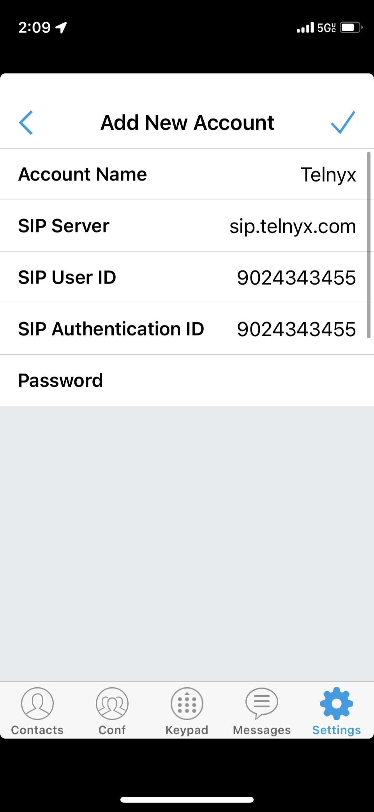
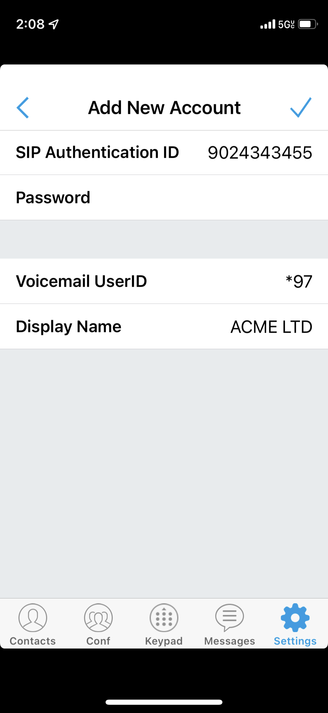

Grandstream Wave Lite (iPhone) | Telnyx Help Center

[Skip to main content](#main-content)

# Grandstream Wave Lite (iPhone)

Learn how to configure the Grandstream Wave Lite app with Telnyx on your iOS device.

C

Written by Customer Success

January 10, 2024

Table of contents

[Jump to Instructions](#h_d6596cc47a)

The [Grandstream Wave Lite softphone app](https://www.grandstream.com/support/product-archive) emerged on the basis of our existing multimedia VoIP Phones and enable users to move freely and continue to receive calls from any business or residential SIP account. The Wave Lite is a free softphone application that allows users to connect to their SIP accounts from anywhere in the world and it supports APPLE iOSTM 8.0 or higher version, and it is compatible with most of iOSTM mobile phones and tablets.

**Additional resources:**

* [User manual](https://documentation.grandstream.com/knowledge-base/wave-lite-ios-user-manual/)
* [Grandstream FAQ](https://blog.grandstream.com/faq)
* [Grandstream user forum](https://forums.grandstream.com/)
* [Helpdesk](https://helpdesk.grandstream.com/)

---

# Instructions for creating a SIP trunk on your Grandstream Wave Lite Softphone

In this activity, you will:

1. [Configure a Telnyx SIP trunk on your device](#h_ed48365955)
2. [Configure call settings](#h_5773656b09)
3. [Configure codecs](#h_7df5b07d63)
4. (Optional) [Configure your STUN server](#h_30ed3c4b3b)

**Pre-Requisites**

* Ensure that your [Telnyx Mission Command Portal is configured properly](https://support.telnyx.com/en/articles/1176636-get-started-with-a-mission-control-account)
* [Purchase a DID](https://portal.telnyx.com/#/app/numbers/search-numbers)
* [Set up your Telnyx SIP connection](https://portal.telnyx.com/#/app/connections)
* [Provision your number](https://portal.telnyx.com/#/app/numbers/my-numbers) (Assign it to a SIP connection)
* [Create an outbound voice profile](https://portal.telnyx.com/#/app/outbound)
* Create a [credentials-based connection](https://portal.telnyx.com/#/app/connections) on your Telnyx Mission Control Portal
* RECOMMENDED: [Enable TLS to encrypt your traffic](https://support.telnyx.com/en/articles/1130711-does-telnyx-encrypt-communication)
* Download Wave Lite for iPhone

**Video Walkthrough**

Setting up your Telnyx SIP portal account so you can make and receive calls:

|  |
| --- |
| ***Note:*** *Video walkthrough for Grandstream* Wave Lite */Telnyx configuration coming soon. Check back as we update our docs.* |

## 1. Configure a Telnyx SIP trunk on your device

In this step, you'll create and register a [SIP trunk](https://telnyx.com/products/sip-trunks) that will connect your device to your Telnyx account or sub-account.

|  |
| --- |
| ***Note:*** *The following settings are required to establish a SIP trunk with your Telnyx service. A full list of settings is available [here](https://documentation.grandstream.com/knowledge-base/wave-lite-ios-user-manual/).* |

1. From your iPhone or iPad, open the Wave Lite app.
2. Navigate to the **Settings** screen.
3. In the **Account Settings** > **Generic Account** section. Then tap on **SIP Account**.  
   ​  
   ​***Note:*** *Do not use the VoIP Provider section below this, as Telnyx has not yet been added to the provider list.*

   1. **Account Name:** Give your account a name that makes sense for your connection. In the example, we used *TelnyxTrunk*.
   2. **SIP Server:** *sip.telnyx.com* (for USA. For all other countries, see [this table](https://sip.telnyx.com/#signaling-addresses))
   3. **SIP User ID:** The SIP connection username. Learn more [here](https://support.telnyx.com/en/articles/4245868-sip-connection-types) in the Credentials Connection Setup section.
   4. **SIP Authentication ID:** The SIP connection username. Learn more [here](https://support.telnyx.com/en/articles/4245868-sip-connection-types) in the Credentials Connection Setup section.
   5. **SIP Password:** The SIP connection password. Learn more [here](https://support.telnyx.com/en/articles/4245868-sip-connection-types) in the Credentials Connection Setup section.

      
   6. **VoiceMail UserID:** Configure the voicemail user ID to retrieve voicemail by pressing Listen on the message screen. This user ID is usually the VM portal access number (ie: *\*97*)
   7. **Display Name:** This is your caller ID. You can choose whatever you like, but keep in mind the following naming conventions:

      1. Caller ID Name should be in capital letters. This will appears more clearly/visible on some devices.
      2. You must NOT use any special characters, as they will not be displayed. Spaces are allowed.
      3. Some of regular Canadian providers will not show more than 15 characters. We suggest shrinking or adapt your caller ID.

      
4. Click the checkmark at the top-right in order to connect to Telnyx.

[Back to Top](#h_d6596cc47a)

## 2. Configure call settings

In this section, you'll configure your ports and transport protocol.

1. After configuring the account, tap on the new account and select **Call Settings**.
2. Fields of note:

   1. **SIP Port:** If you are using TCP or UDP transport, use port *5060*. If you are using TLS transport, use port *5061.*
   2. **Transmission Protocol:** Choose *TCP* or *UDP* unless you are encrypting traffic and have set up encryption on your Telnyx portal. In this case, choose *TLS*.
3. Click the checkmark at the top-right corner once you're done.

[Back to Top](#h_d6596cc47a)

## 3. Configure codecs

In this section, you'll configure your codecs for audio calling.

1. From the list of accounts, tap on your new SIP account and select **Network Setting Parameters**.
2. Field of note:

   1. **Preferred Vocoder:** Select the codecs to be used on WiFi, 2, 3, and 4G. The following is a list of codecs (both audio and video) that Telnyx supports:

      **Audio:**

      * *ulaw(g711u)*
      * *alaw(g711a)*
      * *g722*
      * *g729*

      **Video:**

      * *H264*

[Back to Top](#h_d6596cc47a)

## 4. (Optional) Configure your STUN server

If you use a STUN server, you can configure it in this section.

1. From the list of accounts, tap on your new SIP account and select **Advanced Settings > General Settings** and provide the following:

   1. **STUN Server Settings:** *stun.telnyx.com:3478*

That's it, you've now completed the configuration of your Grandstream Wave Lite device.  
​

[Back to Top](#h_d6596cc47a)

---

## Additional Resources

Review our [getting started guide](https://support.telnyx.com/en/articles/1176636-get-started-with-a-mission-control-account) to make sure your Telnyx Mission Control Portal account is set up correctly.

Additionally you can check out:

* [User manual](https://documentation.grandstream.com/knowledge-base/wave-lite-ios-user-manual/)
* [Grandstream FAQ](https://blog.grandstream.com/faq)
* [Grandstream user forum](https://forums.grandstream.com/)
* [Helpdesk](https://helpdesk.grandstream.com/)

---

Related Articles

[Configuring Grandstream GXP16XX with Telnyx](https://support.telnyx.com/en/articles/1130660-configuring-grandstream-gxp16xx-with-telnyx)[Grandstream Wave Lite (Android)](https://support.telnyx.com/en/articles/6184897-grandstream-wave-lite-android)[Grandstream GDS3710: Wave Lite (Android)](https://support.telnyx.com/en/articles/6187273-grandstream-gds3710-wave-lite-android)[Grandstream GDS3710: Wave Lite (iOS)](https://support.telnyx.com/en/articles/6187411-grandstream-gds3710-wave-lite-ios)[Grandstream GXV3370](https://support.telnyx.com/en/articles/6187576-grandstream-gxv3370)

Did this answer your question?

😞😐😃

Table of contents
