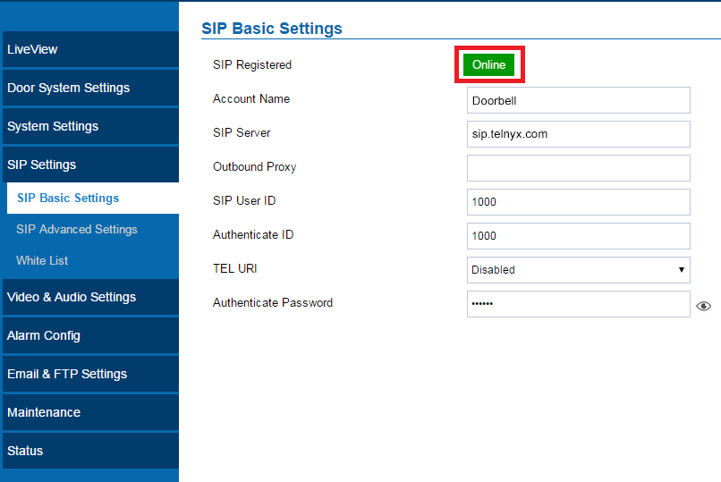

Grandstream GDS3710: Wave Lite (Android) | Telnyx Help Center

[Skip to main content](#main-content)

# Grandstream GDS3710: Wave Lite (Android)

Learn how to connect the GDS3710 video door system with the Wave Lite app on your Android™ device.

C

Written by Customer Success

January 10, 2024

Table of contents

[Jump to Instructions](#h_b4fef01d30)

The [Grandstream GDS3710 video door system](https://www.grandstream.com/products/facility-management/facility-access-systems/product/gds3710) is designed for high-quality door monitoring to assist with managing and remotely communicating with visitors, property protection, and facility operations services. The GDS3710 lets you perform real-time monitoring and real-time interaction remotely from your Android™ device.

The 2-way audio / video streaming and a SIP-based security mechanism lets you stream calls from GDS3710 to your device via a SIP configuration through Wave Lite.

[Wave Lite](https://www.grandstream.com/support/product-archive) is a softphone application that can be integrated with GDS3710, and can be installed on any Android™ device, offering more mobility during security monitoring and meanwhile increasing connectivity to essential communications and real time audio/video stream.

**Additional resources:**

* GDS3710 datasheet ([English](https://www.grandstream.com/hubfs/Product_Documentation/datasheet_gds3710_english.pdf)). For additional languages, see [this page](https://www.grandstream.com/products/facility-management/facility-access-systems/product/gds3710).
* [GDS3710 resources](https://www.grandstream.com/support/resources?title=GDS3710) (including firmware and other configuration and provision guides)
* [GDS3017 user manual](https://www.grandstream.com/hubfs/Product_Documentation/GDS3710_UserManual.pdf)
* [GDSManager user manual](https://www.grandstream.com/hubfs/Product_Documentation/GDSManager_User_Guide.pdf)
* [Wave Lite user manual](https://documentation.grandstream.com/knowledge-base/wave-lite-android-user-manual/#custom-settings)
* [Grandstream FAQ](https://blog.grandstream.com/faq)
* [Grandstream user forum](https://forums.grandstream.com/)
* [Helpdesk](https://helpdesk.grandstream.com/)

---

# Connecting the Grandstream GDS3710 with Wave Lite (Android™)

In this activity, you will:

1. [Configure a Telnyx SIP trunk on your GDS3710](#h_8187527cef)
2. [Configure a Telnyx SIP trunk on the Wave Lite app](#h_1e97a2864d)
3. [Configure Wave Lite call settings](#h_2dfb62bdb5)
4. [Configure Wave Lite codecs](#h_8ee1a886fd)

**Pre-Requisites**

* Ensure that your [Telnyx Mission Command Portal is configured properly](https://support.telnyx.com/en/articles/1176636-get-started-with-a-mission-control-account)
* [Purchase a DID](https://portal.telnyx.com/#/app/numbers/search-numbers)
* [Set up your Telnyx SIP connection](https://portal.telnyx.com/#/app/connections)
* [Provision your number](https://portal.telnyx.com/#/app/numbers/my-numbers) (Assign it to a SIP connection)
* [Create an outbound voice profile](https://portal.telnyx.com/#/app/outbound)
* Create a [credentials-based connection](https://portal.telnyx.com/#/app/connections) on your Telnyx Mission Control Portal
* RECOMMENDED: [Enable TLS to encrypt your traffic](https://support.telnyx.com/en/articles/1130711-does-telnyx-encrypt-communication)
* [Download Wave Lite for Android](https://play.google.com/store/apps/)
* Ensure that your GDS3710 is on firmware version 1.0.1.19 or higher
* Ensure that Wave Lite is on software version 1.0.2.16 or higher
* Make sure you can log into the GDS3710 web GUI. You can find the address and default credentials on [page 40 of the device's user guide](http://Enter%20192.168.1.168%20in%20the%20address%20bar%20of%20the%20browser,%20log%20in%20to%20the%20device%20with%20admin%20credentials.%20the%20default%20admin%20username%20is%20%E2%80%9Cadmin%E2%80%9D%20and%20the%20default%20random%20password%20can%20be%20found%20at%20the%20sticker%20on%20the%20GDS3710.).

**Video Walkthrough**

Setting up your Telnyx SIP portal account so you can make and receive calls:

|  |
| --- |
| ***Note:*** *Video walkthrough for Grandstream* Wave Lite-GDS3710 */Telnyx configuration coming soon. Check back as we update our docs.* |

## 1. Configure a Telnyx SIP trunk on your GDS3710

In this step, you'll create and register a [SIP trunk](https://telnyx.com/products/sip-trunks) that will connect your device to your Telnyx account or sub-account.

1. Log into the GDS3710 web GUI and navigate to **SIP Settings > SIP Basic Settings**.
2. Provide the following information:

   1. **Account Name:** Give the trunk a name that makes sense for your connection (Here we use the example *Doorbell*)
   2. **SIP Server:** *sip.telnyx.com* (for USA. For all other countries, see [this table](https://sip.telnyx.com/#signaling-addresses))
   3. **SIP User ID:** The SIP connection username. Learn more [here](https://support.telnyx.com/en/articles/4245868-sip-connection-types) in the Credentials Connection Setup section.
   4. **Authenticate ID:** The SIP connection username. Learn more [here](https://support.telnyx.com/en/articles/4245868-sip-connection-types) in the Credentials Connection Setup section.
   5. **Authenticate Password:** The SIP connection password. Learn more [here](https://support.telnyx.com/en/articles/4245868-sip-connection-types) in the Credentials Connection Setup section.

      

[Back to Top](#h_b4fef01d30)

## 2 Configure a Telnyx SIP trunk on the Wave Lite app

In this step, you'll set up a SIP trunk on your Wave Lite app.

|  |
| --- |
| ***Note:*** *The following settings are required to establish a SIP trunk with your Telnyx service. A full list of settings is available [here](https://documentation.grandstream.com/knowledge-base/wave-lite-android-user-manual/#settings).* |

1. From your Android™ device, open the Wave Lite app.
2. Navigate to the **Settings** screen.
3. In the **Account Settings** > **Generic Account** section. Then tap on **SIP Account**.  
   ​  
   ​***Note:*** *Do not use the VoIP Provider section below this, as Telnyx has not yet been added to the provider list.*
4. Fill out the following:

   1. **Activate Account:** This is a switch used to either activate or deactivate the account. Turn this on if you wish to activate the account once its created.
   2. **Account Name:** Give your account a name that makes sense for your connection. In the example, we used *TelnyxTrunk*.
   3. **SIP Server:** *sip.telnyx.com* (for USA. For all other countries, see [this table](https://sip.telnyx.com/#signaling-addresses))
   4. **SIP User ID:** Your SIP account/sub-account ID
   5. **SIP Authentication ID:** Your SIP account/sub-account ID
   6. **SIP Password:** Your SIP account/sub-account password
   7. **VoiceMail UserID:** Configure the voicemail user ID to retrieve voicemail by pressing Listen on the message screen. This user ID is usually the VM portal access number (ie: *\*97*)
   8. **Display Name:** This is your caller ID. You can choose whatever you like, but keep in mind the following naming conventions:

      1. Caller ID Name should be in capital letters. This will appears more clearly/visible on some devices.
      2. You must NOT use any special characters, as they will not be displayed. Spaces are allowed.
      3. Some of regular Canadian providers will not show more than 15 characters. We suggest shrinking or adapt your caller ID.
5. Click the checkmark at the top-right in order to connect to Telnyx.

[Back to Top](#h_b4fef01d30)

## 3. Configure Wave Lite call settings

In this section, you'll configure your ports and transport protocol.

1. After configuring the account, tap on the new account and select **Call Settings**.
2. Fields of note:

   1. **SIP Port:** If you are using TCP or UDP transport, use port *5060*. If you are using TLS transport, use port *5061.*
   2. **Transmission Protocol:** Choose *TCP* or *UDP* unless you are encrypting traffic and have set up encryption on your Telnyx portal. In this case, choose *TLS*.
3. Click the checkmark at the top-right corner once you're done.

[Back to Top](#h_b4fef01d30)

## 4. Configure Wave Lite codecs

In this section, you'll configure your codecs for audio calling.

1. From the list of accounts, tap on your new SIP account and select **Network Setting Parameters**.
2. Field of note:

   1. **Preferred Vocoder:** Select the codecs to be used on WiFi, 2, 3, and 4G. The following is a list of codecs (both audio and video) that Telnyx supports:

      **Audio:**

      * *ulaw(g711u)*
      * *alaw(g711a)*
      * *g722*
      * *g729*

      **Video:**

      * *H264*

That's it, you've now completed the configuration of your Grandstream Wave Lite device.  
​

[Back to Top](#h_b4fef01d30)

---

## Additional Resources

Review our [getting started guide](https://support.telnyx.com/en/articles/1176636-get-started-with-a-mission-control-account) to make sure your Telnyx Mission Control Portal account is set up correctly.

Additionally you can check out:

* GDS3710 datasheet ([English](https://www.grandstream.com/hubfs/Product_Documentation/datasheet_gds3710_english.pdf)). For additional languages, see [this page](https://www.grandstream.com/products/facility-management/facility-access-systems/product/gds3710).
* [GDS3710 resources](https://www.grandstream.com/support/resources?title=GDS3710) (including firmware and other configuration and provision guides)
* [GDS3017 user manual](https://www.grandstream.com/hubfs/Product_Documentation/GDS3710_UserManual.pdf)
* [GDSManager user manual](https://www.grandstream.com/hubfs/Product_Documentation/GDSManager_User_Guide.pdf)
* [Wave Lite user manual](https://documentation.grandstream.com/knowledge-base/wave-lite-android-user-manual/#custom-settings)
* [Grandstream FAQ](https://blog.grandstream.com/faq)
* [Grandstream user forum](https://forums.grandstream.com/)
* [Helpdesk](https://helpdesk.grandstream.com/)

---

Related Articles

[Grandstream GXP21XX](https://support.telnyx.com/en/articles/5819218-grandstream-gxp21xx)[Grandstream Wave Lite (iPhone)](https://support.telnyx.com/en/articles/6184748-grandstream-wave-lite-iphone)[Grandstream Wave Lite (Android)](https://support.telnyx.com/en/articles/6184897-grandstream-wave-lite-android)[Grandstream GDS3710: Wave Lite (iOS)](https://support.telnyx.com/en/articles/6187411-grandstream-gds3710-wave-lite-ios)[Grandstream GXV3370](https://support.telnyx.com/en/articles/6187576-grandstream-gxv3370)

Did this answer your question?

😞😐😃

Table of contents
