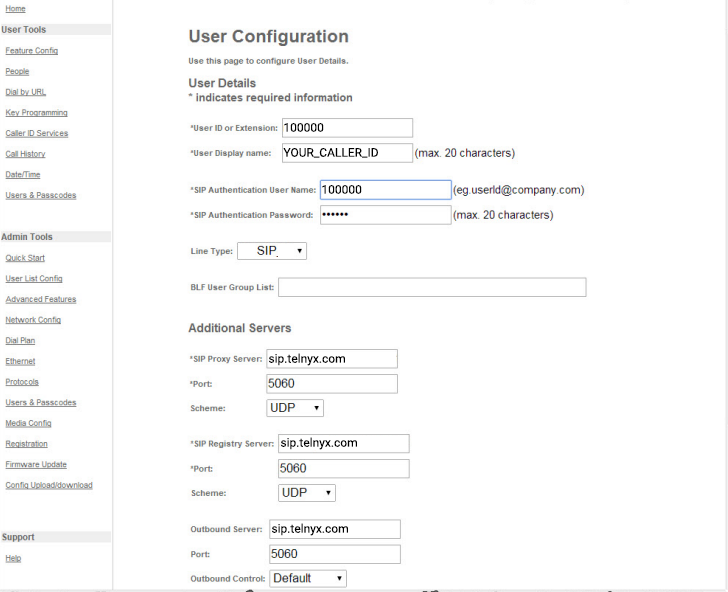

# Mitel: 5320E/5330E/5340E SIP

Learn how to set up and configure a Telnyx SIP trunk on the Mitel 5320E/5330E/5340E SIP phone. See Telnyx guidance and requirements.

C

[Jump to Instructions](#h_aff4ebca1c)

|  |  |
| --- | --- |
| **MIVOICE 5320E**  The [MiVoice 5320e IP Phone](https://www.mitel.com/products/devices-accessories/ip-phones-peripherals/mivoice-5320e-ip-phone) is a full-feature, applications telephone that features a large backlit graphics display, embedded gigabit support, and eight self-labeling keys that can be programmed as speed dial keys, line keys, or feature access keys. Twelve fixed-function keys provide convenient one-touch access to commonly used telephony features, navigation keys and menus, as well as customizable user settings. The MiVoice 5320e IP Phone also has three contextual softkeys to help users easily navigate through telephony functions. | **Key Benefits**  * Backlit LCD display (160 pixels x 320 pixels) * Eight programmable, one-touch, multi-function, self labeling keys (for speed dialing, line appearances, and feature access) * Wideband Audio support (G.722) – ships with a wideband handset (7 kHz) standard * HTML Desktop Toolkit included for applications development * 12 fixed function keys * Three context-sensitive softkeys for intuitive feature access * Unified Communicator® Express or Mitel MiCollab Client support * Mitel Intelligent Directory and Mitel Live Content Suite applications support * Support for Mitel Teleworker Solution, Automatic Call Distribution (ACD) agent and supervisor, hot desking, and resiliency * Browser-based Desktop User Tool for easier user programming and key labeling * Hands-free speakerphone operation (full duplex) * Three context-sensitive softkeys for intuitive feature access * Secure voice communication enabled by encryption * Hands-free speakerphone operation (full duplex) |
| **MIVOICE 5330E**  The [MiVoice 5330e IP Phone](https://www.mitel.com/products/devices-accessories/ip-phones-peripherals/mivoice-5330e-ip-phone) is a full-feature, applications telephone that features a large graphics display, embedded gigabit support, and 24 self-labeling keys that can be programmed as speed dial keys, line keys, or feature access keys. Twelve fixed-function keys provide convenient one-touch access to commonly used telephony features, navigation keys and menus, as well as customizable user settings. The MiVoice 5330e IP Phone also has three contextual softkeys to help users easily navigate through telephony functions. | **Key Benefits**  * Large backlit graphics display (160 x 320) with Auto Dimming * 24 programmable, multi-function, self-labeling keys, provided in three pages of eight keys each (for speed dialing, line appearances, feature access) * Wideband Audio Support (G.722) – ships with a wideband handset (7 kHz) standard * Dual embedded Gigabit Ethernet ports (LAN and PC) * Voicemail access – large message waiting lamp * Three context-sensitive softkeys for intuitive feature access * Hands-free speakerphone operation (full duplex) * Mitel Applications support: Mitel Intelligent Directory, MiCollab Client (formerly Unified Communicator Advanced), Mitel Unified Communicator® Express and Mitel Live Content Suite * HTML Desktop Toolkit included for applications development * 12 fixed function keys: Hold, Settings, Message, Speaker, Mute, Transfer / Conference, Redial, Cancel, Volume / Ringing / Contrast Up and Down, Previous Page, Next Page * Menu key provides one-touch access to embedded applications including: Call History, Call Forwarding, Conference Unit Application, Settings, Help, Call Info, and Visual Voicemail |
| **MIVOICE 5340E**  The [MiVoice 5340e IP Phone](https://www.mitel.com/products/devices-accessories/ip-phones-peripherals/mivoice-5340e-ip-phone) is a full-feature, applications telephone that features a large graphics display, embedded gigabit support, and 48 self-labeling keys that can be programmed as speed dial keys, line keys, or feature access keys. Thirteen fixed-function keys provide convenient one-touch access to commonly used telephony features, navigation keys and menus, as well as customizable user settings. The MiVoice 5340e IP Phone also has six contextual softkeys to help users easily navigate through telephony functions.    Optional modules can be added to your MiVoice 5340e IP Phone, fulfilling the need for users to have conferencing, additional buttons, cordless DECT or Bluetooth accessories, or local emergency access for Teleworkers. | **Key Benefits**  * Large backlit graphics display (160 x 320) with Auto Dimming * 48 programmable, multi-function, self-labeling keys, provided in three pages of 16 keys each * Wideband audio support (G.722) – ships with a wideband handset (7 kHz) standard * Dual embedded Gigabit Ethernet ports (LAN and PC) * Mitel applications support: Mitel Live Directory, MiCollab Client, Mitel Unified Communicator® Express and Mitel Live Content Suite * 13 fixed function keys: Hold, Settings, Message, Speaker, Mute, Transfer / Conference, Redial, Cancel, Volume / Ringing / Contrast Up and Down, Home Page, Previous Page, Next Page * Six context-sensitive softkeys for intuitive feature access * Menu key provides one-touch access to embedded applications, including: Call History, Call Forwarding, Conference Unit Application, People (Contacts), Settings, Help, Call Info, and Visual Voicemail * Hands-free speakerphone operation (full duplex) |

**Additional Resources:**

* [5300 series user manuals](https://www.mitel.com/document-center/devices-and-accessories/ip-phones/5300-series/5300-sip-phones)
* [Mitel Learning Center](https://www.mitel.com/support/learning-center)
* [Mitel live training webinars](https://www.mitel.com/support/learning-center/live-webinars)
* [Mitel user group](https://www.mitel.com/partners/mitel-user-group)

---

## Instructions for setting up and configuring a SIP trunk on the Mitel 5320E/5330E/5340E SIP Phone

**In this activity you will:**

1. [Log into the Mitel Web Configuration Tool](#h_7b0fe15061)
2. [Configure your SIP trunk](#h_18e9e383cc)

**Pre-requisites**

* Ensure that your [Telnyx Mission Command Portal is configured properly](https://support.telnyx.com/en/articles/1176636-get-started-with-a-mission-control-account)
* RECOMMENDED: [Enable TLS to encrypt your traffic](https://support.telnyx.com/en/articles/1130711-does-telnyx-encrypt-communication)
* Make sure your phone is running the latest firmware. See page 51 of [the phone's user guide](https://www.mitel.com/document-center/devices-and-accessories/ip-phones/5300-series/5300-sip-phones/60/en/5320e-5330e-5340e-sip-user-and-administrator-guide).

**Video Walkthrough**

Setting up your Telnyx SIP portal account so you can make and receive calls:

|  |
| --- |
| ***Note:*** *There is currently no video walkthrough for configuring a [SIP trunk](https://telnyx.com/products/sip-trunks) on this device. Check back as we update our docs.* |

## 1. Log into the Mitel Web Configuration Tool

Mitel phone configuration, including SIP trunking, is done through the Mitel Web Configuration Tool, so you'll need to log into the portal first. To do this, you'll need your phone's IP address.

1. Simultaneously press and hold the up and down volume keys on your phone.
2. While continuing to hold the down arrow key, release the up arrow key.
3. Press 234 on the telephone keypad. Now release the down arrow key. The **Network Settings?** option appears.
4. Press # (*No*). The **Network Parameters?** option appears.
5. Press \* (*Yes*). The **View Current Values?** option appears.
6. Press \* (*Yes*). The **View Current Network?** option appears.
7. Press \* (*Yes*). This opens **Current Network Params**.
8. Use the down volume arrow key to scroll to **Phone IP Address**. Take note of the IP address, as you'll need it in a second.
9. From your computer on the same network, open a browser and enter the phone's IP address into the address bar. This will take you to the Web Configuration Tool's login screen. First time logins will use the default credentials:

   1. **Username:** *admin*
   2. **Password**: The phone's model number (*5320e*, *5330e*, or *5340e*)

[Back to Top](#h_aff4ebca1c)

## 2 Configure your SIP trunk

In this section, you'll use the Web Configuration Tool to set up and configure a Telnyx SIP trunk.

1. From the lefthand navigation, go to **Admin Tools > User List Config** and enter the following values:

   1. **User ID or Extension:** Your Telnyx account ID.
   2. **User Display Name:** This is your caller ID. You can choose whatever you like, but keep in mind the following naming conventions:

      1. Caller ID Name should be in capital letters. This will appears more clearly/visible on some devices.
      2. You must NOT use any special characters, as they will not be displayed. Spaces are allowed.
      3. Some of regular Canadian providers will not show more than 15 characters. We suggest shrinking or adapt your caller ID.
   3. **SIP Authentication User Name:** Your Telnyx account ID
   4. **SIP Authentication Password:** This is your Telnyx account password
   5. **Line Type:** *SIP*
   6. **SIP Proxy Server:** *sip.telnyx.com* (US. For a list of international servers, see [this document](https://sip.telnyx.com/#signaling-addresses).)
   7. **Port:** If you are using TCP or UDP transport, use port *5060*. If you are using TLS transport, use port *5061.*
   8. **Scheme:** Choose *TCP* or *UDP* unless you are encrypting traffic and have set up encryption on your Telnyx portal. In this case, choose *TLS*.
   9. **SIP Registry Server:** *sip.telnyx.com* (US. For a list of international servers, see [this document](https://sip.telnyx.com/#signaling-addresses).)
   10. **Port:** If you are using TCP or UDP transport, use port *5060*. If you are using TLS transport, use port *5061.*
   11. **Scheme:** Choose *TCP* or *UDP* unless you are encrypting traffic and have set up encryption on your Telnyx portal. In this case, choose *TLS*.
   12. **SIP Outbound Server:** *sip.telnyx.com* (US. For a list of international servers, see [this document](https://sip.telnyx.com/#signaling-addresses).)
   13. **Port:** If you are using TCP or UDP transport, use port *5060*. If you are using TLS transport, use port *5061.*
   14. **Scheme:** Choose *TCP* or *UDP* unless you are encrypting traffic and have set up encryption on your Telnyx portal. In this case, choose *TLS*.

       
2. Click **OK** to submit.

That's it, you've now completed the configuration of your Mitel SIP phone with your Telnyx account.

[Back to Top](#h_aff4ebca1c)

---

## Additional Resources

Review our [getting started guide](https://support.telnyx.com/en/articles/1176636-get-started-with-a-mission-control-account) to make sure your Telnyx Mission Control Portal account is set up correctly.

Additionally you can check out:

* [5300 series user manuals](https://www.mitel.com/document-center/devices-and-accessories/ip-phones/5300-series/5300-sip-phones)
* [Mitel Learning Center](https://www.mitel.com/support/learning-center)
* [Mitel live training webinars](https://www.mitel.com/support/learning-center/live-webinars)
* [Mitel user group](https://www.mitel.com/partners/mitel-user-group)

---

Related Articles

[Grandstream GRP2612: SIP Trunk](https://support.telnyx.com/en/articles/6184147-grandstream-grp2612-sip-trunk)[Grandstream GXP1700: SIP Trunk](https://support.telnyx.com/en/articles/6184520-grandstream-gxp1700-sip-trunk)[Fanvil H5: Hotel IP](https://support.telnyx.com/en/articles/6203401-fanvil-h5-hotel-ip)[Fanvil XU Series: IP Phone](https://support.telnyx.com/en/articles/6210147-fanvil-xu-series-ip-phone)[Mitel: 6800/6900 SIP](https://support.telnyx.com/en/articles/6249691-mitel-6800-6900-sip)

Did this answer your question?

😞😐😃
