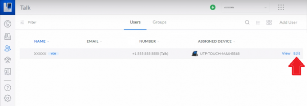
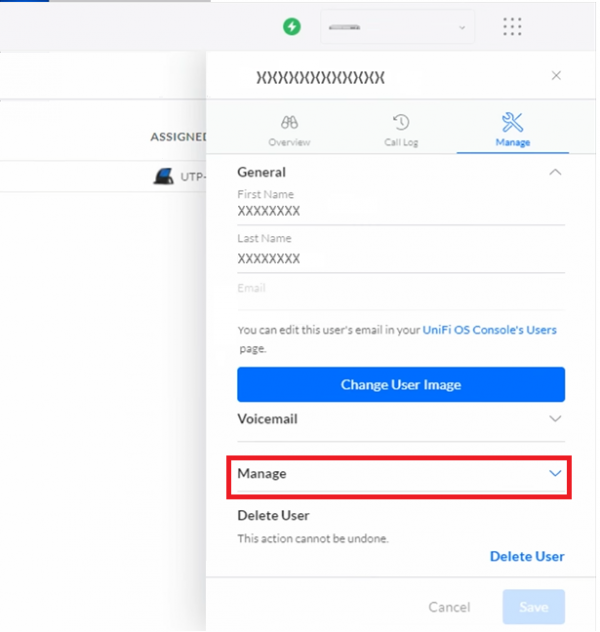

# Ubiquiti Trunk: Unifi Talk - IP Auth

Learn how to configure a Telnyx Trunk with IP authentication with Ubiquiti Unifi Talk PBX. See Telnyx guidance and requirements.

C

[Jump to Instructions](#h_a05d35cd22)

The [UniFi Talk PBX](https://help.ui.com/hc/en-us/articles/1500005593742), provided by [Ubquiti](https://www.ui.com/), is a subscription-based VoIP phone solution that is the ideal plug-and-play setup for small to medium sized businesses.

|  |
| --- |
| ***Note:*** *Unifi Talk (which we will refer to from here as simply Talk) has specific hardware requirements. Only other Talk devices are compatible with the Talk application. See the pre-requisites section of this document for more information.* |

**Additional documentation:**

* [UniFi Talk FAQ](https://www.ui.com/new-integrations/managed-voip)
* [UniFi Talk community](https://community.ui.com/)
* [UniFi Talk support](https://help.ui.com/hc/en-us)
* [Talk device firmware](https://www.ui.com/download/)
* [UniFi Console quick-start guide](https://dl.ui.com/qig/udm-pro/#index)

---

## Instructions for configuring Unifi Talk PBX with your Telnyx Account

In this activity you will:

1. [Add a Telnyx SIP Trunk to your Talk application](#h_25b7a2f2a4)
2. [Authorize international outgoing calls](#h_c4502e01c1)
3. [Configure phone numbers](#h_ce7d29154a)
4. [Set the IP address range](#h_20c4b00040)
5. [Assign a phone number to a user](#h_9c34069bdd)

**Pre-requisites**

* Your Telnyx Portal must be correctly [set up and configured for use](https://support.telnyx.com/en/articles/1176636-get-started-with-a-mission-control-account)
* Have [DID(s) available](https://support.telnyx.com/en/articles/4380325-search-and-buy-numbers) to assign.
* You must have a [UniFi Console](https://ui.com/cloud-gateways) set up and configured: [A Dream Machine Pro](https://store.ui.com/us/en/products/udm-pro) or [Cloud Keygen 2 Plus](https://store.ui.com/us/en/products/uck-g2-plus) is required in order for the Talk application to work.

  + If you want to store call recordings, you will also need a hard disk drive, but this is not required for the Talk application to run correctly.
* PoE switches are required to power and connect your Talk device. UniFi offers their own [in-house option.](https://ui.com/switching/#compare)
* A [Talk device](https://www.ui.com/new-integrations/managed-voip). Only Talk devices will work with the Talk application.
* Your Talk application must be [set up and up to date](https://help.ui.com/hc/en-us/articles/1500005593742) before you continue

  + Ensure you can log into Talk UI
* Make sure to have completed [all firmware updates](https://www.ui.com/download/) or other updates on your endpoint(s) (IP Phone)

**Video Walkthrough**

Setting up your Telnyx SIP portal account so you can make and receive calls:

Setting up a third-party SIP provider with UniFi Talk (in this case, it is 5sigma)

## 1. Add a Telnyx SIP trunk to your Talk application

In this section, you'll configure Telnyx as your SIP provider within your Talk application.

1. From your Unifi Talk dashboard, click on the settings icon in the right-hand navigation.

   
2. Under Unifi Talk settings click **System Settings**.

   
3. Find the **Third Party SIP Setup** section and click on **Add Third Party SIP Provider**.
4. You can enter the provider name here (ie: *Telnyx*).

   
5. Now we need to add a few custom fields, both the field names AND their corresponding values. Click the **Add Fields** button. You'll get a popup screen with a **+** which you can use to add new fields. Add the following information, *making sure to type the field names exactly as they're written below*:

   1. *proxy*
   2. *realm*
   3. *context*
   4. *password*
   5. *register*
   6. *username*
   7. *extension*
   8. *from-user*
   9. *from-domain*
   10. *retry\_seconds*
   11. *expire-seconds*
6. Click on **Done** when you're finished.
7. Now you can add values to the fields you just created. In each field, provide the following:

   1. **proxy:** *192.76.120.10* (For international, see [this document](https://sip.telnyx.com/#signaling-addresses).)
   2. **realm:** *sip.telnyx.com* (For international, see [this document](https://sip.telnyx.com/#signaling-addresses).)
   3. **context:** *public*
   4. **password:** You can type anything here. The Unifi setup wants a password value, even when doing IP authentication.
   5. **register:** *false*
   6. **username:** Your Telnyx username
   7. **extension:** Leave blank
   8. **from-user:** Your Telnyx username
   9. **from-domain:** *192.76.120.10* (For international, see [this document](https://sip.telnyx.com/#signaling-addresses).)

      1. ***Note:*** *If this doesn't work, you may need to instead give the static IP address of your Unifi Talk.*
   10. **retry\_seconds:** *30*
   11. **expire-seconds:** *120*

[Back to Top](#h_a05d35cd22)

## 2. Authorize international outgoing calls

If you want your users to be able to dial out to other countries, you'll need to authorize those. (If you do not want your users making international calls, you can go onto section 3.

1. From the **System Settings** config, click the **Select Countries** button. Make sure your Telnyx account allows for international calling, or this will not work.

   
2. Click **Save**.

[Back to Top](#h_a05d35cd22)

## 3. Configure phone numbers

In this section, you'll be importing phone numbers into Talk. You have the option of importing them either manually by entering them one by one, or auto-importing them from a list in a text file.

1. From the **System Settings** config, open the **DID Numbers** section.
2. To manually import numbers, enter each of your Telnyx DIDs that you provisioned as part of your [pre-requisite activities](#h_b5c46d7544) into **Input Numbers** field in E164 format (ie: +1XXXXXXXXXX).

   1. You ***MUST*** provide the + at the beginning of your number string, otherwise you may get parsing errors.

      
3. To auto-import numbers from a text file, click the **Import Numbers with .TXT File** button.

   1. There ***MUST*** be the + at the beginning of each number string, otherwise you may get parsing errors.
   2. Make sure each number is on a separate line.

[Back to Top](#h_a05d35cd22)

## 4 Set the IP address range

In this section, you will set the range of ACL IP addresses that you will get from Telnyx. If you do not have these, please reach out to support.

1. From the **System Settings** config, click the **IP Address Range** option.
2. Click the **Add IP Address Range** button on the right.

   1. **CIDR Network Address**: *192.76.120.10* (For international, see [this document](https://sip.telnyx.com/#signaling-addresses).) Leave */32* as it is.
3. Click the **Add** button.

   

[Back to Top](#h_a05d35cd22)

## 5. Assign a phone number to a user

In this section, you'll assign a phone number to each user in your setup. These phone numbers are the DIDs you acquired as part of your [pre-requisite activities](#h_b5c46d7544).

1. Go to the left-hand navigation and click on the users icon.

   
2. Find the user you want to assign a number and click the **Edit** button at the far right of their row.

   
3. A user edit popup will appear. Click the **Manage** dropdown

   
4. Find the **Change Number** section. Here you'll see all the DIDs you added in [section 3](#h_ce7d29154a). Any numbers that have not yet been assigned to a user will say "Unassigned" next to them.

   

That's it! You've finished configuring Unifi Talk, and can now start testing calls from your Talk device!

[Back to Top](#h_a05d35cd22)

---

## Additional Resources

Review our [getting started with guide](https://support.telnyx.com/en/articles/1176636-get-started-with-a-mission-control-account) to make sure your Telnyx Mission Control Portal account is setup correctly!

Additionally, check out:

* [UniFi Talk FAQ](https://www.ui.com/new-integrations/managed-voip)
* [UniFi Talk community](https://community.ui.com/)
* [UniFi Talk support](https://help.ui.com/hc/en-us)
* [Talk device firmware](https://www.ui.com/download/)
* [UniFi Console quick-start guide](https://dl.ui.com/qig/udm-pro/#index)

---

---

Related Articles

[Configuring an Elastix 4 PBX IP Trunk](https://support.telnyx.com/en/articles/1130622-configuring-an-elastix-4-pbx-ip-trunk)[Asterisk: Configure an Asterisk IP trunk](https://support.telnyx.com/en/articles/1130628-asterisk-configure-an-asterisk-ip-trunk)[Elastix 5: FQDN Trunk Setup](https://support.telnyx.com/en/articles/3284033-elastix-5-fqdn-trunk-setup)[ScopTEL IP PBX](https://support.telnyx.com/en/articles/5803103-scoptel-ip-pbx)[Ubiquiti Trunk: Unifi Talk - Auth](https://support.telnyx.com/en/articles/6122586-ubiquiti-trunk-unifi-talk-auth)

Did this answer your question?

😞😐😃
