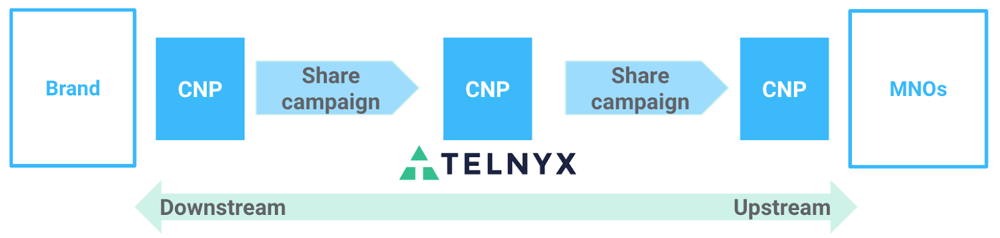

Bring Campaigns to Telnyx | Telnyx Help Center

[Skip to main content](#main-content)

# Bring Campaigns to Telnyx

In this article, we're breaking down shared campaigns, and showing you how to use them within your Telnyx account.

Written by Telnyx Engineering

November 5, 2025

Table of contents

# Campaigns Explained

*Note: Using Shared Campaigns limits the ability of Telnyx to troubleshoot issues with your 10DLC campaigns and throughput. In most cases, we recommend [creating your brands and campaigns through the Telnyx portal](https://portal.telnyx.com/#/messaging-10dlc/brands).*

## **What is a Shared Campaign?**

A shared campaign is a campaign that is registered directly through The Campaign Registry, instead of being created directly through your Telnyx account. In shared campaigns, a **connectivity partner (CNP)** is selected to provide messaging services.

If you're bringing a shared campaign to Telnyx from the Campaign Registry, Telnyx acts as an **upstream connectivity partner (upstream CNP)** for your campaign. In this situation, your organization is referred to as the **downstream connectivity partner (downstream CNP)**. Telnyx in turn shares the campaign with mobile network operators (MNOs), who are referred to as the **upstream CNPs** for Telnyx.

## **How do I import my campaigns from The Campaign Registry to a Connectivity Partner?**

To import campaigns from the Campaign Registry to an upstream connectivity partner (in this case, Telnyx), you must first provide your CSP ID to Telnyx. Your CSP ID is an identifier set by the Campaign Registry and can be found in [your Campaign Registry CSP Portal](https://csp.campaignregistry.com/login). You should share this ID with your account manager or support representative, or send an email to [support@telnyx.com](mailto:support@telnyx.com). Our team will get to work and notify you when your CSP ID has been associated with your Telnyx account. This usually takes up to two business days to complete.

Once you have received confirmation that your CSP ID has been successfully associated with your Telnyx account, you're ready to start importing campaigns.

In the Campaign Registry CSP Portal, choose the campaign you'd like to share and select Telnyx as the connectivity partner. This step automatically submits a request to the Telnyx team to review and approve your Shared Campaign. After Telnyx has reviewed and approved your Shared Campaign, Telnyx will show as the connectivity partner for the campaign in your Campaign Registry CSP Portal.

## **How do I add Telnyx numbers to shared campaigns?**

Once you've verified that Telnyx is the connectivity partner for your Shared Campaign, you're ready to start assigning Telnyx numbers to your Shared Campaign.

At present, the only way to associate Telnyx numbers with Shared Campaigns is by using the [Bulk Phone Number Campaigns endpoint of the Telnyx API](https://developers.telnyx.com/api/messaging/10dlc/post-assign-messaging-profile-to-campaign). Before making this API request, you should first ensure all of the numbers you wish to add to the shared campaign are associated with the same [Messaging Profile](https://developers.telnyx.com/docs/messaging/messages/mission-control-portal-set-up) in your Telnyx account. You'll need the ID of that Messaging Profile, which you can find in the [portal](https://portal.telnyx.com/#/app/messaging) or [by API](https://developers.telnyx.com/api/messaging/list-messaging-profiles). You'll also need the TCR ID of your shared campaign, which you can find in the Campaign Registry CSP Portal.

Once you've made this API request to associate numbers from a Messaging Profile with a Shared Campaign, you can check the status of the [entire request](https://developers.telnyx.com/api/messaging/10dlc/post-assign-messaging-profile-to-campaign) or [individual numbers](https://developers.telnyx.com/api/messaging/10dlc/post-assign-messaging-profile-to-campaign) via the Telnyx API.

## **Frequently Asked Questions about Shared Campaigns and 10DLC**

*How can I update my TCR Brand / Campaign through the Telnyx portal?*

You cannot update shared campaigns through the Telnyx portal. All brand and campaign information associated with Shared Campaigns can be maintained directly through your Campaign Registry CSP Portal. Telnyx, as the messaging service provider for the Shared Campaign, has limited visibility into the details of the campaign and corresponding brand.

*Can I edit my campaign sharing request?*

Once your organization has submitted a Shared Campaign by selecting Telnyx as the **upstream CNP**, and while the sharing status is in the PENDING state, your organization (as the downstream CNP) cannot rescind the sharing request nor change the upstream CNP.

---

Related Articles

[10DLC Shared Campaigns](https://support.telnyx.com/en/articles/5617538-10dlc-shared-campaigns)[Telnyx & 10DLC Compliance](https://support.telnyx.com/en/articles/5664840-telnyx-10dlc-compliance)[Flyingvoice: Telnyx Setup](https://support.telnyx.com/en/articles/5810663-flyingvoice-telnyx-setup)[Telnyx 10DLC Compliance Directory](https://support.telnyx.com/en/articles/6417677-telnyx-10dlc-compliance-directory)[Telnyx Messaging Error Codes](https://support.telnyx.com/en/articles/6505121-telnyx-messaging-error-codes)

Did this answer your question?

😞😐😃

Table of contents
