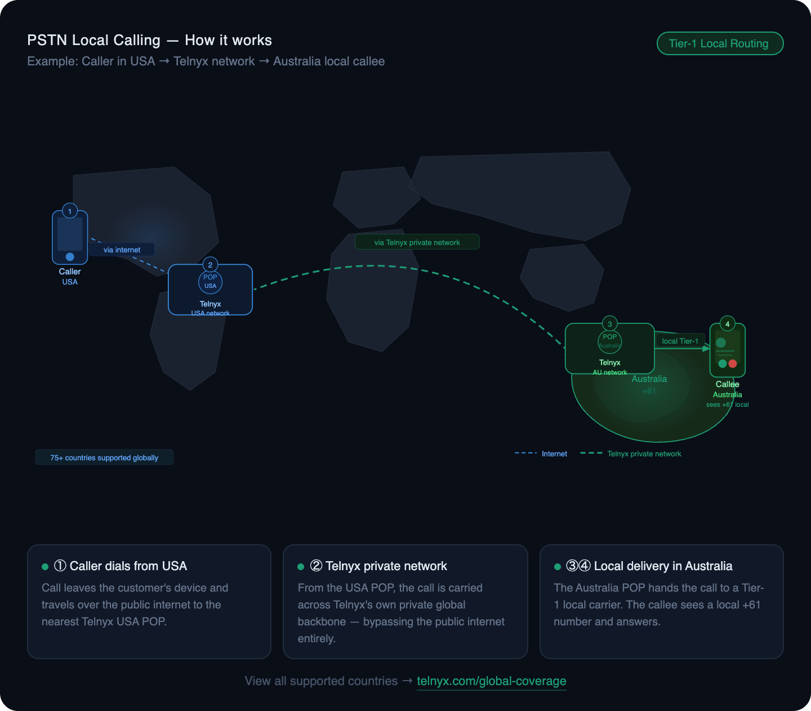
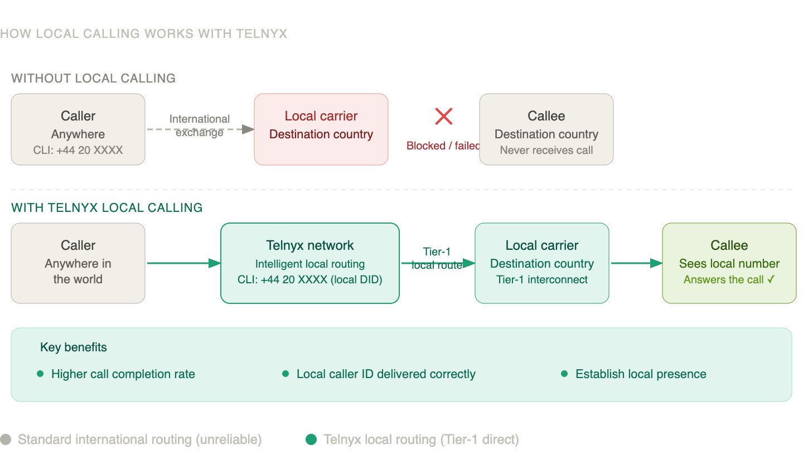
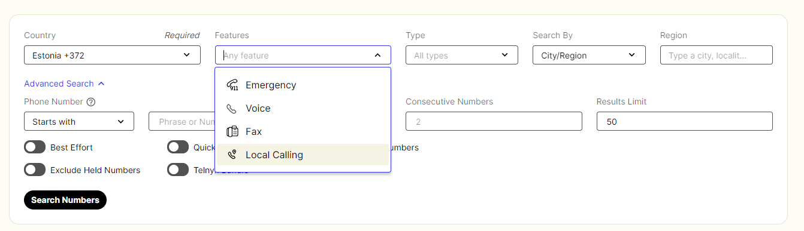

PSTN Replacement / Local Calling with Telnyx | Telnyx Help Center

[Skip to main content](#main-content)

# PSTN Replacement / Local Calling with Telnyx

Establish a local presence anywhere in the world.
Buy a local number, route calls via Telnyx's Tier-1 in-country carriers, and ensure every call is seen by the callee as a local call.

Written by Ashish Muni

Updated over 3 weeks ago

Table of contents

# **What is local calling?**

---

A call is considered **local** when the caller's number (CLI) and the destination number (CLD) belong to the same country.

For example, a UK number calling another UK number, or a Brazilian number calling another Brazilian number.

The challenge is that local calls **cannot enter a country through international exchanges**. If a business operating globally tries to make a local-looking call using standard international routing, downstream carriers in that country will block or reject it, protecting their network from spoofing and unauthorised CLI usage.

This results in failed calls, SIP 503 errors, and poor call completion rates.

---

# The Telnyx local calling solution

Telnyx solves this by routing your calls directly through **Tier-1 carrier partners within each country**, bypassing international exchanges entirely.

Here is how it works:

1. Your caller originates a call from anywhere in the world
2. The call arrives at the Telnyx network
3. Telnyx identifies the destination country and routes the call via its direct in-country Tier-1 carrier interconnect
4. The call is delivered locally, the callee sees a local number and receives the call as if it originated from within their country

This means your business can establish a genuine local presence in any supported country, regardless of where your team or infrastructure is physically located.

---

# Key benefits

* **Higher call completion rates** — calls are no longer blocked at international exchanges
* **Local caller ID delivered correctly** — the callee sees a local number, not an international one
* **Establish local presence** — build customer trust by appearing local in every market you serve
* **No extra charges or configuration** — the feature is built into your Telnyx-issued local number

---

# **What are the requirements for using Local Calling?**

There are no additional fees or complex setup steps. You simply need a Telnyx number with the **Local Calling** feature enabled.

**Step 1 — Get a local number with the Local Calling feature**

You can purchase a number directly in the Telnyx Portal:

1. Log in to the [Telnyx Portal](https://portal.telnyx.com)
2. Navigate to **Numbers → Buy numbers**
3. Select the destination country
4. Filter results by the **Local Calling** feature
5. Choose a number and complete the purchase

   

   Alternatively, email [numbering@telnyx.com](mailto:numbering@telnyx.com) to request a number, or port your existing number to Telnyx — see the [porting policy & procedure](https://support.telnyx.com/en/articles/1130630-porting-policy-procedure) guide.  
   ​
6. Use this same number as CLI on your outbound calls.

Review our [Caller ID Policy](https://PSTN%20/%20Local%20Calling%20with%20Telnyx) and [Number Formats](https://support.telnyx.com/en/articles/1130706-sip-connection-number-formats) which can help with localisation preferences.  
​

---

# What if I don't use the local calling feature?

If you are not able to purchase a Telnyx local number, it is recommended to use a CLI from a **different country** than the destination. Calls with a matching foreign CLI are the most likely to be blocked.

If you use a non-Telnyx number from the same locale as the destination, the call will not be accepted (outside of the US/CAN).

⚠️ **Note:** If you enable call forwarding on your local number, local calling may not complete successfully if the caller's CLI matches the forwarded destination number. Telnyx can only guarantee local call completion when the originating number is used as the CLI.

---

# Supported countries

Telnyx currently supports local calling for the following countries. This list continues to grow as we expand our global carrier network.

|  |  |
| --- | --- |
| **Country** | **Country Code** |
| **Albania** | +355 |
| **Argentina** | +54 |
| **Australia** | +61 |
| **Austria** | +43 |
| **Bahrain** | +973 |
| **Bangladesh** | +88 |
| **Belgium** | +32 |
| **Belize** | +501 |
| **Benin** | +229 |
| **Bolivia** | +591 |
| **Bosnia and Herzegovina** | +387 |
| **Brazil** | +55 |
| **Bulgaria** | +359 |
| **Cameroon** | +237 |
| **Chile** | +56 |
| **China** | +86 |
| **Colombia** | +57 |
| **Costa Rica** | +506 |
| **Croatia** | +385 |
| **Cyprus** | +357 |
| **Czech Republic** | +420 |
| **Democratic Republic of the Congo** | +243 |
| **Denmark** | +45 |
| **Dominican Republic** | +1829 |
| **El Salvador** | +503 |
| **Estonia** | +372 |
| **Equador** | +593 |
| **Finland** | +358 |
| **France** | +33 |
| **French Guiana** | +594 |
| **Georgia** | +995 |
| **Germany** | +49 |
| **Ghana** | +233 |
| **Greece** | +30 |
| **Guadeloupe** | +590 |
| **Guatemala** | +502 |
| **Honduras** | +504 |
| **Hong Kong** | +852 |
| **Hungary** | +36 |
| **Indonesia** | +62 |
| **Ireland** | +353 |
| **Israel** | +972 |
| **Italy** | +39 |
| **Japan** | +81 |
| **Kenya** | +254 |
| **Latvia** | +371 |
| **Lithuania** | +370 |
| **Luxembourg** | +352 |
| **Malaysia** | +60 |
| **Martinique** | +596 |
| **Mexico** | +52 |
| **Mozambique** | +258 |
| **Netherlands** | +31 |
| **New Zealand** | +64 |
| **Nicaragua** | +505 |
| **Nigeria** | +234 |
| **Norway** | +47 |
| **Oman** | +968 |
| **Pakistan** | +92 |
| **Panama** | +507 |
| **Paraguay** | +595 |
| **Peru** | +51 |
| **Philippines** | +63 |
| **Poland** | +48 |
| **Portugal** | +351 |
| **Romania** | +40 |
| **Russia** | +7 |
| **Rwanda** | +250 |
| **Réunion** | +262 |
| **Saudi Arabia (KSA)** | +966 |
| **Serbia** | +381 |
| **Singapore** | +65 |
| **Slovakia** | +421 |
| **Slovenia** | +386 |
| **South Africa** | +27 |
| **South Korea** | +82 |
| **Spain** | +34 |
| **Sweden** | +46 |
| **Switzerland** | +41 |
| **Taiwan** | +886 |
| **Thailand** | +66 |
| **U.S. Virgin Islands** | +1340 |
| **United Arab Emirates** | +971 |
| **United Kingdom** | +44 |
| **Uzbekistan** | +998 |
| **Vietnam** | +84 |
| **Zambia** | +260 |

Telnyx continues to expand its global presence and while we do allow the purchase of DID/numbers from more countries than listed above, countries not listed above will only have inbound local calling guaranteed at this time and not outbound local calling.

Depending on your use case, please feel free to reach out to your Account Manager / Sales representative here at [sales@telnyx.com](mailto:success@telnyx.com) to discuss your requirements further.

---

Related Articles

[Caller ID Outbound vs CNAM](https://support.telnyx.com/en/articles/1130720-caller-id-outbound-vs-cnam)[US Rural Call Completion](https://support.telnyx.com/en/articles/4096828-us-rural-call-completion)[US Local Call Completion](https://support.telnyx.com/en/articles/4378813-us-local-call-completion)[CLI & CLD Validation FAQ](https://support.telnyx.com/en/articles/6247033-cli-cld-validation-faq)[Dialing Emergency Services](https://support.telnyx.com/en/articles/8712528-dialing-emergency-services)

Did this answer your question?

😞😐😃

Table of contents
