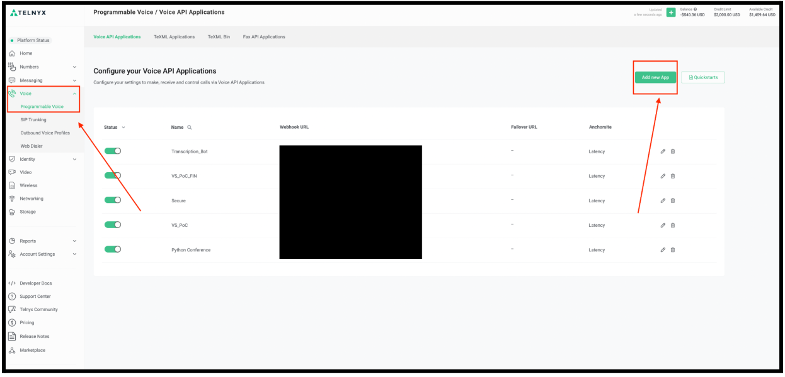
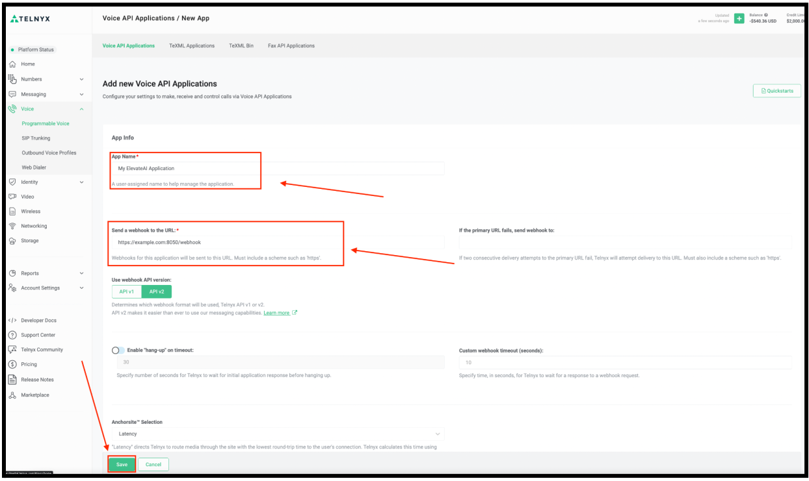
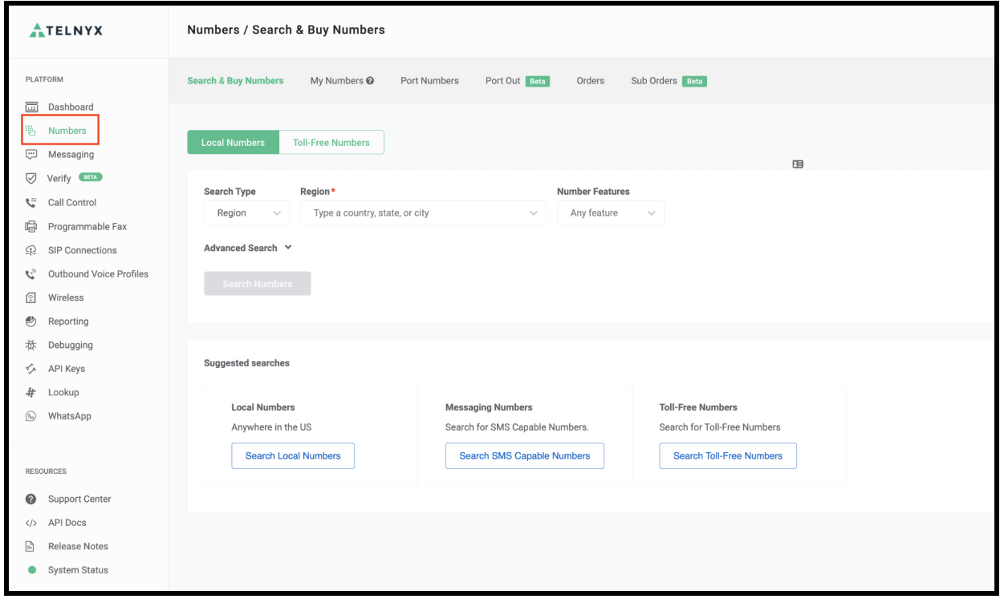
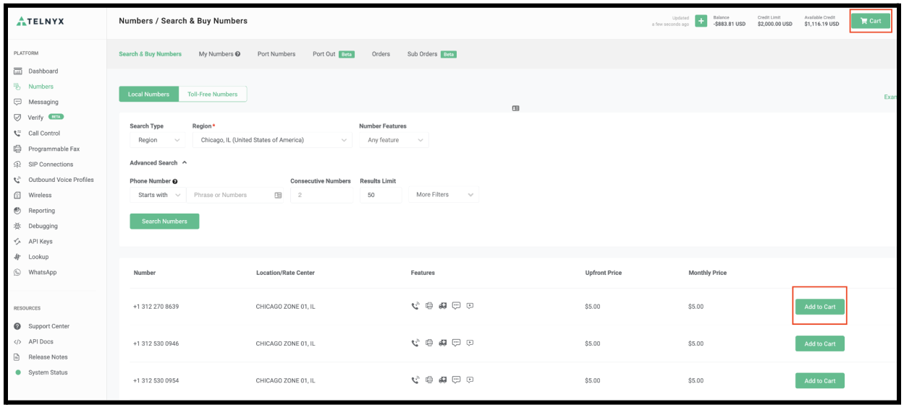
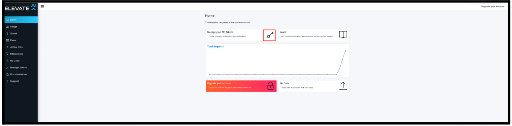

# ElevateAI Proof-of-Concept Setup Guide

Step-by-step guide to integrate Telnyx with ElevateAI for transcription and recording. See Telnyx guidance and requirements.

This article will provide you with a step by step guide to configure Telnyx & ElevateAI which can help demonstrate a sample application using Telnyx-Python transcription and recording functionality.

​

## **Step 1: Create a Call Control Application in the Telnyx Portal**

Once you have created your Telnyx account and you have successfully logged into your account click the **Voice** tab from the left side menu then click **Programmable Voice**.
​
Finally click on the **Add new App** button from the top right corner:

Next, enter in your **application name**, **webhook URL** and then click **Save**:

## **Step 2: Purchase a Telnyx Phone Number**

Once you have created your Telnyx call control application, click the **Numbers** tab from the left side menu:

Next, click the **Search & Buy Numbers** tab from the top menu and click **Search Numbers** once you have selected the correct **search type and region/area code**:

Select the desired number and click **Add to Cart**, then click the **Cart** button from the top right corner:

Under **Connections or Applications** select the ElevateAI call control application that was

created in the previous step. Click **Place Order**:

## **Step 3. Sign up for ElevateAI and get your ElevateAI API Key**

First navigate to [ElevateAI's website](https://www.elevateai.com/) and click **Get Started** from the top right corner.
​

Click **Sign Up** to register for a ElevateAI account.

Fill out the registration form and click **Sign Up**.

Once you verify your account, login to your Elevate account and click **Manage Keys**:

Copy your **API token**, you will need to use it later:

## **Step 4: Clone the PoC project and follow the steps in Github**

Link: <https://github.com/team-telnyx/demo-python-telnyx/tree/master/flask-elevateai-transcription-call-control>

---

Related Articles

[E911 Setup Guide](https://support.telnyx.com/en/articles/1130683-e911-setup-guide)[Yealink: Setup with Telnyx](https://support.telnyx.com/en/articles/3074710-yealink-setup-with-telnyx)[Bicom: PBXware Setup](https://support.telnyx.com/en/articles/5138185-bicom-pbxware-setup)[Configuring Telnyx with Microsoft Teams Direct Routing](https://support.telnyx.com/en/articles/5253876-configuring-telnyx-with-microsoft-teams-direct-routing)[Real-Time Transcription](https://support.telnyx.com/en/articles/8292490-real-time-transcription)

Did this answer your question?

😞😐😃
