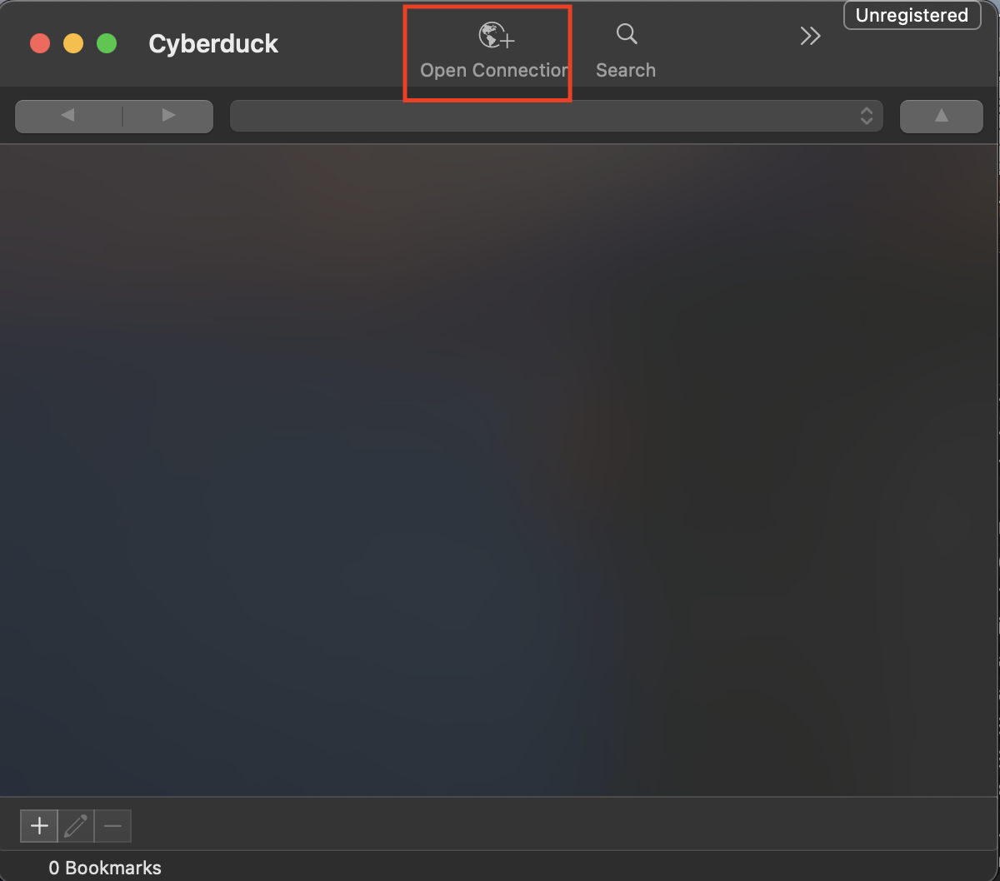
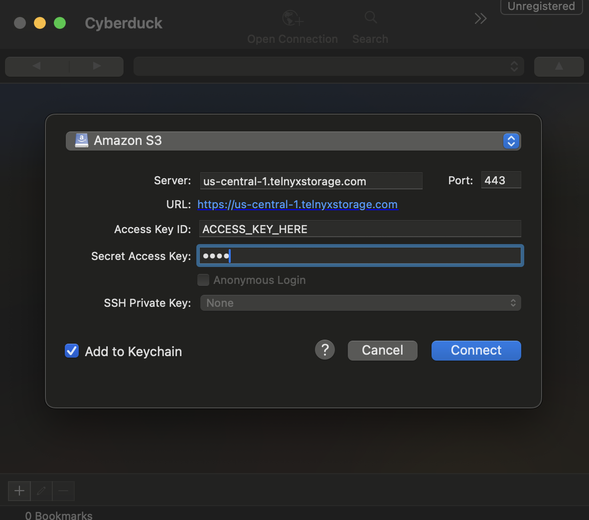

# Use Cyberduck with Telnyx Storage

Learn how to set up Cyberduck, a popular FTP client, with Telnyx Storage for seamless file transfer and storage… See Telnyx guidance and requirements.

[Cyberduck](https://cyberduck.io/) is a free, open-source file transfer client for macOS and Windows. With Cyberduck, you can easily upload, download, and manage files, as well as perform advanced operations such as setting object metadata, versioning, and lifecycle policies.

---

## How to configure Cyberduck to work with Telnyx Storage

1. Download and install the latest version of Cyberduck [here](https://cyberduck.io/download/)!
2. Open the Cyberduck application. Then, click on the option to Open Connection
   ​

   

   ​
3. A new window will pop up to specify your connection settings. Choose Amazon S3 as the connection type from the drop down.

   
4. In the window, enter in the following information:

   1. **Server**: Copy and paste one of our available [API Endpoints](https://developers.telnyx.com/docs/cloud-storage/api-endpoints).
   2. **Port**: 443
   3. **Access Key ID**: copy and paste your [Telnyx API Key](https://portal.telnyx.com/#/app/api-keys) in this field
   4. **Secret Access Key**: The secret access key is not used by TelnyxStorage, but Cyberduck will complain if it doesn’t exist. Type out anything you want here, as long as it doesn't include spaces, quoting, or special characters of any kind.
5. Click Connect

   ​

   And that’s all there is to it! All of your buckets should now appear on the Cyberduck UI, and you are ready to start using Cyberduck to manage your data on Telnyx Storage!

###

---

## Additional Resources

For more information on how to use Cyberduck, check out their [developer documentation](https://docs.cyberduck.io/cyberduck/).

---
