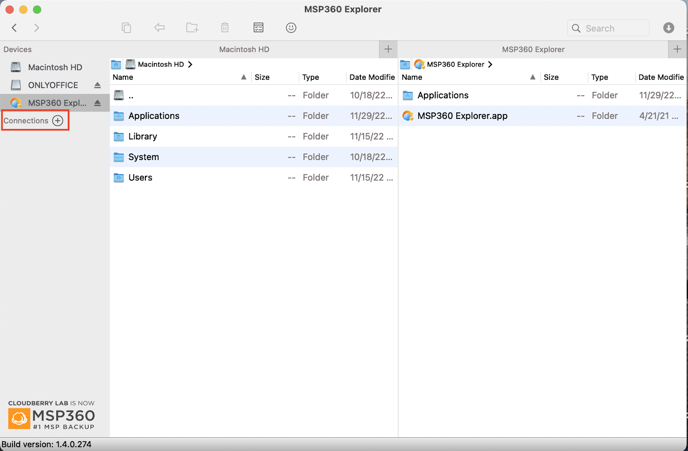
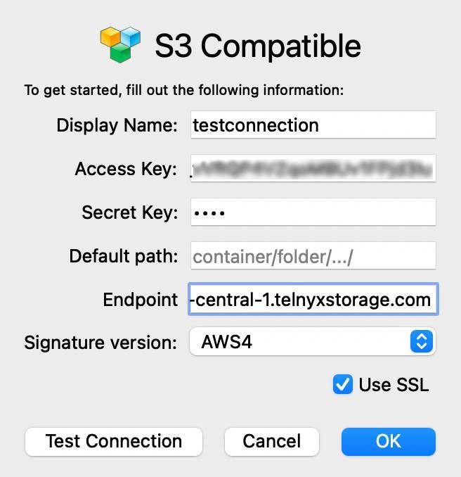
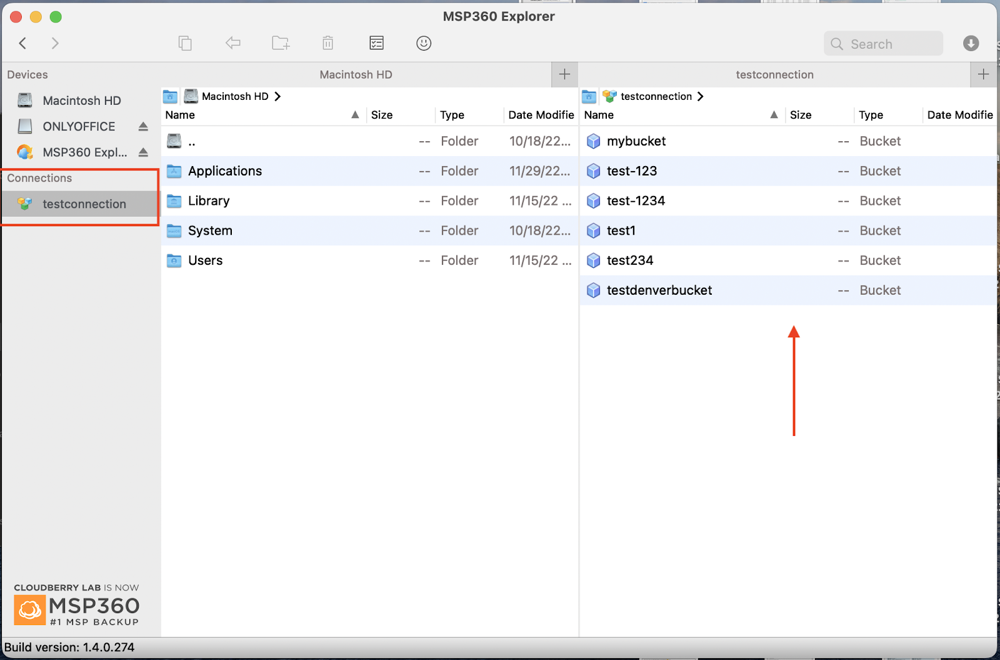

# Use MSP360 Cloudberry Explorer with Telnyx Storage

Learn how to setup MSP360 Cloudberry Explorer, an intuitive file explorer, See Telnyx guidance and requirements.

[MSP360 Cloudberry Explorer](https://www.msp360.com/explorer/) is a powerful, user-friendly file manager, enabling you to manage and transfer data to and from many different cloud storage providers. With Cloudberry Explorer, you can easily upload, download, and organize your files, as well as perform advanced operations such as setting object metadata, versioning, and access control policies.

---

## How to configure MSP360 Cloudberry Explorer to work with Telnyx Storage

1. Download and install the latest version of the MSP360 Cloudberry Explorer [here](https://www.msp360.com/explorer/)!
2. Open the MSP360 Cloudberry Explorer application
3. Select the option to open a new "**Connection"**
   ​

   
4. When prompted with the connection type, select "**S3 compatible"**
   ​

   
5. A new window will pop up to specify your connection settings. Enter in the following information, and then click "**OK"**:
   ​

   ## **S3 compatible fields**

   1. **Display Name**: anything you want! Give this connection a nickname of your choosing.
   2. **Access Key**: copy and paste your [Telnyx API Key](https://portal.telnyx.com/#/app/api-keys) in this field.
   3. **Secret Key**: The secret access key is not used by TelnyxStorage, but WAL-G will complain if it doesn’t exist. Type out anything you want here, as long as it doesn't include spaces, quoting, or special characters of any kind.
   4. **Endpoint**: Copy and paste one of our available [API Endpoints](https://developers.telnyx.com/docs/cloud-storage/api-endpoints).
   5. **Signature Version:** Select AWS4
      ​

      
6. A new Connection should appear on the navigation bar with the same name as the value you entered in "**Display Name"**. If you click on that connection, your buckets will appear in the user interface.
   ​

   

And that’s all there is to it! You have now connected MSP360 Cloudberry Explorer to Telnyx Storage.

---

**Additional Resources**

For more information on how to use MSP360 explorer, check out their [guides for Windows](https://help.msp360.com/explorer), as well as their [guides for Macs](https://help.msp360.com/explorer-for-macos).

---

Related Articles

[Use Cyberduck with Telnyx Storage](https://support.telnyx.com/en/articles/6964207-use-cyberduck-with-telnyx-storage)[Use WinSCP with Telnyx Storage](https://support.telnyx.com/en/articles/7903390-use-winscp-with-telnyx-storage)[Use Syncovery with Telnyx Storage](https://support.telnyx.com/en/articles/8047874-use-syncovery-with-telnyx-storage)[Use CrossFTP with Telnyx Storage](https://support.telnyx.com/en/articles/8047941-use-crossftp-with-telnyx-storage)[Use ExpanDrive with Telnyx Storage](https://support.telnyx.com/en/articles/8047945-use-expandrive-with-telnyx-storage)

Did this answer your question?

😞😐😃
