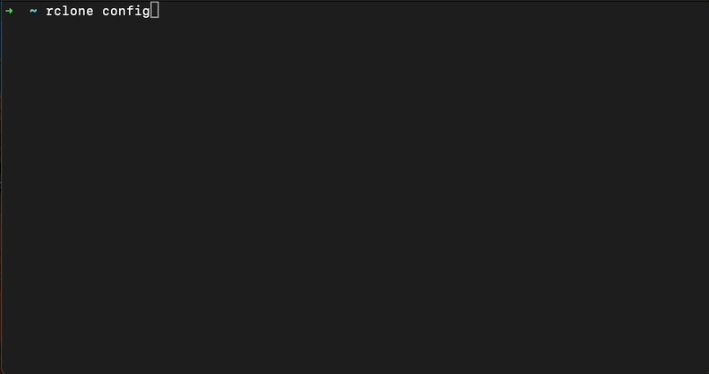

Use rclone with Telnyx Storage | Telnyx Help Center

[Skip to main content](#main-content)

# Use rclone with Telnyx Storage

Easily configure rclone with Telnyx Storage using our step-by-step guide for efficient file transfer and storage management.

Written by Telnyx Engineering

May 6, 2025

Table of contents

[Rclone](https://rclone.org/) is a command-line tool for synchronizing files and directories to and from various cloud storage providers, as well as local file systems. It supports common operations such as uploading, downloading, and syncing files, as well as more advanced features such as server-side file modification times, partial syncs, and more.

---

# How to configure rclone to work with Telnyx Storage

**Steps:**

1. Download and install the latest version of rclone [here](https://rclone.org/install/)!
2. Open your terminal. Run the command rclone config to create a new configuration file for Telnyx Storage
3. For the first prompt, choose option n to create a new remote. Hit “Enter” to continue
4. For "Enter name for new remote", type in any name that you wish! Hit “Enter” to continue
5. For "Option Storage", choose option "4" (Amazon S3 Compliant Storage Providers including AWS, Alibaba, Ceph, …) and hit “Enter” to continue
6. For "Option provider", choose option "34" (Any other S3 compatible provider) and hit “Enter” to continue
7. For "Option env\_auth", choose option 1 (Enter AWS credentials in the next step) and hit “Enter” to continue

   
8. For "Option access\_key\_id", copy and paste your [Telnyx API Key](https://portal.telnyx.com/#/app/api-keys) in this field and hit “Enter” to continue
9. For "Option secret\_access\_key", the secret access key is not used by Telnyx Storage. However rclone will complain if this field is left empty. Type out anything you want here, as long as it doesn't include spaces, quoting, or special characters of any kind.
10. For ​​"Option region", choose option 1 (Will use v4 signatures and an empty region.) and hit “Enter” to continue
11. For "Option endpoint", choose one of our available [API Endpoints](https://developers.telnyx.com/docs/cloud-storage/api-endpoints) and hit “Enter” to continue
12. For "Option location\_constraint", you can either leave empty and hit “enter”. Or if you can type in [one of our available regions](https://developers.telnyx.com/docs/cloud-storage/api-endpoints) and hit “Enter” to continue
13. For "Option acl", choose option 1 (Owner gets full control. No one else has access rights (default).) and hit "Enter" to continue
14. For "Edit advanced config?", type "n" (No (default)) and click “Enter” to continue
15. For "Keep this "{{remote\_name}}" remote?", type "y"(Yes this is OK (default)) and hit “Enter” to continue
16. Finally, type "q" and hit “Enter” to quit the config

---

## Additional Resources

For more information on how to use rclone, check out their developer documentation [here](https://rclone.org/s3/).

---

Related Articles

[Use WinSCP with Telnyx Storage](https://support.telnyx.com/en/articles/7903390-use-winscp-with-telnyx-storage)[Use CrossFTP with Telnyx Storage](https://support.telnyx.com/en/articles/8047941-use-crossftp-with-telnyx-storage)[Use WebDrive with Telnyx Storage](https://support.telnyx.com/en/articles/8047969-use-webdrive-with-telnyx-storage)[Use NetDrive3 with Telnyx Storage](https://support.telnyx.com/en/articles/8048024-use-netdrive3-with-telnyx-storage)[Use AirExplorer with Telnyx Storage](https://support.telnyx.com/en/articles/8048045-use-airexplorer-with-telnyx-storage)

Did this answer your question?

😞😐😃

Table of contents
