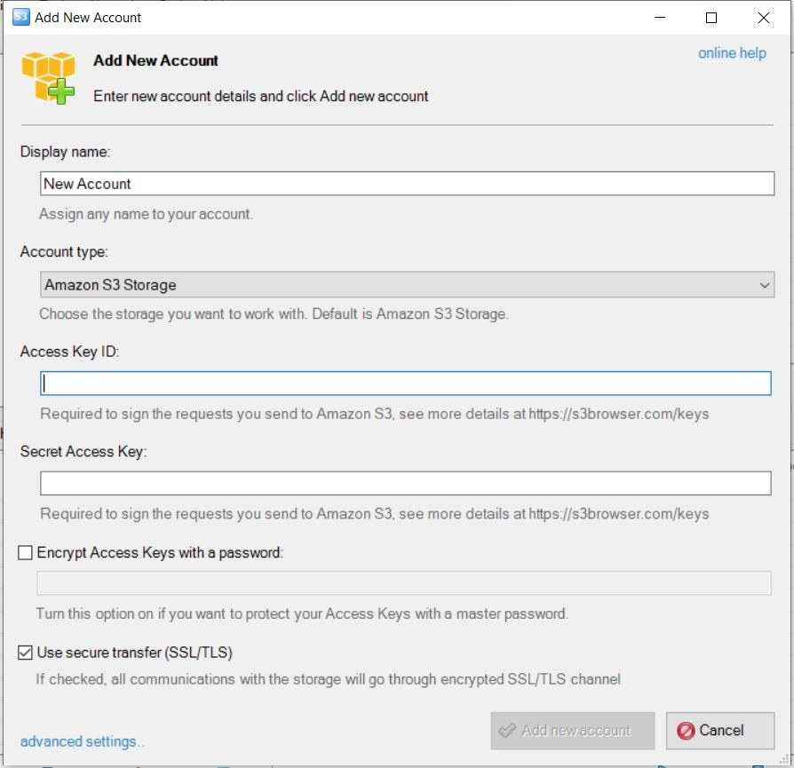

Use S3 Browser with Telnyx Storage | Telnyx Help Center

[Skip to main content](#main-content)

# Use S3 Browser with Telnyx Storage

Simplify your cloud storage management by following our guide to configuring S3 Browser with Telnyx Storage.

Written by Telnyx Engineering

June 6, 2024

Table of contents

S3 Browser is a graphical user interface for managing files on Amazon S3 and other cloud storage services that implement the S3 API. It provides a simple and intuitive way to upload, download, and manage files, as well as perform advanced operations such as setting object metadata, versioning, and access control policies, all through an easy-to-use interface.

---

# How to configure S3 Browser to work with Telnyx Storage

1. Download and install the latest version of S3 Browser [here](https://s3browser.com/)!
2. Start S3 Browser. If this is your first time using S3 Browser, a window should pop up to `Add New Account`. If you have previously used S3 Browser, click on `Accounts` in the top left corner, and then click on `Add New Account`   
   ​

   
3. Enter the following information and then click `Add New Account` to create a new account for Telnyx Storage:

   1. **Display Name:** Anything you want! Give this connection a name of your choosing
   2. **Account Type**: Select `S3 Compatible Storage` from the dropdown menu
   3. **REST Endpoint**: Copy and paste one of our available [API Endpoints](https://developers.telnyx.com/docs/cloud-storage/api-endpoints).
   4. **Access Key ID**: copy and paste your [Telnyx API Key](https://portal.telnyx.com/#/app/api-keys) in this field.
   5. **Secret Access Key**: The secret access key is not used by TelnyxStorage, but S3 Browser will complain if it doesn’t exist. Type out anything you want here, as long as it doesn't include spaces, quoting, or special characters of any kind.  
      ​  
      ​

      

      ​

And that’s all there is to it! You are now ready to use S3 Browser with Telnyx Storage to manage your data. If you had previously created buckets, they will appear in the application window (see image below).

---

**Additional Resources**

For more information on how to use S3 Browser to manage your data, check out [their user guides here](https://s3browser.com/help.aspx).

---

Related Articles

[Use WAL-G with Telnyx Storage](https://support.telnyx.com/en/articles/6966381-use-wal-g-with-telnyx-storage)[Use Cloudmounter with Telnyx Storage](https://support.telnyx.com/en/articles/8047914-use-cloudmounter-with-telnyx-storage)[Use DragonDisk with Telnyx Storage](https://support.telnyx.com/en/articles/8047928-use-dragondisk-with-telnyx-storage)[Use ExpanDrive with Telnyx Storage](https://support.telnyx.com/en/articles/8047945-use-expandrive-with-telnyx-storage)[Use AirExplorer with Telnyx Storage](https://support.telnyx.com/en/articles/8048045-use-airexplorer-with-telnyx-storage)

Did this answer your question?

😞😐😃

Table of contents
