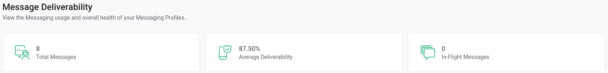
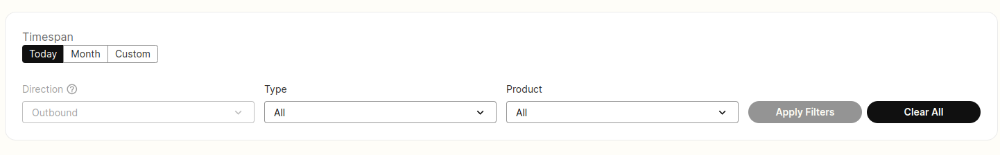
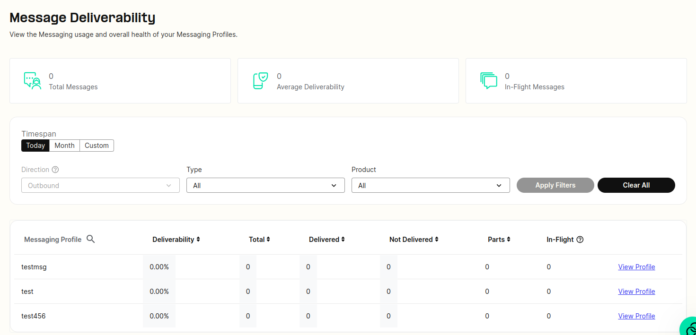

# Message Deliverability Dashboard

This article will showcase the message deliverability dashboard in greater detail. See Telnyx guidance and requirements.

## Message Deliverability Dashboard

The Telnyx Portal now offers a real-time [Message Deliverability dashboard](https://portal.telnyx.com/#/app/reporting/messaging-deliverability) for monitoring and analyzing usage, as well as identifying and troubleshooting potential issues. The report provides deliverability statistics broken out by Messaging Profile, and for the first time provides visibility into the messages that are "In-Flight".

## **How can I access it?**

The Message Deliverability Dashboard can be found on the Mission Control Portal by clicking the **Reports** drop-down on the left-hand side and clicking **Reporting.** The Message Deliverability tab should be visible on the top of the proceeding screen. Alternatively, you can use this direct link: <https://portal.telnyx.com/#/reports/messaging-deliverability>

At the top of the screen, you will see summary headers displaying your total messages, the average deliverability percentage and a total of your “In-Flight” messages.

You can select a time-span for the report that can range from the current day, a specific calendar month or a custom time-frame.

## **What filters can I use?**

Additional report filters can also be applied such as:

* **Direction:** Outbound (NOTE: Inbound functionality to come in a future release).
* **Type:** All, SMS, MMS.
* **Product:** All, Toll Free, [Short Code](https://telnyx.com/products/sms-short-code), Long Code, Alphanumeric.

To generate the report, click the “Apply Filters” button to the right.

Once the report is finished generating, a table will be displayed outlining the following stats for each of your active messaging profiles for that time period:

* **Deliverability:** The ratio of delivered vs undelivered/failed SMS.
* **Total:** The total number of SMS for the specified time period.
* **Delivered:** The total SMS that received a delivery receipt from the downstream carriers.
* **Not Delivered:** The total number of SMS that failed/did not receive a delivery receipt.
* **Parts:** The total number of parts sent.
* **In-Flight:** Messages which have been sent but yet to receive a delivery receipt from the downstream carriers.

You can navigate to a specific messaging profile's configuration page by clicking the "View Profile" link to the far right.

Note: If you are comparing totals from this dashboard compared to your usage reports, this dashboard only operates in UTC 00:00 whereas the usage reports and other reporting use the local browser time.

---

Related Articles

[Reporting: Overview](https://support.telnyx.com/en/articles/4305547-reporting-overview)[Telnyx Dashboards](https://support.telnyx.com/en/articles/4307059-telnyx-dashboards)[Reporting: Detail Requests](https://support.telnyx.com/en/articles/4424926-reporting-detail-requests)[Reporting: Usage Reports](https://support.telnyx.com/en/articles/4425016-reporting-usage-reports)[Reporting: Monthly Charges](https://support.telnyx.com/en/articles/4425088-reporting-monthly-charges)

Did this answer your question?

😞😐😃
