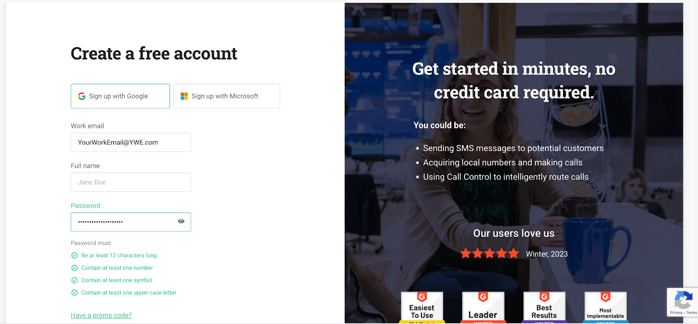
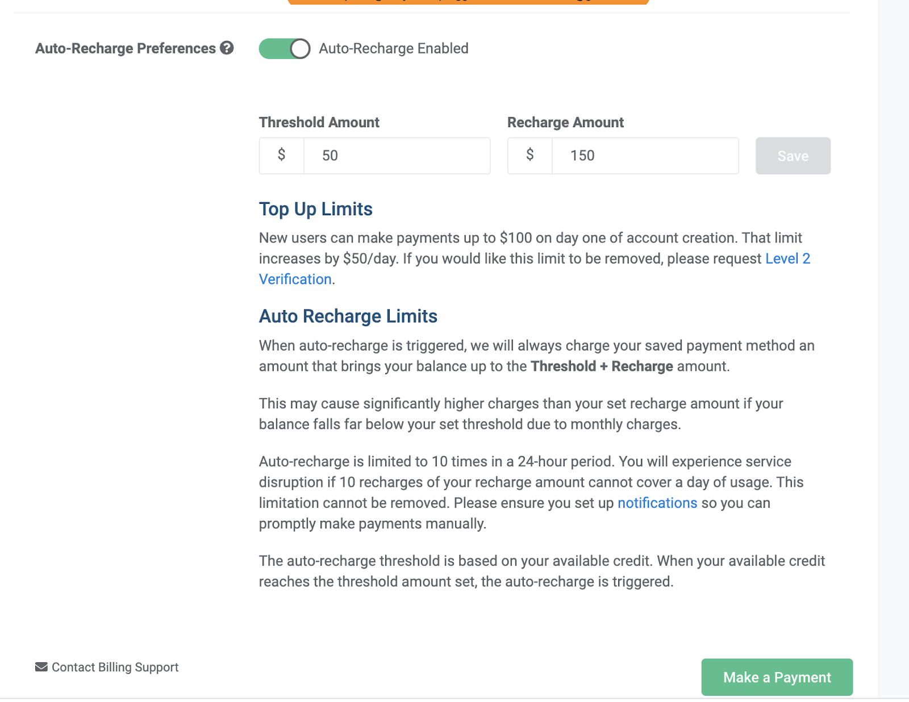
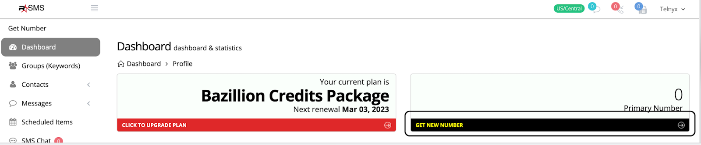

Easy Text Marketing and Telnyx Integration | Telnyx Help Center

[Skip to main content](#main-content)

# Easy Text Marketing and Telnyx Integration

Onboarding for Easy Text Marketing (formerly know as Rockstar SMS) SMS customers using Telnyx as their BYOC Carrier.

K

Written by Klane Pedrie

May 20, 2026

Table of contents

# **Easy Text Marketing and Telnyx Integration**

So you want to get rocking sending SMS using the all star pairing of Telnyx and [Easy Text Marketing](https://www.rockstarinfo.com/) to roll your business towards success, that is music to my ears. The following guide should take less than 30 minutes from start to finish, start now so that your customers can stop singing the blues and start rocking with you!

###

### How to Signup

First, create a Telnyx Account at <https://telnyx.com/sign-up>. It is free to sign up.

Click through the drop downs to answer a few short onboarding prompts.

###

### Adding Funds

Next, the Telnyx platform is prepaid (you only pay for what you use) so “**Add Funds**” to get started at <https://portal.telnyx.com/#/billing/payment> Depending on your volume $25 should be more than enough to get most people started, the only purchase you will be making in this guide is a phone number which standard costs is $1 activation and $1 per month.

### Select the Recharge Settings

Once you add a payment method (from previous step) and after your first payment you will be able to choose your auto recharge settings at: <https://portal.telnyx.com/#/billing/payment>

Then you will need to copy your API Key (not the public key) at <https://portal.telnyx.com/#/home> to plug into the Easy Text Marketing platform.

You are done with Telnyx steps for now so switch over to Easy Text Marketing and

Sign in or Create an Account at [Rockstarsms.app](http://rockstarsms.app)

### Configure the Easy Text Marketing Profile

Now go to your Easy Text Marketing Profile and select Telnyx as your SMS Gateway and put in the Telnyx API Key you copied in a previous step at <https://rockstarsms.app/users/edit>.

### Get a Number

Now in the Easy Text Marketing Dashboard you will “Get a Number” (this should automatically create a Telnyx messaging profile) at <https://rockstarsms.app/users/profile>

### Assign the Messaging Profile

You are done with the Easy Text Marketing steps for now and you will go back to Telnyx and assign the Messaging Profile with the Easy Text Marketing webhook to your new number at <https://portal.telnyx.com/#/voice/my-numbers>. Click the drop down under in the highlighting section and click on the Easy Text Marketing Messaging Profile which is probably listed as "Text Marketing Made Easy".

You are all set to start sending, so rock and roll! Easy Text Marketing tutorials can be found at [https://rockstar.thrivecart.com/rockstar-sms-agency-tutorials/](https://thrivecart.com/special-offer/?ref=tcdotcom)

If you need any help on any of the Telnyx steps please reach out to [klane@telnyx.com](mailto:klane@telnyx.com).

If you need sub-accounts or as we call them "Managed Accounts" enabled please reach out to [klane@telnyx.com](mailto:klane@telnyx.com).

For support on the Easy Text Marketing steps please reach out at <https://rockstarsms.app/helpdesk/>

---

Related Articles

[Forwarding SMS to Your Mobile Number](https://support.telnyx.com/en/articles/3231942-forwarding-sms-to-your-mobile-number)[Telnyx Verify: 2FA made easy](https://support.telnyx.com/en/articles/5701653-telnyx-verify-2fa-made-easy)[Chiro8000 and Telnyx Integration](https://support.telnyx.com/en/articles/7885470-chiro8000-and-telnyx-integration)[How to Configure a SIP Trunk](https://support.telnyx.com/en/articles/8096455-how-to-configure-a-sip-trunk)[Bulk Messaging with Sheets](https://support.telnyx.com/en/articles/8268223-bulk-messaging-with-sheets)

Did this answer your question?

😞😐😃

Table of contents
