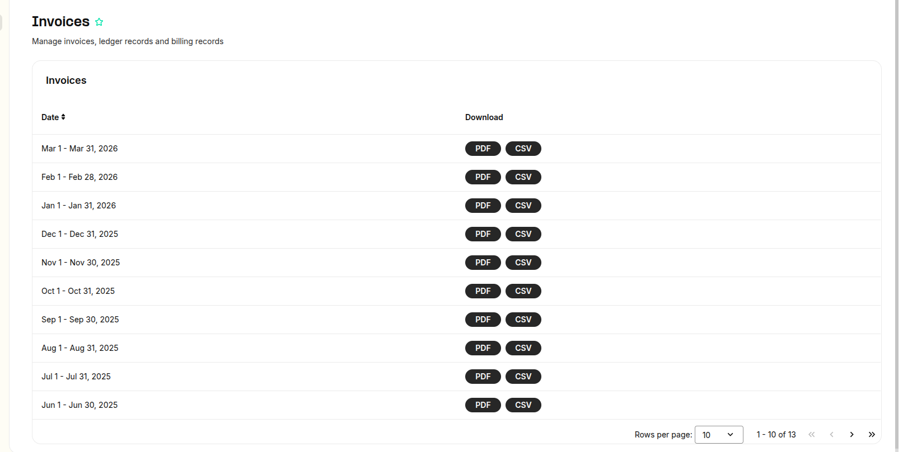
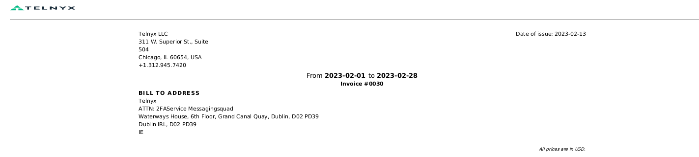
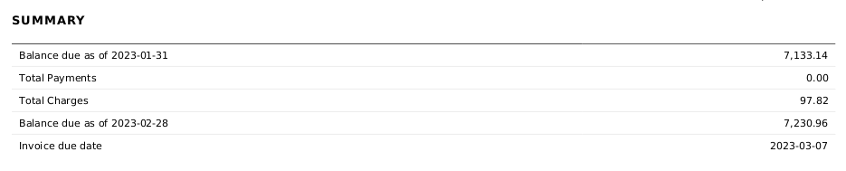
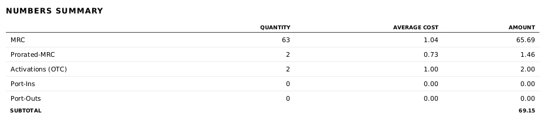
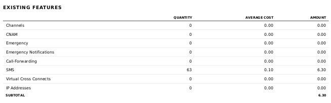
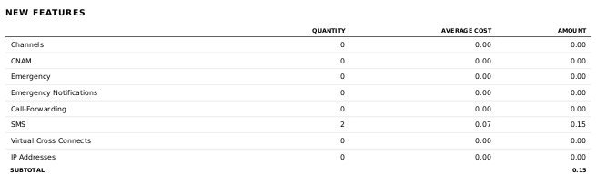
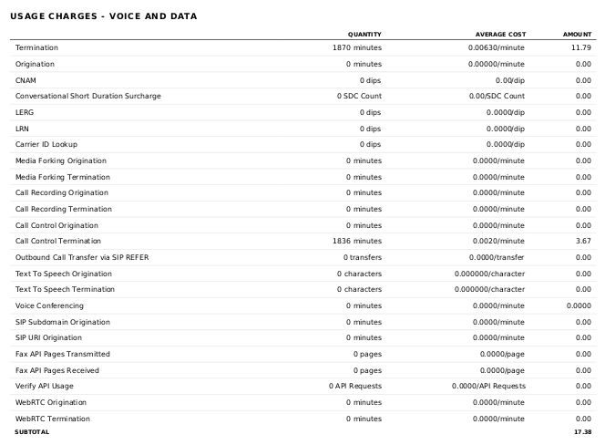
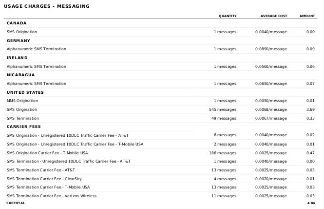
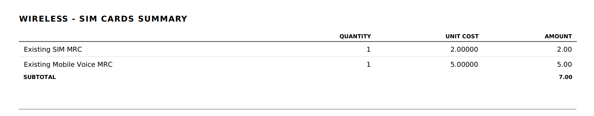
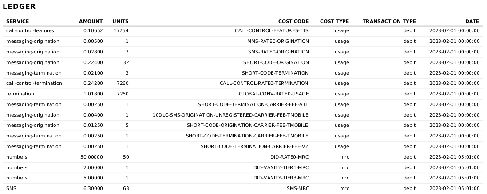

Invoice Overview | Telnyx Help Center

[Skip to main content](#main-content)

# Invoice Overview

This article details the account invoices available for download on the Mission Control Portal

Written by Cameron Fitzpatrick

April 29, 2026

Table of contents

# Invoice Overview

Telnyx account invoices can be accessed through the Billing section of the Mission Control Portal within the Invoices tab. To navigate there, click your profile icon in the upper right corner of the Telnyx Portal, then select **Manage Billing** from the menu. From there, open the **Invoices** tab to view your account invoices. Alternatively, you can access it by clicking [here](https://portal.telnyx.com/#/app/billing/invoices).

Here you can download and view your invoices for past months. Invoices for the previous month will appear during the **first few days of the new month**. These can also be sorted by their **status (Paid, Unpaid).**  
​

If you would like to be notified via email when a new invoice is available to download, you can set up a notification on your portal [here](https://portal.telnyx.com/#/app/advanced-features/notifications). For more information on notifications, please see our [support guide](https://support.telnyx.com/en/articles/4277896-notification-settings).

**NOTE:** All prices within the invoice are in USD.

At the top of the invoice, you'll be presented with your [company name, first and last name and address](https://portal.telnyx.com/#/app/account/general) along with the date of issuance for the invoice and the time-span it pertains to.

## **Summary**

The summary section gives a brief overview of your account balance including total charges, total account top ups and the balance due at the beginning and end of the month and convenience fee's related to the 3% charge for using credit card or paypal on our platform.

## **Numbers Summary**

The numbers summary lists charges pertaining to all owned numbers. This section will detail normal and pro-rated Monthly Recurring Charges for your owned numbers, as well as any One Time Costs incurred from purchases. This section also lists fees pertaining to Port-Ins and Port-Outs.

## **Existing Features**

The existing features section lists recurring charges for features that have been enabled before the month of the invoice. This pertains to features such as inbound channels, CNAM, emergency services and VXCs.

## **New Features**

The new features section covers the same items, however this details any One Time Charges received upon activation of the features.

## **Usage Charges - Voice & Data**

The Usage Charges - Voice and Data section details all incurred costs from all voice and data traffic. Each aspect is broken down into quantity, average cost and the total amount charged.

## **Usage Charges - Messaging**

The Usage Charges - Messaging section details all incurred costs from messaging traffic for the month. The charges are broken down into associated countries, and any carrier fees are listed also.

## **Wireless - SIM Cards Summary**

In this section, you can review the monthly recurring costs for the SIM cards in your account. The monthly cost for each SIM card will be displayed, along with any features linked to that SIM card, such as voice services.

## **Ledger**

Finally, the Ledger section details all changes to your portal balance over the course of the month. The charges are assigned a service name for identifying the product associated, a charge amount and units used, cost code, cost type, transaction type and timestamp.

## **Cost Codes**

If you want to know what the difference cost code descriptions are, such as:

* GLOBAL-CONV-SDC-SURCHARGE
* GLOBAL-CONV-RATE0-USAGE
* US-EMERGENCY-UNREGISTERED-RATE0-USAGE

You can find a csv list of cost codes and their descriptions attached at the end of this article.

If you have any queries or concerns regarding your invoice and any charges you receive, please reach out to [billing@telnyx.com](mailto:billing@telnyx.com) for assistance.

---

[cost\_codes.csv](https://telnyx-48416ce2297b.intercom-attachments-2.com/i/o/1005126237/5230d67c87bb079a5d194f07/cost_codes.csv?expires=1783507500&signature=689fdb13c980d54e9a81aeff80deccbb1e0d44d8f30ea8f564c5dc98ebc703be&req=dSAnE8h8m4NcXvMW1HO4zZOU9VoIJ%2FEiE3fAyF8IZKmnzGL0PKrHgzNg8ITC%0AW0jdXPulqx4%3D%0A)

---

Related Articles

[IoT SIM Card Pricing](https://support.telnyx.com/en/articles/3296669-iot-sim-card-pricing)[SIM Reporting & Analytics](https://support.telnyx.com/en/articles/3679913-sim-reporting-analytics)[Notification Settings](https://support.telnyx.com/en/articles/4277896-notification-settings)[Billing Setup & Billing Groups](https://support.telnyx.com/en/articles/4280500-billing-setup-billing-groups)[Reporting: Monthly Charges](https://support.telnyx.com/en/articles/4425088-reporting-monthly-charges)

Did this answer your question?

😞😐😃

Table of contents
